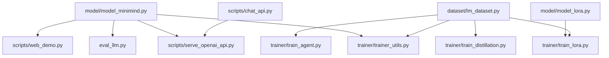
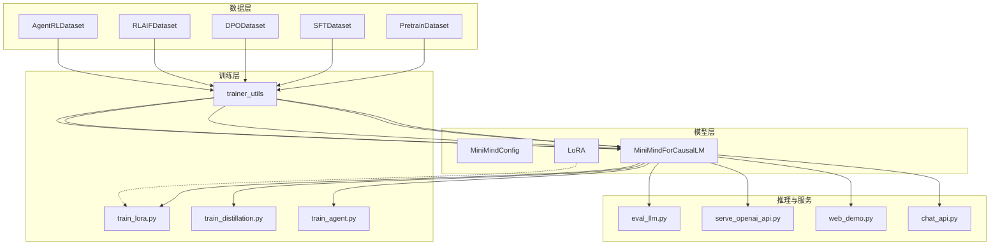
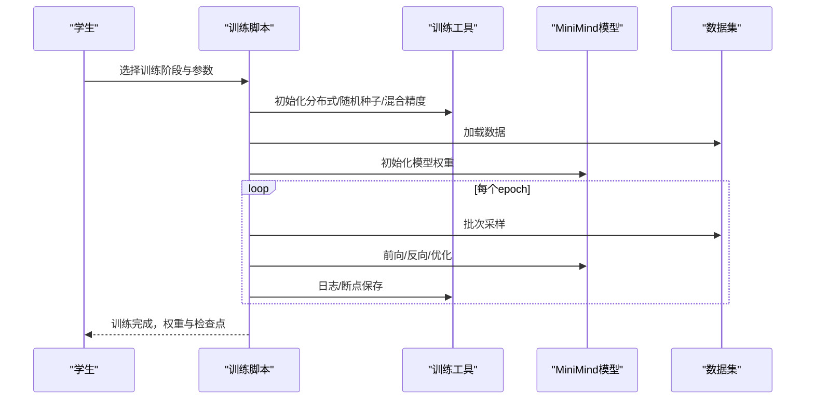
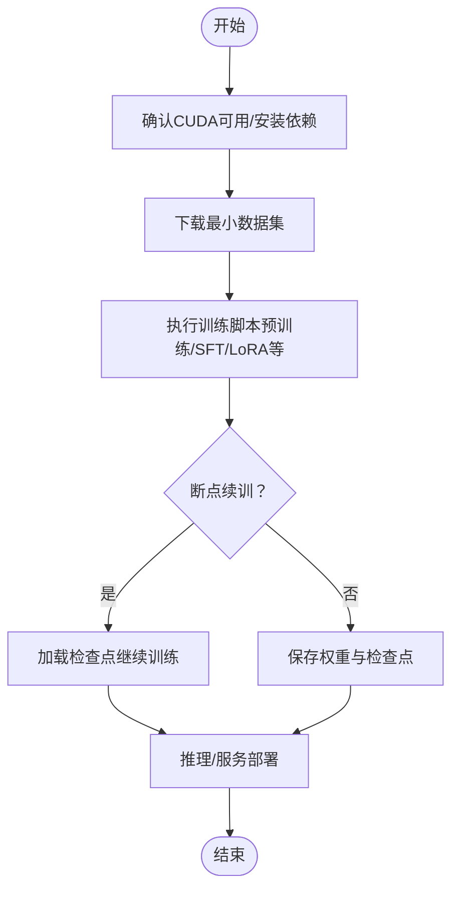
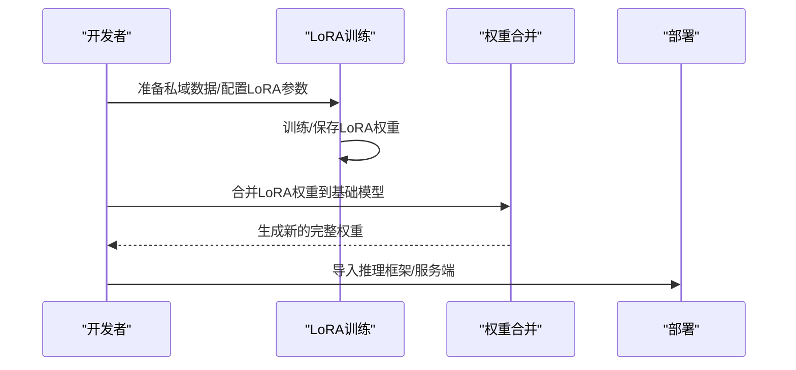
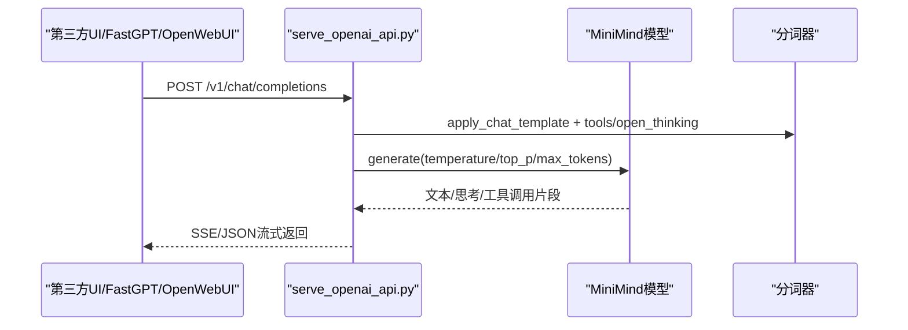
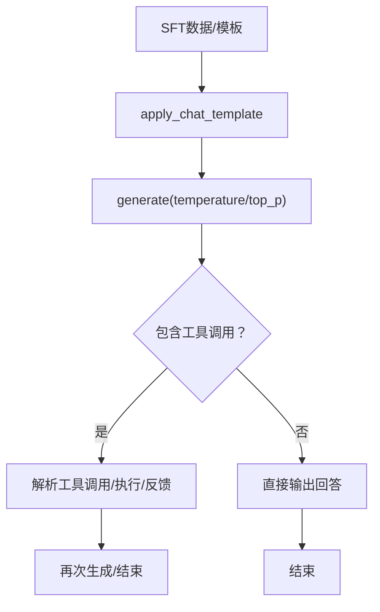
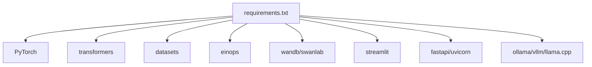

# 应用场景

<cite>
**本文引用的文件**
- [README.md](file://README.md)
- [requirements.txt](file://requirements.txt)
- [model_minimind.py](file://model/model_minimind.py)
- [model_lora.py](file://model/model_lora.py)
- [lm_dataset.py](file://dataset/lm_dataset.py)
- [trainer_utils.py](file://trainer/trainer_utils.py)
- [eval_llm.py](file://eval_llm.py)
- [serve_openai_api.py](file://scripts/serve_openai_api.py)
- [web_demo.py](file://scripts/web_demo.py)
- [chat_api.py](file://scripts/chat_api.py)
- [train_lora.py](file://trainer/train_lora.py)
- [train_distillation.py](file://trainer/train_distillation.py)
- [train_agent.py](file://trainer/train_agent.py)
</cite>

## 目录
1. [引言](#引言)
2. [项目结构](#项目结构)
3. [核心组件](#核心组件)
4. [架构总览](#架构总览)
5. [详细组件分析](#详细组件分析)
6. [依赖分析](#依赖分析)
7. [性能考量](#性能考量)
8. [故障排查指南](#故障排查指南)
9. [结论](#结论)
10. [附录](#附录)

## 引言
MiniMind 是一个从零实现的小型语言模型项目，强调“大道至简”。它以极低的成本与极短的训练时间，实现了可复现、可理解、可扩展的 LLM 训练与推理链路，覆盖预训练、监督微调、LoRA、RLHF（DPO）、RLAIF（PPO/GRPO/CISPO）、工具调用、思维链、模型蒸馏、多模态扩展等全流程。项目同时提供与主流推理框架（如 transformers、vllm、ollama、llama.cpp）的兼容，以及与第三方 UI（FastGPT、OpenWebUI 等）的对接能力，为不同场景下的学习者、研究者与开发者提供起点与工具。

## 项目结构
项目采用按功能域划分的模块化组织：
- model：模型定义与 LoRA 实现
- dataset：数据集加载与预处理
- trainer：训练脚本与工具
- scripts：推理与服务端脚本
- 根目录：README、requirements、评估脚本等

图表来源
- [model_minimind.py:1-280](file://model/model_minimind.py#L1-L280)
- [model_lora.py:1-66](file://model/model_lora.py#L1-L66)
- [lm_dataset.py:1-256](file://dataset/lm_dataset.py#L1-L256)
- [trainer_utils.py:1-177](file://trainer/trainer_utils.py#L1-L177)
- [eval_llm.py:1-94](file://eval_llm.py#L1-L94)
- [serve_openai_api.py:1-246](file://scripts/serve_openai_api.py#L1-L246)
- [web_demo.py:1-421](file://scripts/web_demo.py#L1-L421)
- [chat_api.py:1-40](file://scripts/chat_api.py#L1-L40)
- [train_lora.py:1-184](file://trainer/train_lora.py#L1-L184)
- [train_distillation.py:1-246](file://trainer/train_distillation.py#L1-L246)
- [train_agent.py:1-488](file://trainer/train_agent.py#L1-L488)

章节来源
- [README.md:1-120](file://README.md#L1-L120)
- [requirements.txt:1-32](file://requirements.txt#L1-L32)

## 核心组件
- 模型架构：MiniMindConfig、MiniMindForCausalLM、Attention、FeedForward、MOEFeedForward、RMSNorm、RoPE 与 YaRN 外推
- 数据集：PretrainDataset、SFTDataset、DPODataset、RLAIFDataset、AgentRLDataset
- 训练工具：分布式初始化、学习率调度、断点续训、混合精度、LoRA 参数统计与保存
- 推理与服务：OpenAI 兼容 API、Streamlit Web Demo、CLI 推理、LoRA 合并与权重导出
- 高阶能力：模型蒸馏（黑盒/白盒）、工具调用（Tool Call）、思维链（Reasoning）、代理强化学习（Agent RL）

章节来源
- [model_minimind.py:10-280](file://model/model_minimind.py#L10-L280)
- [lm_dataset.py:37-256](file://dataset/lm_dataset.py#L37-L256)
- [trainer_utils.py:18-177](file://trainer/trainer_utils.py#L18-L177)
- [eval_llm.py:12-94](file://eval_llm.py#L12-L94)
- [serve_openai_api.py:28-246](file://scripts/serve_openai_api.py#L28-L246)
- [web_demo.py:198-421](file://scripts/web_demo.py#L198-L421)
- [chat_api.py:1-40](file://scripts/chat_api.py#L1-L40)
- [train_lora.py:127-184](file://trainer/train_lora.py#L127-L184)
- [train_distillation.py:24-246](file://trainer/train_distillation.py#L24-L246)
- [train_agent.py:31-488](file://trainer/train_agent.py#L31-L488)

## 架构总览
MiniMind 的训练与推理链路贯穿“数据—模型—训练—服务—应用”的闭环，支持从 0 开始的全流程复现，并提供与第三方生态的兼容与集成能力。

图表来源
- [lm_dataset.py:37-256](file://dataset/lm_dataset.py#L37-L256)
- [model_minimind.py:10-280](file://model/model_minimind.py#L10-L280)
- [model_lora.py:21-66](file://model/model_lora.py#L21-L66)
- [trainer_utils.py:18-177](file://trainer/trainer_utils.py#L18-L177)
- [train_lora.py:127-184](file://trainer/train_lora.py#L127-L184)
- [train_distillation.py:145-246](file://trainer/train_distillation.py#L145-L246)
- [train_agent.py:371-488](file://trainer/train_agent.py#L371-L488)
- [eval_llm.py:12-94](file://eval_llm.py#L12-L94)
- [serve_openai_api.py:28-246](file://scripts/serve_openai_api.py#L28-L246)
- [web_demo.py:198-421](file://scripts/web_demo.py#L198-L421)
- [chat_api.py:1-40](file://scripts/chat_api.py#L1-L40)

## 详细组件分析

### 教育场景：入门与实践教学
- 可复现：提供从 0 开始的完整训练链路（预训练、SFT、LoRA、DPO、RLAIF、Agent RL），配合断点续训与可视化工具，便于课堂演示与作业实践。
- 可理解：所有核心算法均从 0 实现，不依赖第三方高层封装，帮助学习者理解 LLM 的内部机制。
- 可扩展：支持 MoE、蒸馏、工具调用、思维链等扩展模块，满足进阶实验与课程设计。

图表来源
- [train_lora.py:77-184](file://trainer/train_lora.py#L77-L184)
- [train_distillation.py:145-246](file://trainer/train_distillation.py#L145-L246)
- [train_agent.py:371-488](file://trainer/train_agent.py#L371-L488)
- [trainer_utils.py:44-177](file://trainer/trainer_utils.py#L44-L177)
- [lm_dataset.py:37-256](file://dataset/lm_dataset.py#L37-L256)
- [model_minimind.py:195-280](file://model/model_minimind.py#L195-L280)

章节来源
- [README.md:75-120](file://README.md#L75-L120)
- [README.md:216-367](file://README.md#L216-L367)

### 个人开发者：在个人 GPU 上快速训练与复现
- 低成本：单卡 3090 上，从 0 训练到对话模型的时间与成本均可控，适合个人开发者快速上手。
- 快速复现：提供最小数据集组合与一键训练命令，降低环境与数据准备门槛。
- 兼容生态：支持 transformers、vllm、ollama、llama.cpp 等推理框架，便于本地部署与二次开发。

图表来源
- [README.md:216-367](file://README.md#L216-L367)
- [requirements.txt:1-32](file://requirements.txt#L1-L32)
- [trainer_utils.py:63-117](file://trainer/trainer_utils.py#L63-L117)

章节来源
- [README.md:618-670](file://README.md#L618-L670)
- [README.md:673-735](file://README.md#L673-L735)

### 企业定制：参数高效微调与领域迁移
- LoRA：参数高效微调，仅训练少量新增参数，适合快速适配私域场景（如医疗、金融、法律等）。
- 权重合并：支持将 LoRA 权重与基础模型合并为新的完整权重，便于部署与版本管理。
- 断点续训：支持跨 GPU 数量恢复，保障长时间训练的稳定性。

图表来源
- [train_lora.py:127-184](file://trainer/train_lora.py#L127-L184)
- [model_lora.py:35-66](file://model/model_lora.py#L35-L66)
- [serve_openai_api.py:28-47](file://scripts/serve_openai_api.py#L28-L47)

章节来源
- [README.md:765-800](file://README.md#L765-L800)
- [model_lora.py:21-66](file://model/model_lora.py#L21-L66)

### 第三方 UI 集成：与 FastGPT、OpenWebUI 等工具链
- OpenAI 兼容 API：提供 /v1/chat/completions 接口，支持流式与非流式响应，兼容 reasoning_content、tool_calls、open_thinking 等扩展字段。
- Web Demo：基于 Streamlit 的聊天界面，支持思考展示、工具选择与多轮 Tool Call。
- CLI 示例：提供 OpenAI SDK 的本地客户端示例，便于快速验证与集成。

图表来源
- [serve_openai_api.py:171-227](file://scripts/serve_openai_api.py#L171-L227)
- [web_demo.py:312-421](file://scripts/web_demo.py#L312-L421)
- [chat_api.py:11-40](file://scripts/chat_api.py#L11-L40)

章节来源
- [README.md:95-97](file://README.md#L95-L97)
- [README.md:260-276](file://README.md#L260-L276)

### 高级功能应用：模型蒸馏、工具调用、思维链
- 模型蒸馏：支持黑盒与白盒蒸馏，结合 CE 与 KL 损失，实现教师模型到学生模型的知识迁移。
- 工具调用：在对话模板中注入工具定义与调用标记，支持多轮 Tool Call 与工具执行反馈。
- 思维链：通过 open_thinking 与思考标记，实现自适应思考展示与推理过程可视化。

图表来源
- [lm_dataset.py:71-119](file://dataset/lm_dataset.py#L71-L119)
- [train_distillation.py:24-92](file://trainer/train_distillation.py#L24-L92)
- [train_agent.py:76-156](file://trainer/train_agent.py#L76-L156)
- [web_demo.py:350-416](file://scripts/web_demo.py#L350-L416)

章节来源
- [README.md:85-97](file://README.md#L85-L97)
- [README.md:425-462](file://README.md#L425-L462)

## 依赖分析
- 运行时依赖：PyTorch、transformers、datasets、einops、swanlab/wandb、streamlit、fastapi、uvicorn 等。
- 训练与推理：支持单卡/多卡（DDP）、混合精度、分布式断点续训、可视化记录。
- 生态兼容：OpenAI 兼容 API、OpenWebUI、FastGPT、ollama、vllm、llama.cpp 等。

图表来源
- [requirements.txt:1-32](file://requirements.txt#L1-L32)

章节来源
- [requirements.txt:1-32](file://requirements.txt#L1-L32)
- [README.md:92-96](file://README.md#L92-L96)

## 性能考量
- 训练效率：通过混合精度、梯度累积、分布式训练与断点续训，平衡显存占用与收敛速度。
- 推理效率：支持 YaRN 外推提升长文本生成能力；提供 OpenAI 兼容 API 与多种推理框架对接。
- 成本控制：单卡 3090 上即可在约 2 小时内完成从 0 到对话模型的训练，适合个人与小团队快速上手。

## 故障排查指南
- CUDA 不可用：确认 PyTorch CUDA 可用性，必要时更换/重装 PyTorch 版本。
- 断点续训：检查 checkpoints 目录是否存在对应权重与检查点文件，确保跨 GPU 数量恢复逻辑生效。
- LoRA 合并：确认基础模型权重与 LoRA 权重路径正确，合并后验证生成质量。
- 服务端异常：核对 /v1/chat/completions 请求参数（temperature/top_p/max_tokens/tools/open_thinking），检查 SSE 返回是否完整。

章节来源
- [README.md:277-367](file://README.md#L277-L367)
- [trainer_utils.py:63-117](file://trainer/trainer_utils.py#L63-L117)
- [model_lora.py:56-66](file://model/model_lora.py#L56-L66)
- [serve_openai_api.py:171-227](file://scripts/serve_openai_api.py#L171-L227)

## 结论
MiniMind 以“可复现、可理解、可扩展”为核心理念，覆盖从入门到进阶的完整 LLM 应用场景。它为教育、个人开发者与企业定制提供了坚实起点，同时通过与第三方 UI 与推理生态的无缝对接，支撑从教学实验到生产落地的多样化需求。依托完善的训练链路与工具集，MiniMind 降低了 LLM 的学习门槛与使用成本，推动更广泛的 AI 社区进步。

## 附录
- 快速开始与训练流程参见项目 README 的“快速开始”与“实验”章节。
- 数据集与模型版本信息参见 README 的“数据介绍”与“模型”章节。