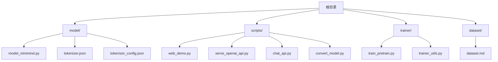
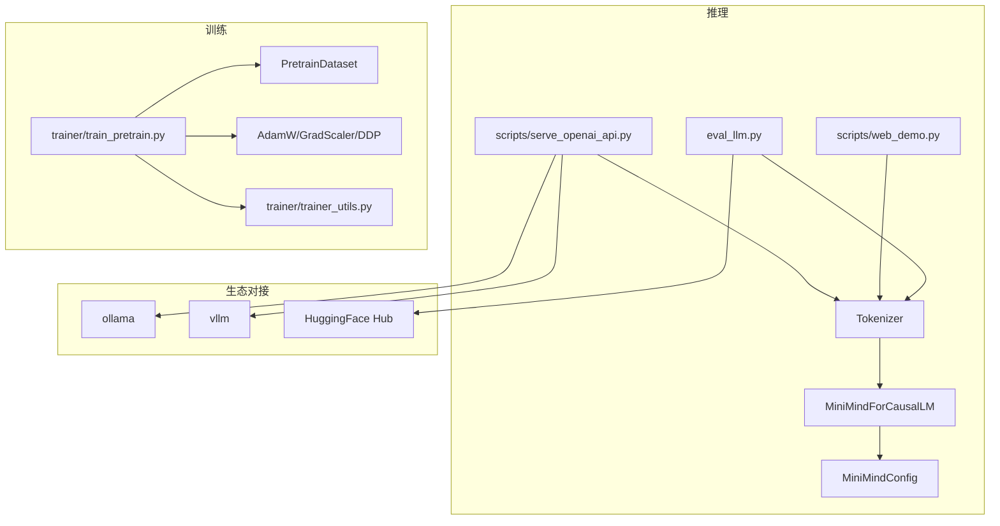
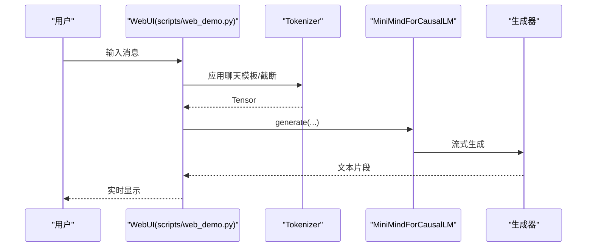
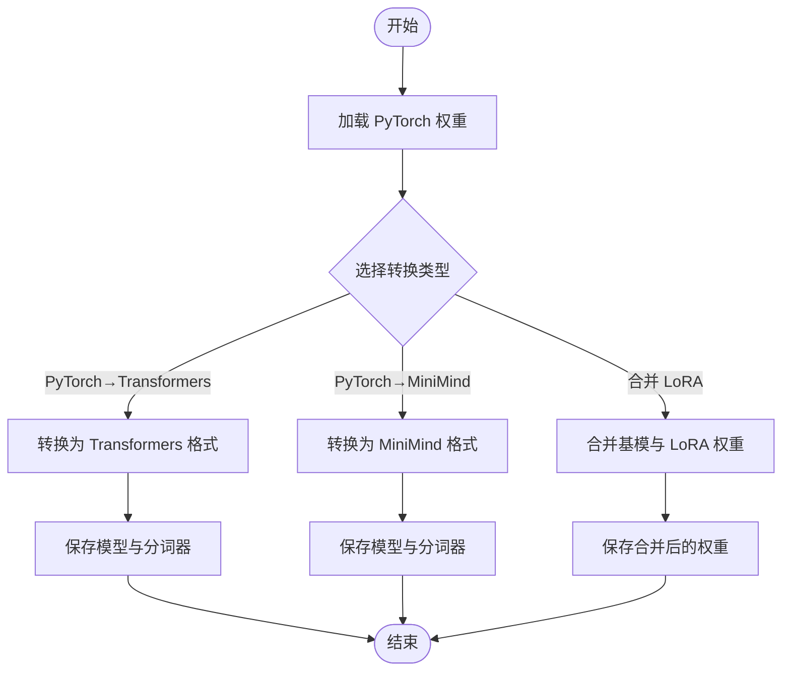
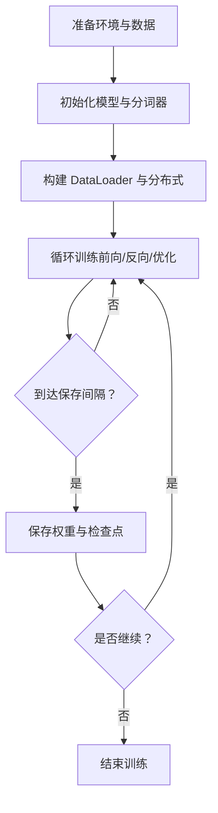
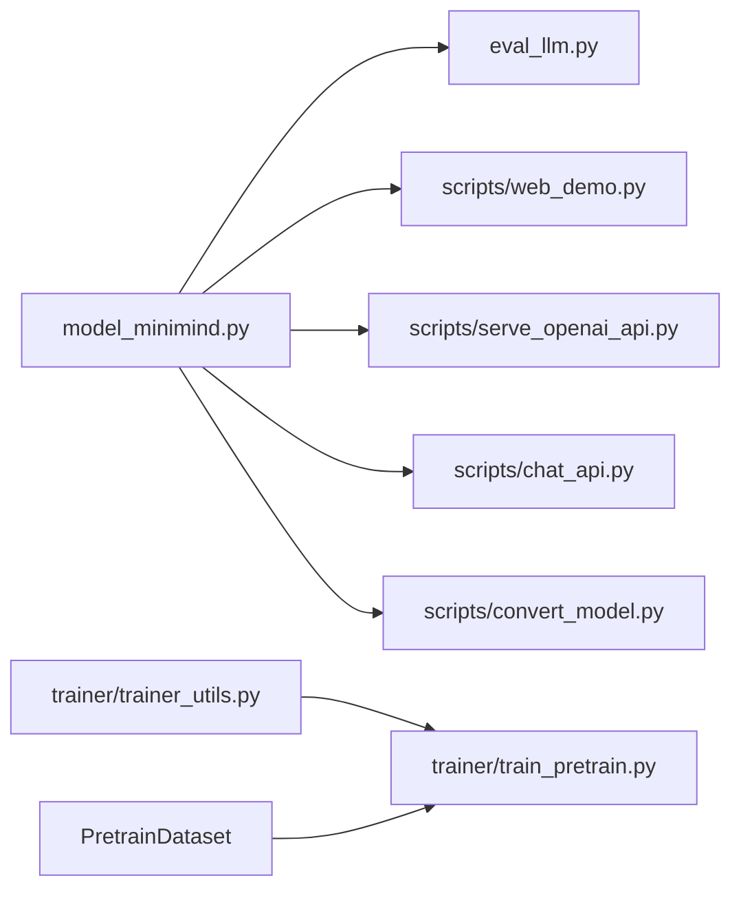

# 快速开始

<cite>
**本文引用的文件**
- [README.md](file://README.md)
- [README_en.md](file://README_en.md)
- [requirements.txt](file://requirements.txt)
- [model/model_minimind.py](file://model/model_minimind.py)
- [eval_llm.py](file://eval_llm.py)
- [scripts/web_demo.py](file://scripts/web_demo.py)
- [scripts/serve_openai_api.py](file://scripts/serve_openai_api.py)
- [scripts/chat_api.py](file://scripts/chat_api.py)
- [scripts/convert_model.py](file://scripts/convert_model.py)
- [trainer/train_pretrain.py](file://trainer/train_pretrain.py)
- [trainer/trainer_utils.py](file://trainer/trainer_utils.py)
- [dataset/dataset.md](file://dataset/dataset.md)
- [model/tokenizer.json](file://model/tokenizer.json)
</cite>

## 目录
1. [简介](#简介)
2. [项目结构](#项目结构)
3. [核心组件](#核心组件)
4. [架构总览](#架构总览)
5. [详细组件解析](#详细组件解析)
6. [依赖关系分析](#依赖关系分析)
7. [性能与资源建议](#性能与资源建议)
8. [故障排查指南](#故障排查指南)
9. [结论](#结论)
10. [附录](#附录)

## 简介
本指南面向初学者，带你从环境准备到模型推理与训练，完整体验 MiniMind 项目。你将学会：
- 安装依赖与环境准备
- 下载与使用模型（Transformers 格式与 PyTorch 原生权重）
- CLI 推理与 WebUI 使用
- 与第三方推理框架（ollama、vllm）对接
- 基础训练流程（预训练、监督微调等）
- 常见问题与性能建议

MiniMind 以“大道至简”为核心理念，提供从零开始训练超小语言模型的完整链路，支持 Dense 与 MoE 结构，并兼容主流生态（Transformers、llama.cpp、vllm、ollama 等）。

**Section sources**
- [README.md:216-367](file://README.md#L216-L367)
- [README_en.md:75-98](file://README_en.md#L75-L98)

## 项目结构
项目采用按功能模块划分的目录结构，核心目录与用途如下：
- model：模型定义与分词器
- scripts：推理与服务脚本（WebUI、OpenAI 兼容 API、模型转换等）
- trainer：训练脚本与工具
- dataset：数据集说明与存放
- 根目录：README、requirements.txt 等

**Diagram sources**
- [model/model_minimind.py](file://model/model_minimind.py)
- [scripts/web_demo.py](file://scripts/web_demo.py)
- [scripts/serve_openai_api.py](file://scripts/serve_openai_api.py)
- [scripts/chat_api.py](file://scripts/chat_api.py)
- [scripts/convert_model.py](file://scripts/convert_model.py)
- [trainer/train_pretrain.py](file://trainer/train_pretrain.py)
- [trainer/trainer_utils.py](file://trainer/trainer_utils.py)
- [dataset/dataset.md](file://dataset/dataset.md)

**Section sources**
- [README.md:216-230](file://README.md#L216-L230)

## 核心组件
- 模型定义：MiniMindConfig、MiniMindForCausalLM、Attention、FeedForward、MOEFeedForward 等
- 推理入口：eval_llm.py（CLI）、scripts/web_demo.py（Streamlit WebUI）、scripts/serve_openai_api.py（OpenAI 兼容 API）
- 训练入口：trainer/train_pretrain.py（预训练）、trainer/trainer_utils.py（工具与检查点）
- 模型转换：scripts/convert_model.py（PyTorch↔Transformers、LoRA 合并等）

**Section sources**
- [model/model_minimind.py:10-280](file://model/model_minimind.py#L10-L280)
- [eval_llm.py:12-94](file://eval_llm.py#L12-L94)
- [scripts/web_demo.py:198-421](file://scripts/web_demo.py#L198-L421)
- [scripts/serve_openai_api.py:28-246](file://scripts/serve_openai_api.py#L28-L246)
- [scripts/convert_model.py:16-145](file://scripts/convert_model.py#L16-L145)
- [trainer/train_pretrain.py:82-170](file://trainer/train_pretrain.py#L82-L170)
- [trainer/trainer_utils.py:18-177](file://trainer/trainer_utils.py#L18-L177)

## 架构总览
MiniMind 的推理与训练路径如下：
- 推理路径：CLI/Streamlit/WebUI → Tokenizer → 模型生成 → 输出
- 训练路径：数据集 → DataLoader → 模型前向/反向 → 优化器更新 → 检查点保存
- 生态对接：通过 OpenAI 兼容 API 与第三方框架（ollama、vllm）互通

**Diagram sources**
- [eval_llm.py:12-94](file://eval_llm.py#L12-L94)
- [scripts/web_demo.py:198-421](file://scripts/web_demo.py#L198-L421)
- [scripts/serve_openai_api.py:28-246](file://scripts/serve_openai_api.py#L28-L246)
- [model/model_minimind.py:10-280](file://model/model_minimind.py#L10-L280)
- [trainer/train_pretrain.py:82-170](file://trainer/train_pretrain.py#L82-L170)
- [trainer/trainer_utils.py:18-177](file://trainer/trainer_utils.py#L18-L177)

## 详细组件解析

### 环境与依赖
- 安装依赖：克隆仓库后，使用 requirements.txt 安装所需包
- 推荐 Python 版本与 CUDA 版本：参考 README 中的“本人的软硬件配置”
- 训练设备检测：可使用 torch.cuda.is_available() 检查 CUDA 可用性

**Section sources**
- [README.md:231-237](file://README.md#L231-L237)
- [README.md:279-291](file://README.md#L279-L291)
- [requirements.txt:1-32](file://requirements.txt#L1-L32)

### 模型下载与使用
- 方式一：使用 ModelScope 下载 Transformers 格式模型
- 方式二：使用 Git 克隆 HuggingFace 模型仓库
- CLI 推理：
  - 使用 Transformers 格式模型：eval_llm.py --load_from ./minimind-3
  - 使用 PyTorch 原生权重：eval_llm.py --load_from ./model --weight full_sft
- WebUI：将模型复制到 scripts 目录下，运行 streamlit 启动 web_demo.py
- 第三方推理框架：
  - ollama：ollama run jingyaogong/minimind-3
  - vllm：vllm serve /path/to/model --served-model-name "minimind"

**Section sources**
- [README.md:241-276](file://README.md#L241-L276)
- [eval_llm.py:32-94](file://eval_llm.py#L32-L94)
- [scripts/web_demo.py:239-249](file://scripts/web_demo.py#L239-L249)
- [scripts/chat_api.py:1-40](file://scripts/chat_api.py#L1-L40)

### 推理接口与流式输出
- OpenAI 兼容 API：serve_openai_api.py 提供 /v1/chat/completions，支持流式返回、思考标记与工具调用解析
- CLI 流式输出：TextStreamer 实时打印生成内容
- WebUI：Streamlit 页面，支持多轮对话、工具选择、思考展示

**Diagram sources**
- [scripts/web_demo.py:312-417](file://scripts/web_demo.py#L312-L417)
- [model/model_minimind.py:229-280](file://model/model_minimind.py#L229-L280)

**Section sources**
- [scripts/serve_openai_api.py:171-227](file://scripts/serve_openai_api.py#L171-L227)
- [scripts/web_demo.py:312-417](file://scripts/web_demo.py#L312-L417)
- [eval_llm.py:65-91](file://eval_llm.py#L65-L91)

### 模型转换与 LoRA 合并
- PyTorch 原生权重转 Transformers：convert_model.py 提供 convert_torch2transformers 与 convert_torch2transformers_minimind
- LoRA 合并：convert_merge_base_lora 将基模与 LoRA 权重合并为新的完整权重
- 反向转换：Transformers 转 PyTorch

**Diagram sources**
- [scripts/convert_model.py:16-145](file://scripts/convert_model.py#L16-L145)

**Section sources**
- [scripts/convert_model.py:16-145](file://scripts/convert_model.py#L16-L145)

### 训练流程（预训练与监督微调）
- 预训练：train_pretrain.py，支持多卡 DDP、混合精度、梯度累积、断点续训、WandB/SwanLab 可视化
- 监督微调：train_full_sft.py（在 README 中介绍），流程与预训练类似，使用 SFT 数据
- 断点续训：trainer_utils.lm_checkpoint 保存完整检查点，支持跨 GPU 数量恢复

**Diagram sources**
- [trainer/train_pretrain.py:23-80](file://trainer/train_pretrain.py#L23-L80)
- [trainer/trainer_utils.py:63-117](file://trainer/trainer_utils.py#L63-L117)

**Section sources**
- [trainer/train_pretrain.py:82-170](file://trainer/train_pretrain.py#L82-L170)
- [trainer/trainer_utils.py:63-117](file://trainer/trainer_utils.py#L63-L117)
- [README.md:323-367](file://README.md#L323-L367)

### 分词器与数据集
- 分词器：tokenizer.json 包含特殊标记（如思考与工具调用标记），建议直接使用项目自带分词器以保持生态兼容
- 数据集：dataset/dataset.md 指示将下载的数据集文件放入 dataset 目录；README 提供数据集下载链接与推荐组合

**Section sources**
- [model/tokenizer.json:1-200](file://model/tokenizer.json#L1-L200)
- [dataset/dataset.md:1-5](file://dataset/dataset.md#L1-L5)
- [README.md:491-554](file://README.md#L491-L554)

## 依赖关系分析
- 模型层：model_minimind.py 定义了 MiniMindConfig、MiniMindForCausalLM、Attention、FeedForward、MOEFeedForward 等核心组件
- 推理层：eval_llm.py、web_demo.py、serve_openai_api.py、chat_api.py 依赖 Transformers 与模型定义
- 训练层：train_pretrain.py 依赖 trainer_utils.py 与数据集
- 转换层：convert_model.py 提供权重格式转换与 LoRA 合并

**Diagram sources**
- [model/model_minimind.py:10-280](file://model/model_minimind.py#L10-L280)
- [eval_llm.py:12-94](file://eval_llm.py#L12-L94)
- [scripts/web_demo.py:198-421](file://scripts/web_demo.py#L198-L421)
- [scripts/serve_openai_api.py:28-246](file://scripts/serve_openai_api.py#L28-L246)
- [scripts/chat_api.py:1-40](file://scripts/chat_api.py#L1-L40)
- [scripts/convert_model.py:16-145](file://scripts/convert_model.py#L16-L145)
- [trainer/train_pretrain.py:82-170](file://trainer/train_pretrain.py#L82-L170)
- [trainer/trainer_utils.py:18-177](file://trainer/trainer_utils.py#L18-L177)

**Section sources**
- [model/model_minimind.py:10-280](file://model/model_minimind.py#L10-L280)
- [trainer/train_pretrain.py:82-170](file://trainer/train_pretrain.py#L82-L170)
- [trainer/trainer_utils.py:18-177](file://trainer/trainer_utils.py#L18-L177)

## 性能与资源建议
- 硬件建议：单卡 NVIDIA 3090（24GB 显存）可满足快速复现；多卡可显著缩短训练时间
- CUDA 与 Python：参考 README 中的“本人的软硬件配置”中的 CUDA 与 Python 版本
- 训练加速：混合精度（bfloat16/float16）、梯度累积、torch.compile（可选）、DDP 多卡
- 推理加速：使用 Transformers 格式模型与第三方推理引擎（ollama、vllm）可获得更好吞吐

**Section sources**
- [README.md:219-227](file://README.md#L219-L227)
- [README.md:282-291](file://README.md#L282-L291)
- [trainer/train_pretrain.py:90-105](file://trainer/train_pretrain.py#L90-L105)

## 故障排查指南
- CUDA 不可用：确认 torch.cuda.is_available() 返回 True；必要时更换或安装合适版本的 PyTorch
- 模型加载失败：确保 Transformers 格式模型与分词器完整；或使用 PyTorch 原生权重并指定 --weight
- WebUI 报错找不到模型：确保将模型目录复制到 scripts 目录下，且包含权重文件
- OpenAI API 流式输出异常：检查 serve_openai_api.py 的流式生成逻辑与解析函数
- 训练断点续训：使用 --from_resume 1，检查 checkpoints 目录下的检查点文件

**Section sources**
- [README.md:279-291](file://README.md#L279-L291)
- [scripts/web_demo.py:239-249](file://scripts/web_demo.py#L239-L249)
- [scripts/serve_openai_api.py:105-169](file://scripts/serve_openai_api.py#L105-L169)
- [trainer/train_pretrain.py:102-106](file://trainer/train_pretrain.py#L102-L106)

## 结论
通过本快速开始指南，你已掌握 MiniMind 的环境准备、模型下载与使用、CLI 推理、WebUI 使用、第三方推理框架对接以及基础训练流程。建议先从 CLI 推理与 WebUI 入手，熟悉模型能力后再尝试训练与转换。遇到问题可参考故障排查部分，或查阅各脚本与 README 的详细说明。

[无具体文件分析引用]

## 附录
- 模型与数据下载链接：README 中提供 ModelScope 与 HuggingFace 的数据集下载地址
- 模型列表：README 中列出 minimind-3、minimind-3-moe 等模型参数与版本信息
- 分词器：tokenizer.json 包含特殊标记，建议直接使用项目自带分词器

**Section sources**
- [README.md:99-111](file://README.md#L99-L111)
- [README.md:491-554](file://README.md#L491-L554)
- [model/tokenizer.json:1-200](file://model/tokenizer.json#L1-L200)