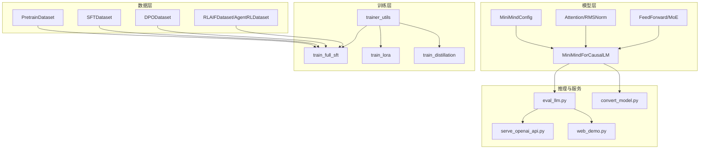
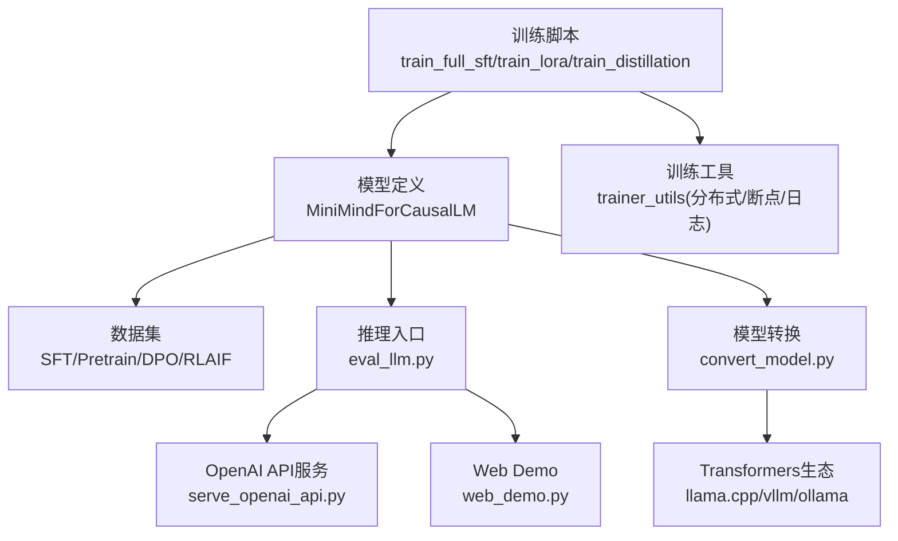
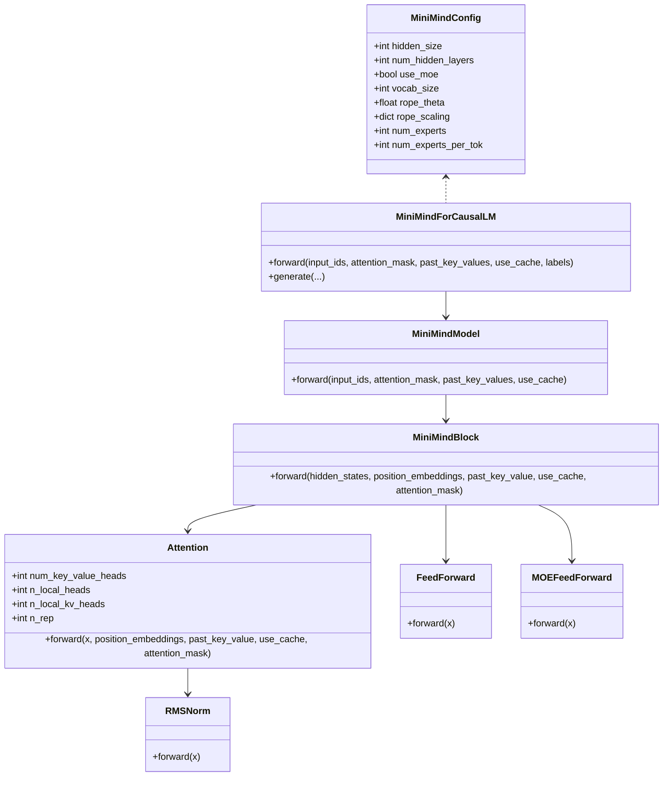
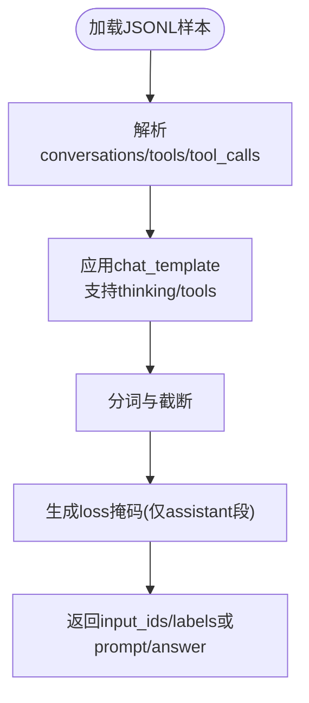
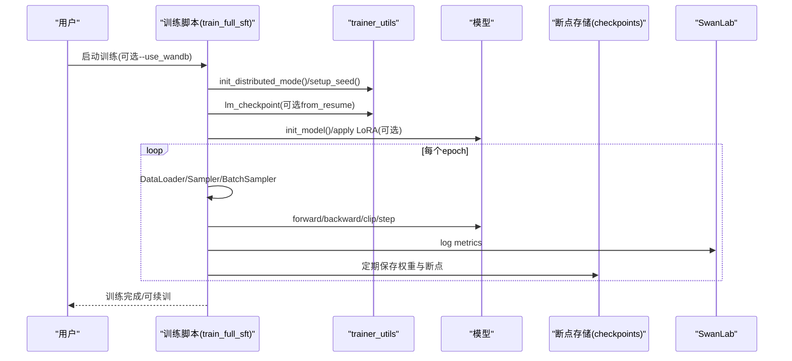
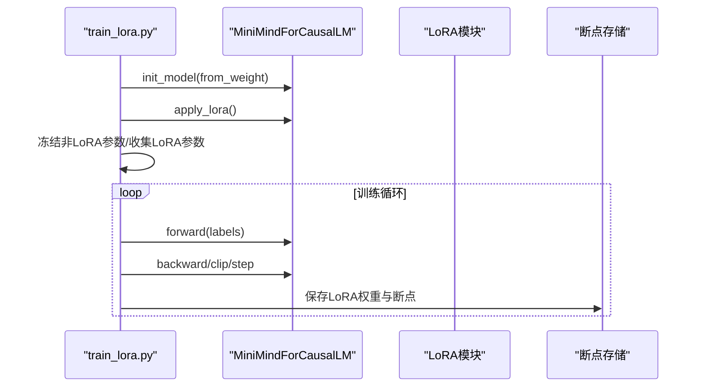
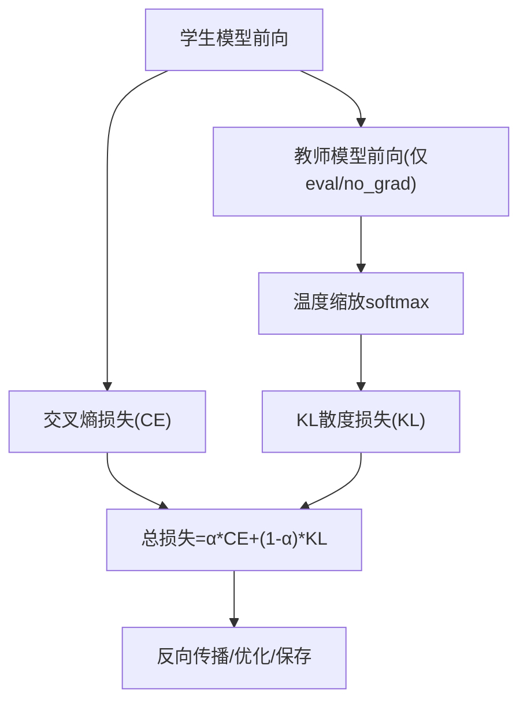
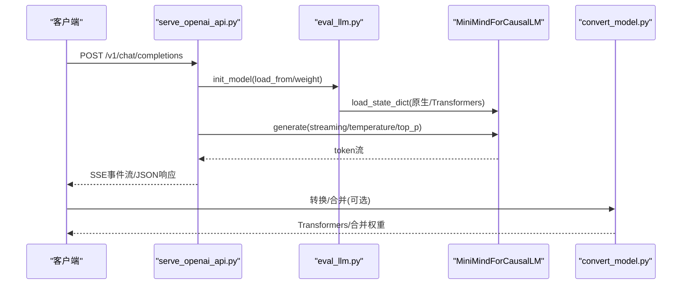
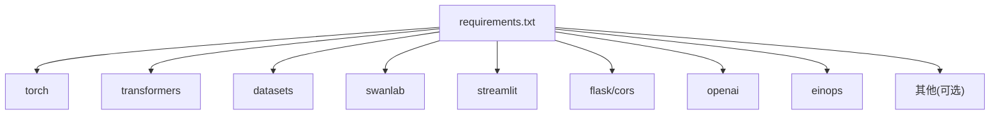

# 技术优势

<cite>
**本文引用的文件**
- [README.md](file://README.md)
- [requirements.txt](file://requirements.txt)
- [model_minimind.py](file://model/model_minimind.py)
- [model_lora.py](file://model/model_lora.py)
- [lm_dataset.py](file://dataset/lm_dataset.py)
- [trainer_utils.py](file://trainer/trainer_utils.py)
- [train_full_sft.py](file://trainer/train_full_sft.py)
- [train_lora.py](file://trainer/train_lora.py)
- [train_distillation.py](file://trainer/train_distillation.py)
- [serve_openai_api.py](file://scripts/serve_openai_api.py)
- [web_demo.py](file://scripts/web_demo.py)
- [eval_llm.py](file://eval_llm.py)
- [convert_model.py](file://scripts/convert_model.py)
</cite>

## 目录
1. [引言](#引言)
2. [项目结构](#项目结构)
3. [核心组件](#核心组件)
4. [架构总览](#架构总览)
5. [详细组件分析](#详细组件分析)
6. [依赖分析](#依赖分析)
7. [性能考量](#性能考量)
8. [故障排查指南](#故障排查指南)
9. [结论](#结论)
10. [附录](#附录)

## 引言
本项目以“大道至简”为核心理念，从零开始仅用约3元成本与约2小时训练时间，即可在个人GPU上训练出约64M参数的极小语言模型MiniMind。项目强调“从0实现”的可复现性与可理解性，所有核心算法均基于PyTorch原生实现，不依赖第三方高层抽象接口，覆盖预训练、监督微调、LoRA、知识蒸馏、DPO、PPO/GRPO/CISPO、工具调用、思维链、Agent强化学习与模型蒸馏等完整训练链路。同时，项目提供与transformers、trl、peft等主流框架以及llama.cpp、vllm、ollama等推理引擎的兼容能力，并支持单机单卡与单机多卡训练、断点续训、可视化工具集成、YaRN长序列外推、OpenAI API服务与Streamlit WebUI等实用特性。

## 项目结构
项目采用按功能域划分的模块化组织方式，核心目录与职责如下：
- model：模型定义与LoRA实现，包含MiniMind配置、注意力、FFN、MoE、生成接口等
- dataset：数据集加载与预处理，涵盖预训练、SFT、DPO、RLAIF、Agent RL等数据格式
- trainer：训练脚本与工具，包含全参数SFT、LoRA、知识蒸馏、PPO/GRPO/DPO等训练流程与分布式、断点续训、日志与可视化
- scripts：推理与服务脚本，包含OpenAI API服务、Web Demo、模型转换与合并
- eval_llm.py：统一的推理入口，支持原生权重与Transformers格式模型
- README.md：项目介绍、快速开始、训练开销与兼容性说明

图表来源
- [model_minimind.py:10-280](file://model/model_minimind.py#L10-L280)
- [lm_dataset.py:37-256](file://dataset/lm_dataset.py#L37-L256)
- [trainer_utils.py:18-177](file://trainer/trainer_utils.py#L18-L177)
- [train_full_sft.py:23-171](file://trainer/train_full_sft.py#L23-L171)
- [train_lora.py:24-184](file://trainer/train_lora.py#L24-L184)
- [train_distillation.py:24-246](file://trainer/train_distillation.py#L24-L246)
- [eval_llm.py:12-94](file://eval_llm.py#L12-L94)
- [serve_openai_api.py:28-246](file://scripts/serve_openai_api.py#L28-L246)
- [web_demo.py:198-421](file://scripts/web_demo.py#L198-L421)
- [convert_model.py:16-145](file://scripts/convert_model.py#L16-L145)

章节来源
- [README.md:75-113](file://README.md#L75-L113)
- [requirements.txt:1-32](file://requirements.txt#L1-L32)

## 核心组件
- 模型架构与生成接口：MiniMindConfig、Attention、FeedForward/MOE、MiniMindForCausalLM，支持RMSNorm、SwiGLU、RoPE/YaRN、KV缓存与生成流式输出
- 数据集与模板：PretrainDataset、SFTDataset、DPODataset、RLAIFDataset、AgentRLDataset，统一对话模板、工具调用与思维链标记
- 训练工具与分布式：trainer_utils提供分布式初始化、断点续训、学习率调度、参数统计、SkipBatchSampler等
- 训练脚本：train_full_sft、train_lora、train_distillation覆盖全参数微调、LoRA、知识蒸馏等
- 推理与服务：eval_llm.py统一推理入口；serve_openai_api.py提供OpenAI兼容API；web_demo.py提供Streamlit聊天界面；convert_model.py支持原生权重与Transformers格式互转、LoRA合并
- 可视化与生态兼容：默认使用SwanLab替代WandB，兼容transformers、trl、peft、llama.cpp、vllm、ollama等生态

章节来源
- [model_minimind.py:10-280](file://model/model_minimind.py#L10-L280)
- [lm_dataset.py:37-256](file://dataset/lm_dataset.py#L37-L256)
- [trainer_utils.py:18-177](file://trainer/trainer_utils.py#L18-L177)
- [train_full_sft.py:23-171](file://trainer/train_full_sft.py#L23-L171)
- [train_lora.py:24-184](file://trainer/train_lora.py#L24-L184)
- [train_distillation.py:24-246](file://trainer/train_distillation.py#L24-L246)
- [eval_llm.py:12-94](file://eval_llm.py#L12-L94)
- [serve_openai_api.py:28-246](file://scripts/serve_openai_api.py#L28-L246)
- [web_demo.py:198-421](file://scripts/web_demo.py#L198-L421)
- [convert_model.py:16-145](file://scripts/convert_model.py#L16-L145)
- [README.md:350-367](file://README.md#L350-L367)

## 架构总览
MiniMind采用“模型-数据-训练-推理/服务”的清晰分层，训练阶段以PyTorch原生实现为主，结合分布式与混合精度；推理阶段提供OpenAI API与WebUI，同时支持与主流生态的格式互转与工具链对接。

图表来源
- [train_full_sft.py:109-171](file://trainer/train_full_sft.py#L109-L171)
- [train_lora.py:103-184](file://trainer/train_lora.py#L103-L184)
- [train_distillation.py:145-246](file://trainer/train_distillation.py#L145-L246)
- [model_minimind.py:229-280](file://model/model_minimind.py#L229-L280)
- [lm_dataset.py:58-256](file://dataset/lm_dataset.py#L58-L256)
- [trainer_utils.py:44-177](file://trainer/trainer_utils.py#L44-L177)
- [eval_llm.py:12-94](file://eval_llm.py#L12-L94)
- [serve_openai_api.py:28-246](file://scripts/serve_openai_api.py#L28-L246)
- [web_demo.py:198-421](file://scripts/web_demo.py#L198-L421)
- [convert_model.py:16-145](file://scripts/convert_model.py#L16-L145)

## 详细组件分析

### 模型与注意力实现（PyTorch原生）
- 配置与归一化：MiniMindConfig集中管理模型超参；RMSNorm提供数值稳定与高效实现
- 注意力与RoPE：Attention模块实现Q/K/V投影、RMSNorm归一化、apply_rotary_pos_emb旋转位置编码、KV缓存与flash attention条件选择
- 前馈与MoE：FeedForward采用SwiGLU激活；MOEFeedForward实现top-1路由与专家前馈堆叠，支持aux_loss用于负载均衡
- 生成接口：MiniMindForCausalLM继承GenerationMixin，提供generate流式生成、温度/Top-p/Top-k采样、重复惩罚、eos控制与past_key_values缓存

图表来源
- [model_minimind.py:10-280](file://model/model_minimind.py#L10-L280)

章节来源
- [model_minimind.py:10-280](file://model/model_minimind.py#L10-L280)

### 数据集与模板（统一格式与标记）
- PretrainDataset：将文本转为BOS/EOS包裹的序列，标签忽略padding
- SFTDataset：应用chat_template，支持tools、reasoning_content、tool_calls等标记，生成assistant段落的loss掩码
- DPODataset：将chosen/rejected偏好样本转为相同格式，生成loss掩码
- RLAIFDataset/AgentRLDataset：支持思维链开关与工具调用模板

图表来源
- [lm_dataset.py:58-256](file://dataset/lm_dataset.py#L58-L256)

章节来源
- [lm_dataset.py:37-256](file://dataset/lm_dataset.py#L37-L256)

### 训练流程与分布式（断点续训、多卡、可视化）
- 学习率调度：余弦退火；混合精度：bfloat16/float16；梯度累积与裁剪
- 断点续训：lm_checkpoint保存模型、优化器、scaler、wandb run id与step；支持跨GPU数量恢复
- 分布式：DDP包装、NCCL后端、忽略freqs_cos/sin参数；SkipBatchSampler跳过已训练step
- 可视化：默认SwanLab（兼容WandB），记录loss、学习率、耗时等

图表来源
- [train_full_sft.py:109-171](file://trainer/train_full_sft.py#L109-L171)
- [trainer_utils.py:63-117](file://trainer/trainer_utils.py#L63-L117)

章节来源
- [train_full_sft.py:23-171](file://trainer/train_full_sft.py#L23-L171)
- [trainer_utils.py:44-117](file://trainer/trainer_utils.py#L44-L117)
- [README.md:350-367](file://README.md#L350-L367)

### LoRA参数高效微调（纯原生实现）
- LoRA模块：低秩A/B矩阵注入，原地forward叠加；apply_lora遍历Linear层，动态替换forward
- 训练策略：冻结非LoRA参数，仅训练A/B；统计LoRA参数占比；支持断点续训与分布式
- 合并与转换：convert_model.py支持LoRA与基模合并为完整权重，便于部署

图表来源
- [train_lora.py:127-184](file://trainer/train_lora.py#L127-L184)
- [model_lora.py:6-66](file://model/model_lora.py#L6-L66)
- [convert_model.py:105-113](file://scripts/convert_model.py#L105-L113)

章节来源
- [train_lora.py:24-184](file://trainer/train_lora.py#L24-L184)
- [model_lora.py:6-66](file://model/model_lora.py#L6-L66)
- [convert_model.py:105-113](file://scripts/convert_model.py#L105-L113)

### 知识蒸馏（白盒与黑盒）
- 白盒蒸馏：CE + KL散度，温度缩放，支持MoE与Dense组合蒸馏
- 黑盒蒸馏：以教师输出作为监督信号的SFT
- 训练脚本：train_distillation.py实现蒸馏损失、混合精度、断点续训与分布式

图表来源
- [train_distillation.py:24-93](file://trainer/train_distillation.py#L24-L93)

章节来源
- [train_distillation.py:24-246](file://trainer/train_distillation.py#L24-L246)

### 推理与服务（OpenAI API、WebUI、格式转换）
- 推理入口：eval_llm.py支持原生权重与Transformers格式，可选LoRA合并、思维链与工具调用
- OpenAI API：serve_openai_api.py提供/v1/chat/completions，支持流式与非流式响应、thinking与tool_calls解析
- Web Demo：web_demo.py基于Streamlit，支持工具选择、思维链折叠展示、多轮对话与流式生成
- 格式转换：convert_model.py支持原生权重→Transformers/Qwen结构、LoRA合并、模板互转

图表来源
- [serve_openai_api.py:105-227](file://scripts/serve_openai_api.py#L105-L227)
- [eval_llm.py:12-94](file://eval_llm.py#L12-L94)
- [convert_model.py:16-97](file://scripts/convert_model.py#L16-L97)

章节来源
- [eval_llm.py:12-94](file://eval_llm.py#L12-L94)
- [serve_openai_api.py:28-246](file://scripts/serve_openai_api.py#L28-L246)
- [web_demo.py:198-421](file://scripts/web_demo.py#L198-L421)
- [convert_model.py:16-145](file://scripts/convert_model.py#L16-L145)

## 依赖分析
- 运行时依赖：PyTorch、transformers、datasets、accelerate风格的分布式与tokenizer生态
- 训练可视化：默认SwanLab（兼容WandB），可选OpenAI SDK、Flask/CORS、Streamlit、ujson、einops等
- 与生态兼容：通过convert_model.py与Transformers/Qwen结构对齐，支持llama.cpp、vllm、ollama等推理引擎

图表来源
- [requirements.txt:1-32](file://requirements.txt#L1-L32)

章节来源
- [requirements.txt:1-32](file://requirements.txt#L1-L32)
- [README.md:92-96](file://README.md#L92-L96)

## 性能考量
- 训练效率
  - 混合精度：bfloat16/float16，显著降低显存占用与提升吞吐
  - Flash Attention：在满足条件时使用scaled_dot_product_attention
  - 梯度累积与裁剪：平衡显存与收敛稳定性
  - 断点续训：避免长时间训练中断导致的进度丢失
- 推理效率
  - KV缓存：past_key_values减少重复计算
  - 生成策略：温度、Top-p、Top-k、重复惩罚可控
  - YaRN：RoPE外推提升长序列生成能力
- 成本控制
  - 小模型参数量（64M/198M MoE），单卡3090约2小时可完成Zero模型复现
  - LoRA参数高效微调，显著降低训练与部署成本
  - 原生权重与格式转换，减少第三方依赖带来的额外开销

章节来源
- [model_minimind.py:108-133](file://model/model_minimind.py#L108-L133)
- [train_full_sft.py:119-138](file://trainer/train_full_sft.py#L119-L138)
- [README.md:618-649](file://README.md#L618-L649)

## 故障排查指南
- 分布式与多卡
  - 确认NCCL后端与CUDA可见设备；torchrun --nproc_per_node N启动多卡
  - DDP忽略freqs_cos/sin参数，避免同步异常
- 断点续训
  - 检查checkpoints目录权重与resume文件；跨GPU数量会自动调整step
  - 若wandb记录连续性，确保run id一致
- 可视化
  - 国内网络环境建议使用SwanLab替代WandB
- 推理与服务
  - OpenAI API：确认chat_template与thinking/tool_calls标记解析
  - Web Demo：确保模型目录扫描与权重文件存在
- LoRA与转换
  - 合并LoRA前确保基模与LoRA权重路径正确；转换为Transformers格式时注意专家权重映射

章节来源
- [trainer_utils.py:44-117](file://trainer/trainer_utils.py#L44-L117)
- [README.md:354-367](file://README.md#L354-L367)
- [serve_openai_api.py:83-102](file://scripts/serve_openai_api.py#L83-L102)
- [web_demo.py:239-249](file://scripts/web_demo.py#L239-L249)
- [convert_model.py:105-113](file://scripts/convert_model.py#L105-L113)

## 结论
MiniMind通过“从0实现”的PyTorch原生架构，实现了在个人GPU上低成本、高效率、可复现的完整LLM训练与推理链路。项目在技术架构、训练效率、成本控制与易用性方面具备显著优势：以原生实现确保可理解性与可扩展性；以断点续训、分布式、混合精度与LoRA等手段提升效率与降低成本；以统一数据模板与OpenAI API/WebUI提升易用性；以格式转换与生态兼容增强实用性。这些优势共同构成了MiniMind在入门教学、快速复现与个人实践场景中的独特价值。

## 附录
- 快速开始与训练开销参考见README中的“快速开始”与“训练开销”章节
- 数据集与推荐组合见README“数据介绍”章节

章节来源
- [README.md:216-367](file://README.md#L216-L367)