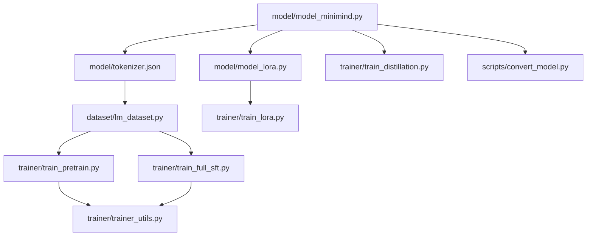
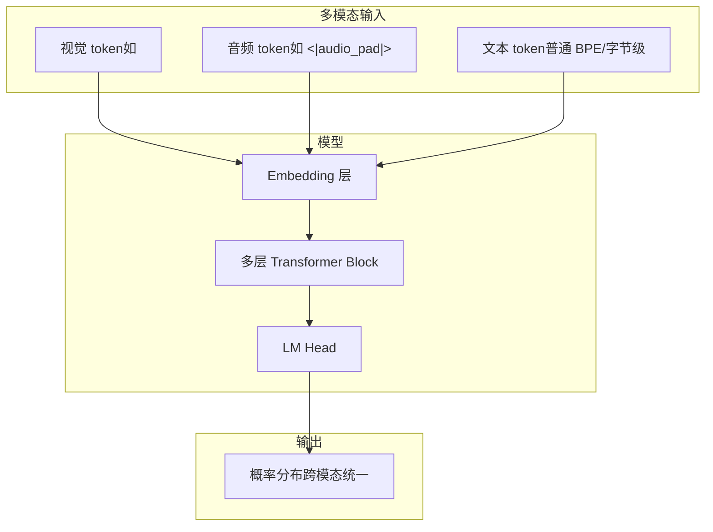
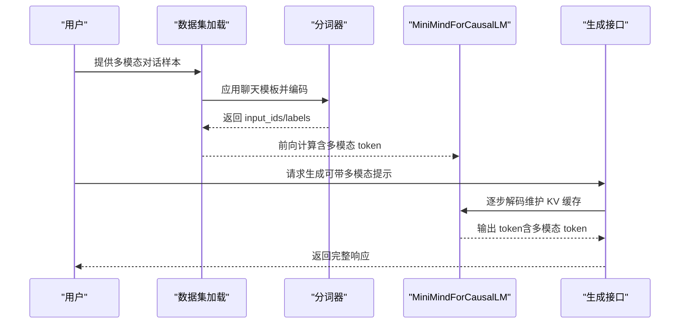
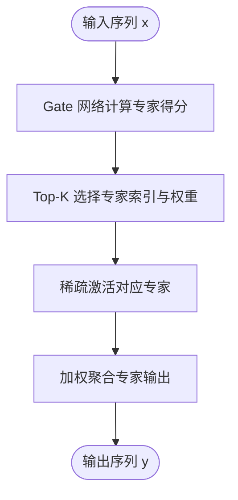
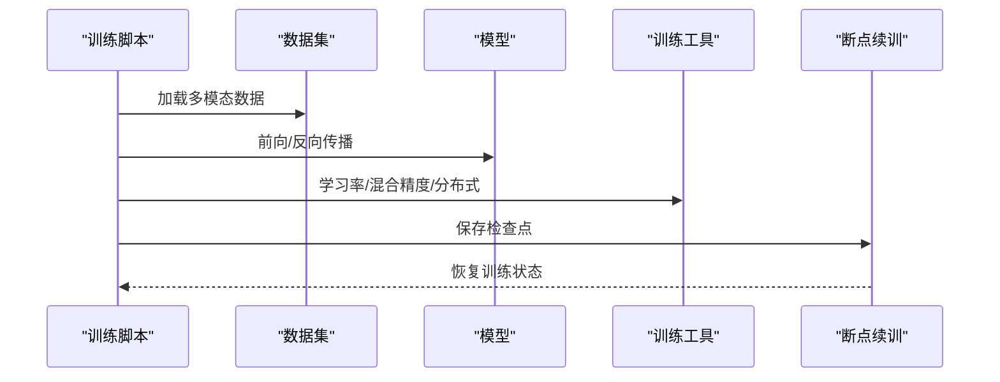
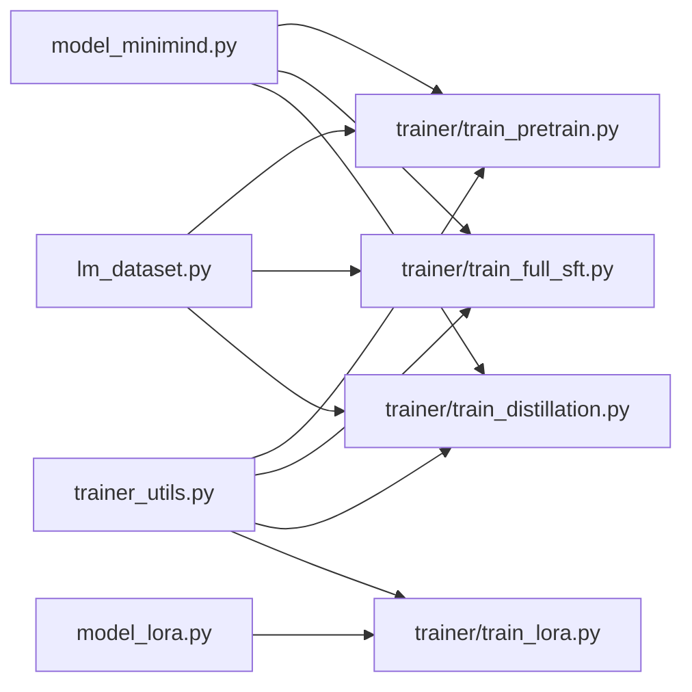

# 多模态扩展能力

<cite>
**本文引用的文件**
- [README.md](file://README.md)
- [model_minimind.py](file://model/model_minimind.py)
- [model_lora.py](file://model/model_lora.py)
- [lm_dataset.py](file://dataset/lm_dataset.py)
- [train_pretrain.py](file://trainer/train_pretrain.py)
- [train_full_sft.py](file://trainer/train_full_sft.py)
- [trainer_utils.py](file://trainer/trainer_utils.py)
- [convert_model.py](file://scripts/convert_model.py)
- [train_lora.py](file://trainer/train_lora.py)
- [train_distillation.py](file://trainer/train_distillation.py)
- [tokenizer.json](file://model/tokenizer.json)
- [tokenizer_config.json](file://model/tokenizer_config.json)
- [README_en.md](file://README_en.md)
</cite>

## 目录
1. [引言](#引言)
2. [项目结构](#项目结构)
3. [核心组件](#核心组件)
4. [架构总览](#架构总览)
5. [详细组件分析](#详细组件分析)
6. [依赖分析](#依赖分析)
7. [性能考量](#性能考量)
8. [故障排查指南](#故障排查指南)
9. [结论](#结论)
10. [附录](#附录)

## 引言
本文件聚焦 MiniMind 的多模态扩展能力，系统阐述其在保持原有轻量化优势的基础上，如何扩展到视觉、音频等多模态场景。文档涵盖：
- 多模态架构设计原则与扩展路径
- MoE（专家混合）在多模态场景的应用（路由、负载均衡）
- 线性注意力在长序列处理中的优势与实现要点
- 训练与推理示例，指导在现有架构基础上进行扩展开发

MiniMind 已在主线中兼容 Qwen3/Qwen3-MoE 风格配置，并提供实验性扩展：离散扩散语言模型（dLM）与线性注意力模型（Linear Attention），均可基于主线 AR 模型进行续训。

**章节来源**
- [README.md: 34-39:34-39](file://README.md#L34-L39)
- [README_en.md: 85-97:85-97](file://README_en.md#L85-L97)

## 项目结构
本项目采用“按功能域划分”的模块化组织方式，核心目录与职责如下：
- model：模型定义与轻量实现（含 MoE、注意力、生成等）
- dataset：数据集加载与预处理（SFT/Pretrain/DPO/RL等）
- trainer：训练脚本（预训练、SFT、LoRA、蒸馏、RL等）
- scripts：模型转换与推理辅助工具
- images：项目配图与结构图

**图表来源**
- [model_minimind.py: 1-280:1-280](file://model/model_minimind.py#L1-L280)
- [model_lora.py: 1-66:1-66](file://model/model_lora.py#L1-L66)
- [lm_dataset.py: 1-256:1-256](file://dataset/lm_dataset.py#L1-L256)
- [train_pretrain.py: 1-170:1-170](file://trainer/train_pretrain.py#L1-L170)
- [train_full_sft.py: 1-171:1-171](file://trainer/train_full_sft.py#L1-L171)
- [trainer_utils.py: 1-177:1-177](file://trainer/trainer_utils.py#L1-L177)
- [train_lora.py: 1-184:1-184](file://trainer/train_lora.py#L1-L184)
- [train_distillation.py: 1-246:1-246](file://trainer/train_distillation.py#L1-L246)
- [convert_model.py: 1-145:1-145](file://scripts/convert_model.py#L1-L145)

**章节来源**
- [README.md: 216-368:216-368](file://README.md#L216-L368)

## 核心组件
- 模型核心：MiniMindConfig、Attention（含 Flash Attention 与常规注意力）、FeedForward、MOEFeedForward、MiniMindBlock、MiniMindModel、MiniMindForCausalLM
- 训练工具：分布式初始化、学习率调度、断点续训、混合精度、参数统计
- 数据集：Pretrain/SFT/DPO/RLAIF 等数据集封装
- LoRA：低秩适配模块与合并逻辑
- 转换工具：PyTorch↔Transformers 格式互转，兼容 Qwen3/Qwen3-MoE

**章节来源**
- [model_minimind.py: 10-280:10-280](file://model/model_minimind.py#L10-L280)
- [trainer_utils.py: 18-177:18-177](file://trainer/trainer_utils.py#L18-L177)
- [lm_dataset.py: 37-256:37-256](file://dataset/lm_dataset.py#L37-L256)
- [model_lora.py: 5-66:5-66](file://model/model_lora.py#L5-L66)
- [convert_model.py: 16-96:16-96](file://scripts/convert_model.py#L16-L96)

## 架构总览
MiniMind 的多模态扩展遵循“以文本为主、按模态注入 token”的统一接口设计：
- 统一词表：通过 tokenizer.json/tokenizer_config.json 定义特殊 token（如视觉/音频占位符），保证多模态 token 与文本 token 的无缝拼接
- 模型结构：在现有 Decoder-only 架构上，通过输入拼接实现多模态融合；推理时通过生成接口扩展多模态提示
- 训练管线：预训练与 SFT 阶段均可直接使用多模态 token 输入，无需额外解码器

**图表来源**
- [tokenizer.json: 1-200:1-200](file://model/tokenizer.json#L1-L200)
- [tokenizer_config.json: 310-332:310-332](file://model/tokenizer_config.json#L310-L332)
- [model_minimind.py: 195-246:195-246](file://model/model_minimind.py#L195-L246)

## 详细组件分析

### 多模态架构设计与扩展路径
- 统一接口：通过 tokenizer 的特殊 token（如视觉/音频起止、占位符）实现多模态 token 插入，保持与文本 token 的一致处理
- 输入拼接：在数据加载阶段将多模态 token 与文本 token 拼接为统一序列，送入模型进行联合建模
- 推理扩展：在生成接口中支持多模态提示（如在对话模板中插入视觉/音频 token），并在 KV 缓存中维持一致性

**图表来源**
- [lm_dataset.py: 58-119:58-119](file://dataset/lm_dataset.py#L58-L119)
- [model_minimind.py: 229-280:229-280](file://model/model_minimind.py#L229-L280)

**章节来源**
- [tokenizer.json: 1-200:1-200](file://model/tokenizer.json#L1-L200)
- [tokenizer_config.json: 310-332:310-332](file://model/tokenizer_config.json#L310-L332)
- [lm_dataset.py: 58-119:58-119](file://dataset/lm_dataset.py#L58-L119)
- [model_minimind.py: 229-280:229-280](file://model/model_minimind.py#L229-L280)

### MoE（专家混合）在多模态场景的应用
- 路由机制：Gate 网络对每个 token 计算专家得分，Top-1/Top-K 选择激活专家，实现稀疏激活
- 负载均衡：通过辅助损失（aux_loss）鼓励均匀分配，缓解专家过载
- 多模态扩展：在多模态输入中，仍按 token 级别进行专家路由，保持路由一致性

**图表来源**
- [model_minimind.py: 147-175:147-175](file://model/model_minimind.py#L147-L175)

**章节来源**
- [model_minimind.py: 147-175:147-175](file://model/model_minimind.py#L147-L175)

### 线性注意力在长序列处理中的优势
- 时间复杂度：线性注意力将注意力计算从二次方降至线性，显著降低长序列推理与训练的内存与时间开销
- 实现要点：通过核函数近似或局部窗口机制，维持长程依赖建模能力
- 适用场景：在多模态长序列（如视频帧序列、长音频片段）中，线性注意力可有效支撑高效建模

[本节为概念性说明，不直接分析具体文件]

### 训练与推理示例（基于现有架构扩展）
- 预训练与 SFT：可直接使用多模态 token 输入进行训练，数据加载与损失计算与文本一致
- LoRA 适配：在现有 LoRA 模块基础上，冻结主干参数，仅训练低秩增量，实现多模态场景的参数高效微调
- 蒸馏：可使用教师模型（如更大规模的 MoE 模型）对多模态学生模型进行知识蒸馏

**图表来源**
- [train_pretrain.py: 23-81:23-81](file://trainer/train_pretrain.py#L23-L81)
- [train_full_sft.py: 23-82:23-82](file://trainer/train_full_sft.py#L23-L82)
- [trainer_utils.py: 63-117:63-117](file://trainer/trainer_utils.py#L63-L117)

**章节来源**
- [train_pretrain.py: 23-81:23-81](file://trainer/train_pretrain.py#L23-L81)
- [train_full_sft.py: 23-82:23-82](file://trainer/train_full_sft.py#L23-L82)
- [trainer_utils.py: 63-117:63-117](file://trainer/trainer_utils.py#L63-L117)
- [train_lora.py: 127-184:127-184](file://trainer/train_lora.py#L127-L184)
- [train_distillation.py: 38-143:38-143](file://trainer/train_distillation.py#L38-L143)

## 依赖分析
- 模块内聚：模型定义集中在 model_minimind.py，训练工具集中在 trainer_utils.py，数据加载集中在 lm_dataset.py
- 训练脚本耦合：train_pretrain.py 与 train_full_sft.py 均依赖 trainer_utils.init_model 与数据集封装
- LoRA 与蒸馏：train_lora.py 依赖 model_lora.py，train_distillation.py 依赖教师/学生模型封装

**图表来源**
- [model_minimind.py: 10-280:10-280](file://model/model_minimind.py#L10-L280)
- [model_lora.py: 1-66:1-66](file://model/model_lora.py#L1-L66)
- [lm_dataset.py: 1-256:1-256](file://dataset/lm_dataset.py#L1-L256)
- [train_pretrain.py: 16-18:16-18](file://trainer/train_pretrain.py#L16-L18)
- [train_full_sft.py: 16-18:16-18](file://trainer/train_full_sft.py#L16-L18)
- [trainer_utils.py: 16-16:16-16](file://trainer/trainer_utils.py#L16-L16)
- [train_lora.py: 16-19:16-19](file://trainer/train_lora.py#L16-L19)
- [train_distillation.py: 17-19:17-19](file://trainer/train_distillation.py#L17-L19)

**章节来源**
- [model_minimind.py: 10-280:10-280](file://model/model_minimind.py#L10-L280)
- [model_lora.py: 1-66:1-66](file://model/model_lora.py#L1-L66)
- [lm_dataset.py: 1-256:1-256](file://dataset/lm_dataset.py#L1-L256)
- [train_pretrain.py: 16-18:16-18](file://trainer/train_pretrain.py#L16-L18)
- [train_full_sft.py: 16-18:16-18](file://trainer/train_full_sft.py#L16-L18)
- [trainer_utils.py: 16-16:16-16](file://trainer/trainer_utils.py#L16-L16)
- [train_lora.py: 16-19:16-19](file://trainer/train_lora.py#L16-L19)
- [train_distillation.py: 17-19:17-19](file://trainer/train_distillation.py#L17-L19)

## 性能考量
- 注意力优化：在注意力实现中优先使用内置 scaled_dot_product_attention（Flash Attention），在满足条件时自动走高效路径
- 混合精度：训练脚本支持 bfloat16/float16，结合 GradScaler 提升吞吐
- 分布式训练：支持 DDP，自动忽略某些缓冲参数参与同步，减少通信开销
- MoE 训练成本：专家路由与调度带来额外 kernel 启停开销，建议在当前实现下采用适度专家数与 top-1 路由

**章节来源**
- [model_minimind.py: 108-133:108-133](file://model/model_minimind.py#L108-L133)
- [train_pretrain.py: 118-122:118-122](file://trainer/train_pretrain.py#L118-L122)
- [train_full_sft.py: 119-123:119-123](file://trainer/train_full_sft.py#L119-L123)
- [trainer_utils.py: 44-51:44-51](file://trainer/trainer_utils.py#L44-L51)
- [README.md: 569-570:569-570](file://README.md#L569-L570)

## 故障排查指南
- 断点续训：检查 checkpoints 目录是否存在 resume 文件，确认 world_size 变化时 step 的自动转换
- 分布式初始化：确认 LOCAL_RANK/RANK 环境变量，确保 NCCL 后端可用
- 混合精度：CPU/CUDA 环境下自动切换上下文，避免 dtype 不匹配
- LoRA 冲突：torch.compile 与 monkey-patch forward 不兼容，训练 LoRA 时会自动关闭 use_compile

**章节来源**
- [trainer_utils.py: 63-117:63-117](file://trainer/trainer_utils.py#L63-L117)
- [trainer_utils.py: 44-51:44-51](file://trainer/trainer_utils.py#L44-L51)
- [train_lora.py: 163-166:163-166](file://trainer/train_lora.py#L163-L166)

## 结论
MiniMind 在保持轻量化与易复现的前提下，提供了清晰的多模态扩展路径：以统一词表与输入拼接为核心，结合现有注意力与 MoE 能力，可在不破坏原有架构的前提下扩展到视觉、音频等模态。实验性扩展（dLM、Linear Attention）为长序列与更高效注意力提供了新方向。配合完善的训练与转换工具链，开发者可基于主线架构快速开展多模态扩展与落地。

[本节为总结性内容，不直接分析具体文件]

## 附录
- 模型转换：支持将 PyTorch 权重转换为 Transformers 格式（含 Qwen3/Qwen3-MoE），便于生态对接
- 推理接口：生成接口支持温度、top-k/top-p、重复惩罚等采样策略，适配多模态提示

**章节来源**
- [convert_model.py: 16-96:16-96](file://scripts/convert_model.py#L16-L96)
- [model_minimind.py: 229-280:229-280](file://model/model_minimind.py#L229-L280)