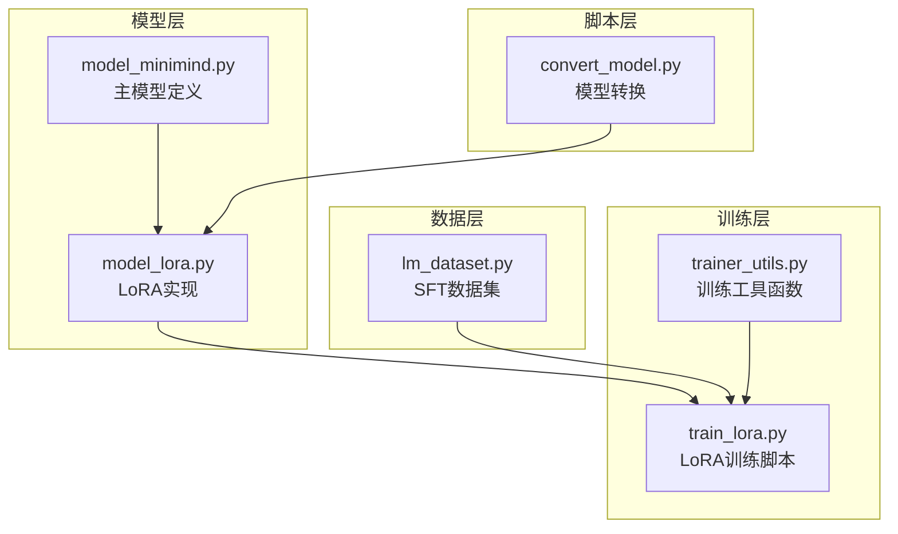
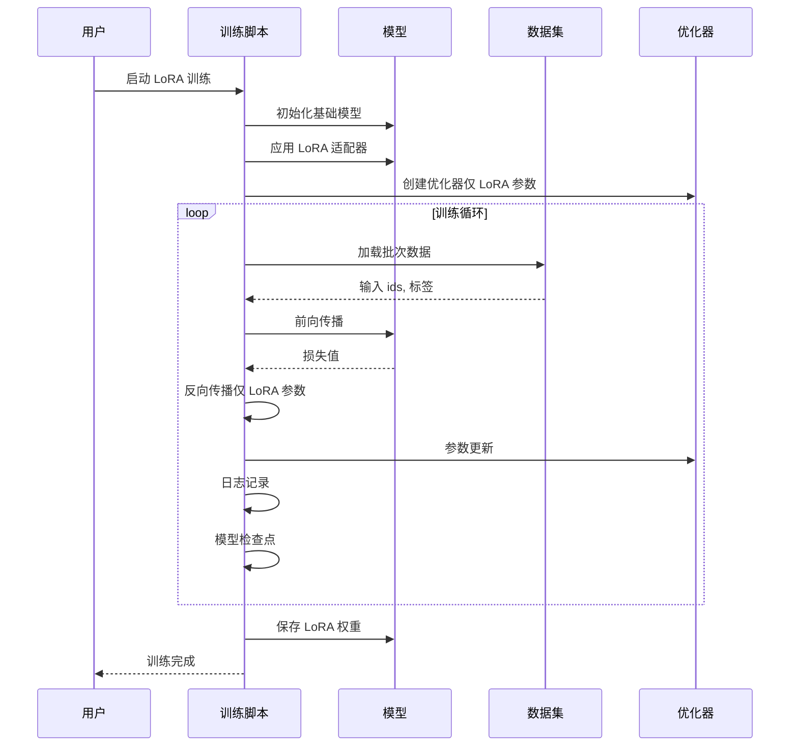
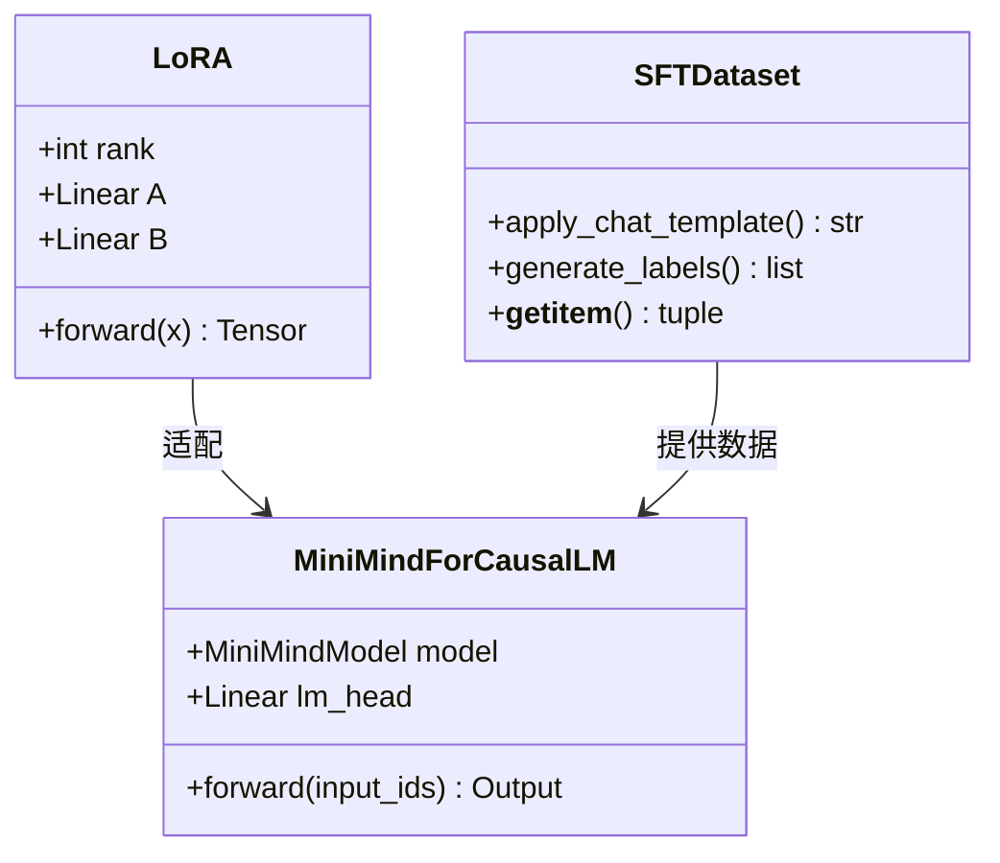
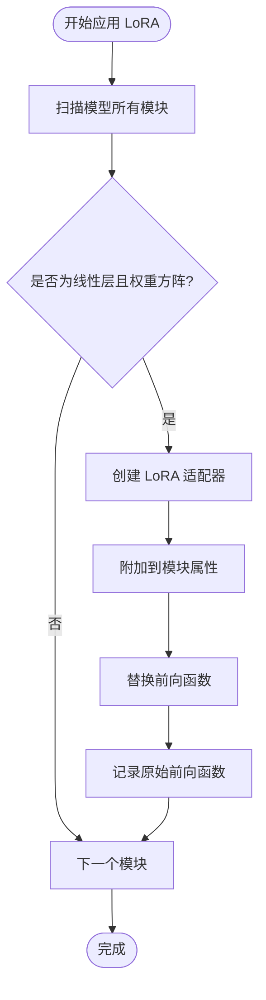
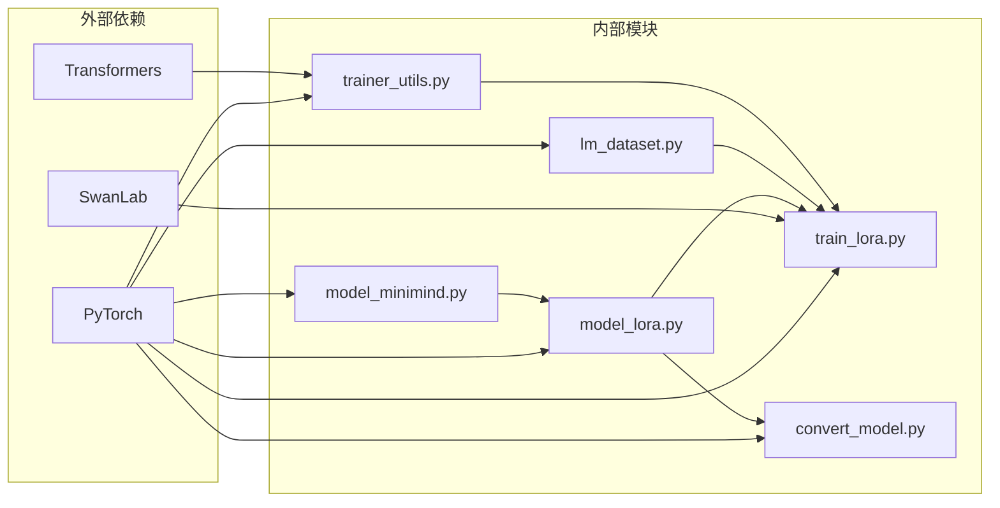

# LoRA 微调阶段

<cite>
**本文档引用的文件**
- [model_lora.py](file://model/model_lora.py)
- [train_lora.py](file://trainer/train_lora.py)
- [model_minimind.py](file://model/model_minimind.py)
- [lm_dataset.py](file://dataset/lm_dataset.py)
- [trainer_utils.py](file://trainer/trainer_utils.py)
- [README.md](file://README.md)
- [convert_model.py](file://scripts/convert_model.py)
- [requirements.txt](file://requirements.txt)
</cite>

## 目录
1. [引言](#引言)
2. [项目结构](#项目结构)
3. [核心组件](#核心组件)
4. [架构概览](#架构概览)
5. [详细组件分析](#详细组件分析)
6. [依赖关系分析](#依赖关系分析)
7. [性能考量](#性能考量)
8. [故障排除指南](#故障排除指南)
9. [结论](#结论)
10. [附录](#附录)

## 引言
本节介绍 MiniMind 项目中的 LoRA（低秩适配）微调阶段。LoRA 是一种参数高效微调（PEFT）方法，通过在预训练模型的线性层上添加低秩增量分支，仅训练少量新增参数，从而在保持基础模型通用能力的同时，实现对特定领域或任务的快速适配。MiniMind 的 LoRA 实现完全基于 PyTorch 原生代码，不依赖第三方封装，具有以下特点：
- 低秩适配矩阵设计：通过两个低秩矩阵 A 和 B 实现参数高效的增量更新
- 冻结预训练权重：仅训练 LoRA 参数，冻结基础模型权重
- 适配器初始化策略：矩阵 A 采用高斯初始化，矩阵 B 采用零初始化
- 权重合并导出：支持将 LoRA 权重与基础模型权重合并为完整模型

## 项目结构
MiniMind 项目采用模块化设计，LoRA 微调相关的代码分布在以下目录：
- `model/`：包含模型定义和 LoRA 实现
- `trainer/`：包含训练脚本和工具函数
- `dataset/`：包含数据集处理逻辑
- `scripts/`：包含模型转换和合并工具

**图表来源**
- [model_minimind.py:195-280](file://model/model_minimind.py#L195-L280)
- [model_lora.py:1-66](file://model/model_lora.py#L1-L66)
- [train_lora.py:1-184](file://trainer/train_lora.py#L1-L184)
- [lm_dataset.py:58-119](file://dataset/lm_dataset.py#L58-L119)
- [trainer_utils.py:119-131](file://trainer/trainer_utils.py#L119-L131)
- [convert_model.py:105-112](file://scripts/convert_model.py#L105-L112)

**章节来源**
- [README.md:765-780](file://README.md#L765-L780)
- [requirements.txt:1-32](file://requirements.txt#L1-L32)

## 核心组件
本节深入分析 LoRA 微调阶段的核心组件及其相互关系。

### LoRA 适配器类
LoRA 适配器通过低秩矩阵分解实现参数高效的微调：
- **秩参数（rank）**：控制低秩矩阵的大小，影响适配器的表达能力和计算复杂度
- **矩阵 A**：输入投影矩阵，将输入特征映射到低秩空间
- **矩阵 B**：输出投影矩阵，将低秩特征映射回原始输出空间
- **初始化策略**：矩阵 A 采用高斯初始化（均值0，标准差0.02），矩阵 B 采用零初始化

### 适配器应用机制
LoRA 适配器通过动态替换线性层前向函数实现无缝集成：
- **条件匹配**：仅对权重矩阵为方阵的线性层应用 LoRA
- **前向函数重写**：将原始前向函数与 LoRA 增量相加
- **参数冻结**：基础模型权重保持不变，仅训练 LoRA 参数

### 训练配置与优化
LoRA 训练采用与全参数微调相同的训练框架，但参数管理更加精细：
- **参数收集**：仅收集包含 'lora' 的参数参与优化
- **梯度裁剪**：对 LoRA 参数进行梯度裁剪，防止梯度爆炸
- **混合精度**：支持 bfloat16 和 float16 混合精度训练
- **学习率调度**：使用余弦退火学习率调度策略

**章节来源**
- [model_lora.py:6-33](file://model/model_lora.py#L6-L33)
- [train_lora.py:127-146](file://trainer/train_lora.py#L127-L146)

## 架构概览
LoRA 微调阶段的整体架构体现了参数高效微调的设计理念：

**图表来源**
- [train_lora.py:24-76](file://trainer/train_lora.py#L24-L76)
- [model_lora.py:21-33](file://model/model_lora.py#L21-L33)
- [lm_dataset.py:106-119](file://dataset/lm_dataset.py#L106-L119)

## 详细组件分析

### LoRA 类实现分析
LoRA 类的设计体现了低秩矩阵分解的核心思想：

**图表来源**
- [model_lora.py:6-18](file://model/model_lora.py#L6-L18)
- [model_minimind.py:229-246](file://model/model_minimind.py#L229-L246)
- [lm_dataset.py:58-119](file://dataset/lm_dataset.py#L58-L119)

#### LoRA 参数初始化策略
- **矩阵 A 初始化**：采用高斯分布 N(0, 0.02²)，确保适配器具有适当的表达能力
- **矩阵 B 初始化**：采用零初始化，使初始状态下适配器对基础模型输出无影响
- **偏差设置**：两个矩阵均不包含偏差项，保持与基础模型线性层结构一致

#### 适配器应用流程

**图表来源**
- [model_lora.py:21-33](file://model/model_lora.py#L21-L33)

**章节来源**
- [model_lora.py:1-66](file://model/model_lora.py#L1-L66)

### 训练流程详解
LoRA 训练流程与全参数微调保持一致的训练框架，但参数管理更加精细化：

#### 训练参数收集与冻结
- **参数分离**：通过 'lora' 关键字区分 LoRA 参数和基础模型参数
- **梯度控制**：仅对 LoRA 参数启用梯度计算，基础模型参数保持 requires_grad=False
- **内存优化**：避免存储基础模型参数的梯度，显著减少内存占用

#### 学习率调度与优化
- **余弦退火调度**：使用余弦退火策略，学习率从初始值平滑衰减到 0.1 倍
- **动态调整**：每个训练步动态计算学习率，支持学习率热重启
- **优化器配置**：使用 AdamW 优化器，学习率可配置，支持权重衰减

#### 混合精度训练
- **自动混合精度**：支持 bfloat16 和 float16，提高训练效率
- **梯度缩放**：使用 GradScaler 防止梯度下溢
- **CPU 兼容**：在 CPU 上自动降级为正常精度

**章节来源**
- [train_lora.py:24-76](file://trainer/train_lora.py#L24-L76)
- [trainer_utils.py:40-42](file://trainer/trainer_utils.py#L40-L42)

### 数据处理与适配
LoRA 训练使用与全参数微调相同的 SFT 数据格式，但适配器的应用使其能够快速适应特定领域的对话模式：

#### 对话模板处理
- **系统提示**：可选的系统提示注入，提高对话一致性
- **工具调用**：支持工具调用数据的完整保留
- **思考标签**：处理包含思考内容的对话样本

#### 标签生成机制
- **损失掩码**：仅对助手回复部分计算损失
- **特殊标记**：使用 BOS 和 EOS 标记标识回复范围
- **填充处理**：正确处理序列填充，避免对损失计算产生影响

**章节来源**
- [lm_dataset.py:58-119](file://dataset/lm_dataset.py#L58-L119)

## 依赖关系分析
LoRA 微调阶段的依赖关系体现了模块化设计的优势：

**图表来源**
- [requirements.txt:1-32](file://requirements.txt#L1-L32)
- [model_minimind.py:1-6](file://model/model_minimind.py#L1-L6)
- [model_lora.py:1-2](file://model/model_lora.py#L1-L2)
- [train_lora.py:1-19](file://trainer/train_lora.py#L1-L19)
- [lm_dataset.py:1-6](file://dataset/lm_dataset.py#L1-L6)
- [trainer_utils.py:1-16](file://trainer/trainer_utils.py#L1-L16)
- [convert_model.py:1-12](file://scripts/convert_model.py#L1-L12)

### 关键依赖关系
- **PyTorch 核心依赖**：所有模块都依赖 PyTorch 进行张量运算和自动微分
- **模型依赖链**：MiniMindForCausalLM 依赖 MiniMindModel，LoRA 适配器依赖线性层结构
- **训练工具依赖**：训练脚本依赖工具函数进行分布式训练、检查点管理和学习率调度

**章节来源**
- [requirements.txt:1-32](file://requirements.txt#L1-L32)

## 性能考量
LoRA 微调在多个方面展现出显著的性能优势：

### 内存占用优化
- **参数数量**：LoRA 参数数量通常仅为基础模型参数的 0.1%-1%，显著减少内存占用
- **梯度存储**：仅存储 LoRA 参数的梯度，避免存储基础模型参数梯度
- **缓存效率**：LoRA 参数更小，提高了 GPU 缓存的利用率

### 训练速度提升
- **计算复杂度**：LoRA 增量计算的计算复杂度与基础模型无关，训练速度接近线性增长
- **收敛速度**：在特定领域数据上通常具有更快的收敛速度
- **推理效率**：推理时仅需基础模型，无需额外的 LoRA 计算

### 适用场景分析
- **垂直领域适配**：医疗、法律、金融等专业领域的快速适配
- **多任务学习**：为不同任务维护独立的 LoRA 适配器
- **模型版本管理**：通过 LoRA 权重实现模型版本的增量更新

## 故障排除指南
针对 LoRA 微调阶段可能出现的问题提供解决方案：

### 常见问题与解决方案

#### 1. 内存不足问题
**症状**：训练过程中出现 OOM 错误
**解决方案**：
- 减少批量大小（batch_size）
- 降低秩参数（rank）值
- 使用更小的学习率
- 启用混合精度训练

#### 2. 训练不收敛
**症状**：损失值不下降或收敛缓慢
**解决方案**：
- 检查学习率设置是否合适
- 验证 LoRA 参数是否正确训练
- 确认数据质量是否足够
- 调整梯度裁剪阈值

#### 3. LoRA 权重加载失败
**症状**：加载 LoRA 权重时报错
**解决方案**：
- 确认权重文件路径正确
- 检查模型结构是否匹配
- 验证权重文件完整性
- 确认设备兼容性

#### 4. 推理结果异常
**症状**：推理时输出质量不佳
**解决方案**：
- 检查 LoRA 权重是否正确应用
- 验证模型配置参数
- 确认推理参数设置
- 测试基础模型性能

**章节来源**
- [train_lora.py:127-146](file://trainer/train_lora.py#L127-L146)
- [model_lora.py:35-53](file://model/model_lora.py#L35-L53)

## 结论
MiniMind 项目的 LoRA 微调实现展现了参数高效微调技术的精髓。通过精心设计的低秩适配器、精确的参数管理策略和完善的训练框架，LoRA 技术能够在保持基础模型通用能力的同时，实现对特定领域的快速适配。该实现具有以下优势：
- **参数高效**：仅训练少量新增参数，显著减少计算资源消耗
- **易于部署**：支持权重合并导出，便于在生产环境中部署
- **灵活性强**：适用于多种垂直领域和任务场景
- **可扩展性好**：支持多任务学习和模型版本管理

对于希望在资源受限环境下进行高效微调的研究者和开发者，MiniMind 的 LoRA 实现提供了一个优秀的参考实现和实践指南。

## 附录

### 最佳实践建议
1. **参数设置**：根据数据规模和计算资源合理设置 rank 值
2. **学习率选择**：LoRA 通常需要更高的学习率，建议从 1e-4 开始尝试
3. **数据质量**：确保训练数据的质量和多样性
4. **监控指标**：建立完善的训练监控体系
5. **版本管理**：使用检查点机制进行训练进度管理

### 常用命令参考
- 启动 LoRA 训练：`python trainer/train_lora.py`
- 检查点续训：`python trainer/train_lora.py --from_resume 1`
- 权重合并：`python scripts/convert_model.py`