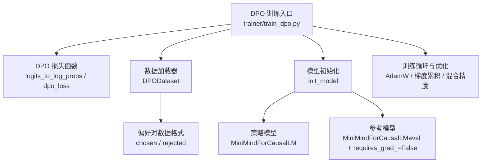
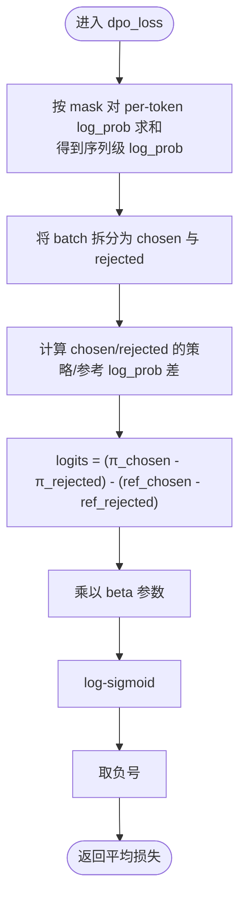
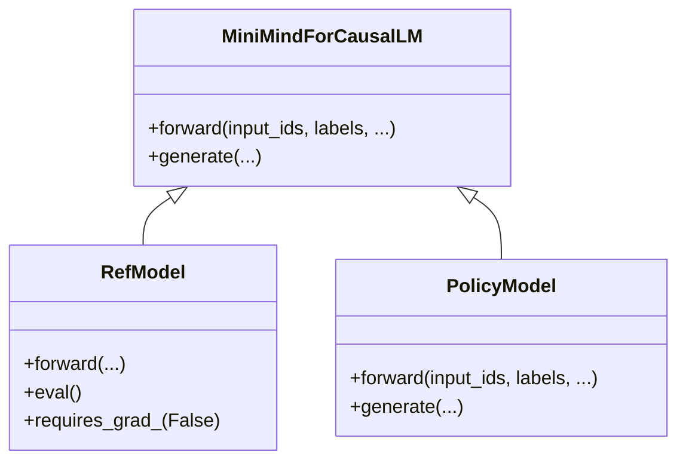
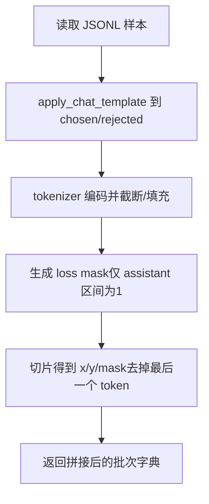
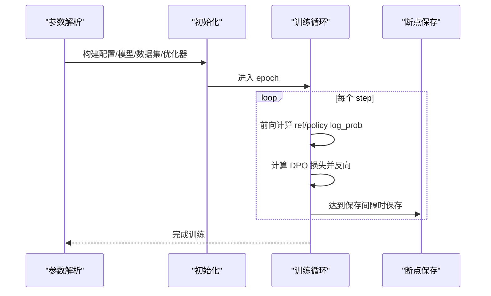
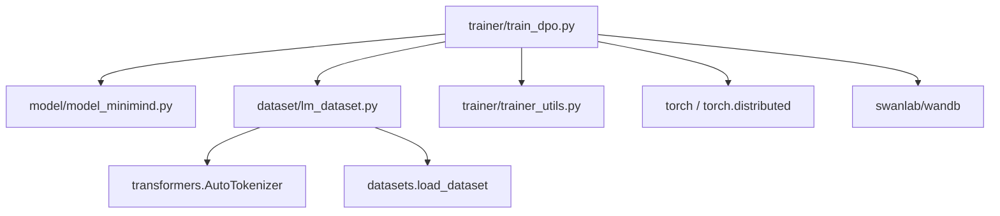

# DPO 直接偏好优化

<cite>
**本文引用的文件**
- [train_dpo.py](file://trainer/train_dpo.py)
- [model_minimind.py](file://model/model_minimind.py)
- [lm_dataset.py](file://dataset/lm_dataset.py)
- [trainer_utils.py](file://trainer/trainer_utils.py)
- [README.md](file://README.md)
</cite>

## 目录
1. [引言](#引言)
2. [项目结构](#项目结构)
3. [核心组件](#核心组件)
4. [架构总览](#架构总览)
5. [详细组件分析](#详细组件分析)
6. [依赖关系分析](#依赖关系分析)
7. [性能考量](#性能考量)
8. [故障排查指南](#故障排查指南)
9. [结论](#结论)
10. [附录](#附录)

## 引言
本文件围绕 MiniMind 的 DPO（Direct Preference Optimization，直接偏好优化）训练流程展开，系统阐述其核心理念、数学原理、实现细节与工程实践。DPO 通过直接比较“更好回答（chosen）”与“较差回答（rejected）”的对数似然差异，构造偏好优化损失，无需单独的奖励模型或价值模型，显著简化了 RLHF 的训练流程。本文将结合代码实现，解释参考模型与策略模型的关系、损失函数的设计思路、log_prob 计算、偏好对比较与 beta 参数的作用机制，并提供数据格式、训练流程与参数配置建议，帮助读者高效开展指令微调与偏好对齐。

## 项目结构
本节聚焦与 DPO 直接相关的关键文件及其职责：
- 训练入口与核心逻辑：trainer/train_dpo.py
- 模型定义与前向：model/model_minimind.py
- 数据集与偏好对格式：dataset/lm_dataset.py
- 训练工具与模型初始化：trainer/trainer_utils.py
- 理论与公式说明：README.md



图表来源
- [train_dpo.py:130-226](file://trainer/train_dpo.py#L130-L226)
- [lm_dataset.py:122-193](file://dataset/lm_dataset.py#L122-L193)
- [trainer_utils.py:119-131](file://trainer/trainer_utils.py#L119-L131)
- [model_minimind.py:229-246](file://model/model_minimind.py#L229-L246)

章节来源
- [train_dpo.py:130-226](file://trainer/train_dpo.py#L130-L226)
- [lm_dataset.py:122-193](file://dataset/lm_dataset.py#L122-L193)
- [trainer_utils.py:119-131](file://trainer/trainer_utils.py#L119-L131)
- [model_minimind.py:229-246](file://model/model_minimind.py#L229-L246)

## 核心组件
- DPO 损失函数与 log_prob 计算
  - log_prob 计算：对每个 token 的 logits 做 softmax，再按真实 token 索引取对数，得到 per-token log_prob。
  - 偏好对比较：对 chosen 与 rejected 的 per-token log_prob 按 mask 求和，得到序列级 log_prob；两者相减得到对数几率差。
  - 损失：使用 log-sigmoid 形式，结合 beta 参数控制对偏好的敏感度与稳定性。
- 参考模型与策略模型
  - 参考模型（ref_model）由 SFT 权重初始化，训练期间 eval + 冻结，仅用于提供 baseline log_prob。
  - 策略模型（model）在 DPO 训练中更新，目标是提升 chosen 的相对概率，抑制 rejected 的概率。
- 数据集与格式
  - DPODataset 读取 JSONL，每条样本包含 chosen 与 rejected 两组对话历史与回复，返回 x/y/mask 三元组的拼接，便于批内成对计算。

章节来源
- [train_dpo.py:24-49](file://trainer/train_dpo.py#L24-L49)
- [train_dpo.py:52-121](file://trainer/train_dpo.py#L52-L121)
- [lm_dataset.py:122-193](file://dataset/lm_dataset.py#L122-L193)
- [model_minimind.py:229-246](file://model/model_minimind.py#L229-L246)

## 架构总览
DPO 的训练流程可概括为：加载 SFT 权重初始化策略模型与参考模型；从 DPO 数据集中读取偏好对；前向计算参考模型与策略模型的 logits；计算 per-token log_prob 并按 mask 求和得到序列级 log_prob；对 chosen 与 rejected 的 log_prob 做差，得到对数几率；乘以 beta 后用 log-sigmoid 构造损失；反向传播更新策略模型参数。

```mermaid
sequenceDiagram
participant Loader as "数据加载器"
participant Ref as "参考模型 ref_model"
participant Policy as "策略模型 model"
participant Loss as "DPO 损失"
participant Opt as "优化器"
Loader->>Ref : 前向计算 ref_logits
Ref-->>Loader : ref_log_probs
Loader->>Policy : 前向计算 policy_logits
Policy-->>Loader : policy_log_probs
Loader->>Loss : 计算 chosen/rejected 的序列级 log_prob 差
Loss-->>Loader : beta * (chosen - rejected)
Loader->>Opt : 反向传播与参数更新
```

图表来源
- [train_dpo.py:52-121](file://trainer/train_dpo.py#L52-L121)
- [train_dpo.py:24-49](file://trainer/train_dpo.py#L24-L49)

## 详细组件分析

### DPO 损失函数与 log_prob 计算
- log_prob 计算
  - 输入：logits（batch_size, seq_len, vocab_size），labels（batch_size, seq_len）
  - 输出：per-token log_prob（batch_size, seq_len）
  - 方法：softmax 后按 labels 索引取值，得到每个 token 的对数概率。
- 偏好对比较
  - 对 per-token log_prob 按 mask 求和，得到序列级 log_prob。
  - 将 batch 拆分为 chosen 与 rejected 两部分，分别计算 chosen/ref 和 rejected/ref 的 log_prob 差。
  - 对数几率：logits = (chosen_policy - rejected_policy) - (chosen_ref - rejected_ref)
- 损失
  - 使用 -logsigmoid(beta * logits)，对 beta 控制偏好强度与数值稳定性。
  - 返回平均损失。



图表来源
- [train_dpo.py:33-49](file://trainer/train_dpo.py#L33-L49)

章节来源
- [train_dpo.py:24-49](file://trainer/train_dpo.py#L24-L49)

### 参考模型与策略模型的关系
- 初始化
  - 策略模型与参考模型均来自同一 SFT 权重初始化，结构一致。
  - 参考模型在 DPO 训练中 eval + requires_grad_(False)，不参与反向更新。
- 作用机制
  - 参考模型提供 baseline log_prob，策略模型通过最大化 chosen 相对概率、抑制 rejected 相对概率，实现偏好对齐。
  - 无需单独奖励模型，降低显存与实现复杂度。



图表来源
- [model_minimind.py:229-246](file://model/model_minimind.py#L229-L246)
- [train_dpo.py:181-188](file://trainer/train_dpo.py#L181-L188)

章节来源
- [model_minimind.py:229-246](file://model/model_minimind.py#L229-L246)
- [train_dpo.py:181-188](file://trainer/train_dpo.py#L181-L188)

### DPO 数据格式与数据集实现
- 数据格式
  - 每条样本包含 chosen 与 rejected 两组对话历史与回复，二者共享相同的上下文（如用户问题）。
- 数据集实现
  - DPODataset 使用 chat template 应用到 chosen/rejected，再进行截断与 padding。
  - 生成 loss mask，仅对 assistant 回复部分计算损失（跳过 system/user 部分）。
  - 返回 x/y/mask 三元组的拼接，便于批内成对计算。



图表来源
- [lm_dataset.py:135-174](file://dataset/lm_dataset.py#L135-L174)
- [lm_dataset.py:176-192](file://dataset/lm_dataset.py#L176-L192)

章节来源
- [lm_dataset.py:122-193](file://dataset/lm_dataset.py#L122-L193)

### 训练流程与参数配置
- 训练入口
  - 解析参数：保存目录、权重前缀、训练轮数、batch size、学习率、设备、混合精度、梯度累积、日志/保存间隔、模型维度、MoE 开关、数据路径、起始权重、是否续训、beta、可视化、torch.compile 等。
- 初始化
  - 初始化分布式、随机种子；创建保存目录；构建 MiniMindConfig；加载检查点（可选）；设置混合精度上下文；初始化策略模型与参考模型；构建 DPO 数据集与 DataLoader；构建优化器与 GradScaler。
- 训练循环
  - 每步：拼接 chosen 与 rejected 的 x/y/mask；计算学习率；前向计算 ref_log_probs 与 policy_log_probs；计算 DPO 损失；反向传播与梯度裁剪；可选保存权重；记录日志与可视化。
- 断点续训
  - 通过 lm_checkpoint 保存/恢复模型、优化器、scaler、epoch、step、wandb id 等，支持跨 GPU 数量恢复。



图表来源
- [train_dpo.py:130-226](file://trainer/train_dpo.py#L130-L226)
- [trainer_utils.py:63-117](file://trainer/trainer_utils.py#L63-L117)

章节来源
- [train_dpo.py:130-226](file://trainer/train_dpo.py#L130-L226)
- [trainer_utils.py:63-117](file://trainer/trainer_utils.py#L63-L117)

### beta 参数的作用机制
- 数学含义
  - beta 控制对偏好差异的敏感度：越大越强调 chosen 相对概率的提升，越小越平滑。
- 实践建议
  - 初始建议值可参考 0.1~0.2，依据 loss 与困惑度表现微调。
  - 过大可能导致策略过度拟合，过小可能导致收敛缓慢或对偏好差异不敏感。

章节来源
- [train_dpo.py:151](file://trainer/train_dpo.py#L151)
- [README.md:956](file://README.md#L956)

## 依赖关系分析
- 模块耦合
  - train_dpo.py 依赖 model_minimind.py（模型结构）、lm_dataset.py（数据集）、trainer_utils.py（工具函数与模型初始化）。
  - DPODataset 依赖 AutoTokenizer 与 datasets，负责将 chosen/rejected 转为 tokens 并生成 loss mask。
- 外部依赖
  - transformers（AutoTokenizer/Model）、datasets（JSONL 加载）、torch（深度学习框架）、torch.distributed（多卡）、swanlab/wandb（可视化）。



图表来源
- [train_dpo.py:17-19](file://trainer/train_dpo.py#L17-L19)
- [lm_dataset.py:6](file://dataset/lm_dataset.py#L6)
- [trainer_utils.py:15](file://trainer/trainer_utils.py#L15)

章节来源
- [train_dpo.py:17-19](file://trainer/train_dpo.py#L17-L19)
- [lm_dataset.py:6](file://dataset/lm_dataset.py#L6)
- [trainer_utils.py:15](file://trainer/trainer_utils.py#L15)

## 性能考量
- 混合精度与梯度累积
  - 使用 autocast 与 GradScaler 提升吞吐与显存利用率；通过 accumulation_steps 减少内存峰值。
- 学习率调度
  - 采用余弦退火学习率，有助于稳定训练。
- 梯度裁剪
  - clip_grad_norm 防止梯度爆炸，提高数值稳定性。
- 模型编译与分布式
  - 可选 torch.compile 加速；多卡训练使用 DDP，忽略特定缓冲以减少通信开销。
- 数据加载
  - DataLoader 使用 pin_memory 与多 worker，提升 IO 吞吐。

章节来源
- [train_dpo.py:168-170](file://trainer/train_dpo.py#L168-L170)
- [train_dpo.py:192-193](file://trainer/train_dpo.py#L192-L193)
- [trainer_utils.py:40](file://trainer/trainer_utils.py#L40)
- [train_dpo.py:204-210](file://trainer/train_dpo.py#L204-L210)

## 故障排查指南
- 显存不足
  - 降低 batch size 或 max_seq_len；关闭 torch.compile；使用 bfloat16/float16；启用梯度累积。
- 收敛异常
  - 调整 beta（过大/过小都会影响稳定性）；检查学习率是否过高；确认数据集 chosen/rejected 是否合理。
- 数据格式错误
  - 确认 JSONL 中每条样本包含 chosen 与 rejected；确保 tokenizer 能正确应用 chat template。
- 参考模型未冻结
  - 确保 ref_model.eval() 且 requires_grad_(False)。
- 断点续训不生效
  - 检查 checkpoints 目录是否存在 _resume.pth；确认 world_size 与当前 GPU 数量一致或已自动转换 step。

章节来源
- [train_dpo.py:184-188](file://trainer/train_dpo.py#L184-L188)
- [lm_dataset.py:135-174](file://dataset/lm_dataset.py#L135-L174)
- [trainer_utils.py:63-117](file://trainer/trainer_utils.py#L63-L117)

## 结论
DPO 通过直接比较 chosen 与 rejected 的对数似然差，构造偏好优化损失，避免了奖励/价值模型的训练与部署复杂度。在 MiniMind 的实现中，参考模型由 SFT 权重初始化并在训练中冻结，策略模型仅通过 AdamW 优化，配合混合精度、梯度累积与分布式训练，可在中小模型规模上稳定收敛。实践中，合理设置 beta、学习率与数据格式，是获得良好偏好对齐效果的关键。

## 附录

### DPO 数学原理与公式
- 目标：最大化 chosen 相对概率，抑制 rejected 相对概率。
- 损失：$\mathcal{L}_{DPO} = -\mathbb{E}\left[\log \sigma\left(\beta \left[\log \frac{\pi_\theta(y_w|x)}{\pi_{ref}(y_w|x)} - \log \frac{\pi_\theta(y_l|x)}{\pi_{ref}(y_l|x)}\right]\right)\right]$
- 其中：
  - 策略项：$f(r_t) = \log r_w - \log r_l$
  - 优势项：无显式优势项（通过偏好对比隐式体现）
  - 正则项：隐含在 $\beta$ 中（控制偏离参考模型程度）

章节来源
- [README.md:956](file://README.md#L956)

### 训练数据格式要求
- JSONL 每行包含：
  - chosen：更符合偏好的回复（assistant）
  - rejected：相对较差的回复（assistant）
- 示例字段：
  - chosen/rejected：数组，元素为 {role, content}

章节来源
- [README.md:469-482](file://README.md#L469-L482)
- [lm_dataset.py:135-174](file://dataset/lm_dataset.py#L135-L174)

### 训练流程与参数配置建议
- 训练流程
  - 预训练 → 监督微调（SFT）→ DPO 偏好对齐
- 关键参数
  - beta：0.1~0.2（依据验证集表现微调）
  - 学习率：建议 ≤ 5e-8（避免遗忘）
  - batch size：根据显存与数据长度调整
  - max_seq_len：中文≈1.5~1.7字符/token，结合数据分布设置
  - 梯度累积：显存紧张时增大
  - 混合精度：bfloat16/float16
  - 断点续训：开启自动恢复与可视化

章节来源
- [train_dpo.py:134-151](file://trainer/train_dpo.py#L134-L151)
- [README.md:522-535](file://README.md#L522-L535)