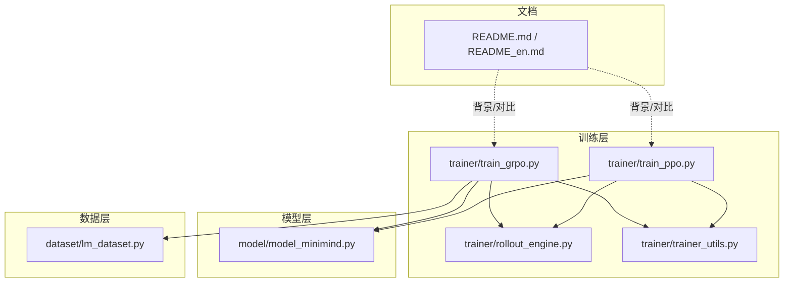
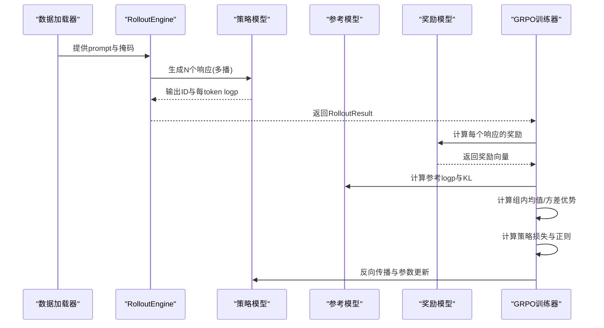
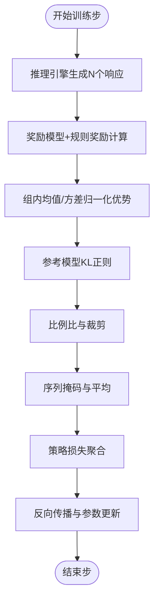
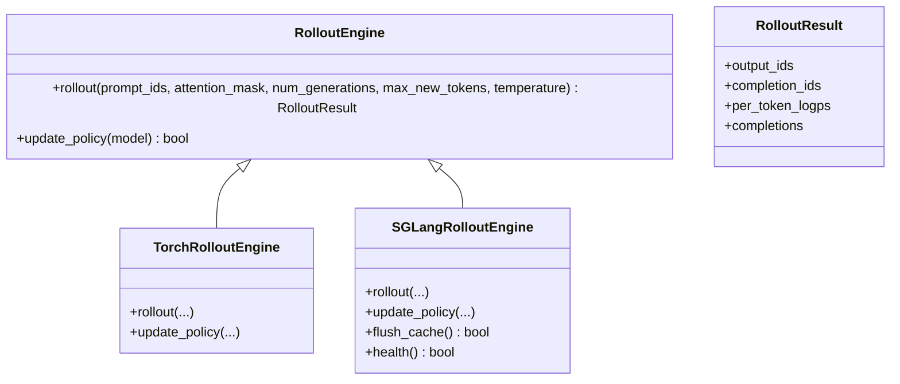
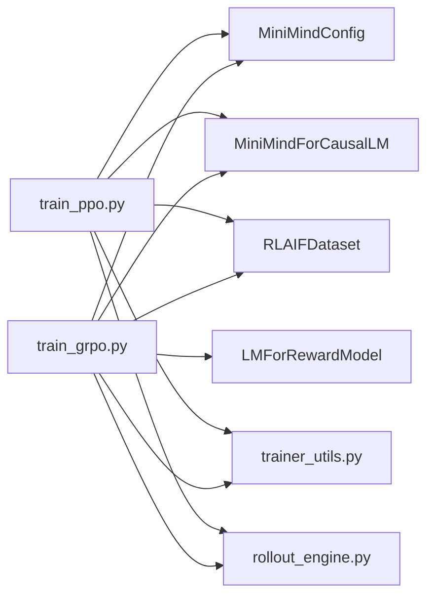
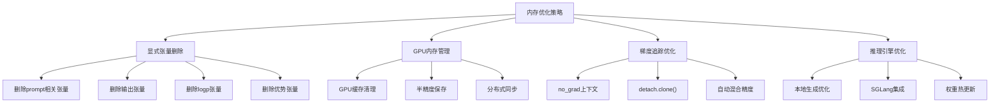

# GRPO 指导强化学习优化

<cite>
**本文引用的文件**
- [train_grpo.py](file://trainer/train_grpo.py)
- [rollout_engine.py](file://trainer/rollout_engine.py)
- [trainer_utils.py](file://trainer/trainer_utils.py)
- [model_minimind.py](file://model/model_minimind.py)
- [lm_dataset.py](file://dataset/lm_dataset.py)
- [README.md](file://README.md)
- [README_en.md](file://README_en.md)
- [train_ppo.py](file://trainer/train_ppo.py)
</cite>

## 更新摘要
**变更内容**
- 新增内存优化章节，详细说明CUDA OOM解决方案
- 更新性能考量部分，增加内存管理最佳实践
- 新增故障排查指南的内存相关问题处理
- 增强训练稳定性保障措施说明

## 目录
1. [引言](#引言)
2. [项目结构](#项目结构)
3. [核心组件](#核心组件)
4. [架构总览](#架构总览)
5. [详细组件分析](#详细组件分析)
6. [依赖关系分析](#依赖关系分析)
7. [性能考量](#性能考量)
8. [内存优化与稳定性保障](#内存优化与稳定性保障)
9. [故障排查指南](#故障排查指南)
10. [结论](#结论)
11. [附录](#附录)

## 引言
本文件围绕 MiniMind 项目中的 GRPO（Group Relative Policy Optimization，分组相对策略优化）指导强化学习优化算法展开，系统阐述其设计理念、创新点与实现细节。GRPO 的核心思想是"分组相对价值估计"，即在同一问题的多个响应中，以组内平均奖励作为基线，消除对额外 Critic 网络的需求，从而实现单网络、低开销的策略优化。本文将从算法机制、指导信号设计、策略更新规则、稳定性保障、参数配置与训练实践等方面进行深入解析，并提供与 PPO、CISPO 等变体的对比，帮助读者理解何时选择 GRPO 以及如何优化其训练效果。

**更新** 本版本特别关注了最新的内存优化改进，解决了大规模训练中的 CUDA OOM 问题，显著提升了训练稳定性。

## 项目结构
本项目采用"按功能域分层"的组织方式，训练相关逻辑集中在 trainer 目录，模型结构与推理在 model 目录，数据集与工具在 dataset 目录，README 提供总体说明与算法背景。与 GRPO 相关的关键文件如下：
- 训练入口与核心逻辑：trainer/train_grpo.py
- 推理引擎（可插拔）：trainer/rollout_engine.py
- 训练工具与辅助：trainer/trainer_utils.py
- 模型结构与生成：model/model_minimind.py
- 数据集与提示模板：dataset/lm_dataset.py
- 项目说明与算法综述：README.md、README_en.md
- 对比算法（PPO）：trainer/train_ppo.py

**图表来源**
- [train_grpo.py:1-332](file://trainer/train_grpo.py#L1-L332)
- [rollout_engine.py:1-225](file://trainer/rollout_engine.py#L1-L225)
- [trainer_utils.py:1-177](file://trainer/trainer_utils.py#L1-L177)
- [model_minimind.py:1-280](file://model/model_minimind.py#L1-L280)
- [lm_dataset.py:1-256](file://dataset/lm_dataset.py#L1-L256)
- [README.md:1-1987](file://README.md#L1-L1987)
- [README_en.md:1057-1271](file://README_en.md#L1057-L1271)
- [train_ppo.py:1-444](file://trainer/train_ppo.py#L1-L444)

**章节来源**
- [train_grpo.py:1-332](file://trainer/train_grpo.py#L1-L332)
- [README.md:1123-1166](file://README.md#L1123-L1166)
- [README_en.md:1057-1271](file://README_en.md#L1057-L1271)

## 核心组件
- GRPO 训练主循环与损失计算：负责采样、奖励计算、优势估计、策略更新与日志记录。
- 推理引擎（Rollout Engine）：提供可插拔的生成与 log-prob 计算能力，支持 PyTorch 原生与 SGLang 两种后端。
- 训练工具集：分布式初始化、断点续训、模型加载、随机种子设置、学习率调度等。
- 模型结构：MiniMind 的因果语言模型，支持 MoE 前馈层与 YaRN RoPE 外推。
- 数据集：RLAIF 数据集，支持多轮对话与思考标签模板。

**章节来源**
- [train_grpo.py:70-203](file://trainer/train_grpo.py#L70-L203)
- [rollout_engine.py:20-225](file://trainer/rollout_engine.py#L20-L225)
- [trainer_utils.py:44-117](file://trainer/trainer_utils.py#L44-L117)
- [model_minimind.py:10-280](file://model/model_minimind.py#L10-L280)
- [lm_dataset.py:195-225](file://dataset/lm_dataset.py#L195-L225)

## 架构总览
GRPO 的训练流程以"策略模型 + 参考模型 + 奖励模型 + 推理引擎"为核心，形成闭环：
- 策略模型：当前参数化的政策网络，负责生成响应并计算当前 token 的对数概率。
- 参考模型：冻结的参考策略，用于 KL 正则化，稳定训练。
- 奖励模型：提供连续评分，作为强化信号来源。
- 推理引擎：负责批量生成与 log-prob 计算，支持本地或 SGLang 后端。

**图表来源**
- [train_grpo.py:70-203](file://trainer/train_grpo.py#L70-L203)
- [rollout_engine.py:66-91](file://trainer/rollout_engine.py#L66-L91)
- [trainer_utils.py:160-177](file://trainer/trainer_utils.py#L160-L177)

## 详细组件分析

### GRPO 核心机制与损失设计
- 指导信号设计
  - 奖励来源：奖励模型提供连续评分，结合规则奖励（长度、思考标签、重复惩罚）形成综合奖励。
  - 优势估计：对同一 prompt 的 N 个响应，以组内均值与标准差进行归一化，得到组内相对优势，避免额外 Critic 网络。
- 策略更新规则
  - 比例比裁剪：支持 GRPO 的对称裁剪与 CISPO 的上界裁剪两种变体。
  - KL 正则：使用参考模型与当前模型的 token 级 KL 散度，稳定策略更新。
  - 掩码与平均：按完成序列的有效长度进行掩码，对每个序列的 token 损失求平均。
- 稳定性保障
  - 组内归一化：降低极端奖励导致的信号退化风险。
  - 梯度裁剪与学习率调度：防止爆炸与震荡。
  - 断点续训与分布式：支持多卡与跨 GPU 数量恢复。

**图表来源**
- [train_grpo.py:121-143](file://trainer/train_grpo.py#L121-L143)

**章节来源**
- [train_grpo.py:36-67](file://trainer/train_grpo.py#L36-L67)
- [train_grpo.py:121-143](file://trainer/train_grpo.py#L121-L143)
- [train_grpo.py:146-152](file://trainer/train_grpo.py#L146-L152)

### 推理引擎（Rollout Engine）
- 功能
  - 生成：支持多播生成，返回输出 ID、完成序列与每 token log-prob。
  - 可插拔：支持 PyTorch 原生生成与 SGLang HTTP 后端，后者可热更新权重。
- 关键实现
  - 计算每 token log-prob：对输出序列进行前向，取对数概率并按完成长度截取。
  - SGLang 更新：将当前策略权重保存到共享路径并通知后端更新。
  - 内存优化：使用 `.detach().clone()` 避免梯度追踪，减少内存占用。

**图表来源**
- [rollout_engine.py:46-225](file://trainer/rollout_engine.py#L46-L225)

**章节来源**
- [rollout_engine.py:20-34](file://trainer/rollout_engine.py#L20-L34)
- [rollout_engine.py:66-91](file://trainer/rollout_engine.py#L66-L91)
- [rollout_engine.py:105-182](file://trainer/rollout_engine.py#L105-L182)

### 训练工具与辅助
- 分布式与断点续训：支持 NCCL 后端、DDP 包装、权重与优化器状态保存与恢复。
- 模型初始化：按权重前缀加载基础权重，支持 MoE 与非 MoE。
- 学习率调度：余弦退火，支持自动步数计算。
- 日志与可视化：支持 SwanLab（原 WandB）记录指标。

**章节来源**
- [trainer_utils.py:44-117](file://trainer/trainer_utils.py#L44-L117)
- [trainer_utils.py:119-132](file://trainer/trainer_utils.py#L119-L132)
- [trainer_utils.py:160-177](file://trainer/trainer_utils.py#L160-L177)

### 模型结构与生成
- MiniMind 结构：预规范化 + RMSNorm、SwiGLU 激活、RoPE + YaRN 外推、可选 MoE 前馈层。
- 生成接口：支持温度、Top-k/Top-p、重复惩罚、EOS 控制与缓存复用。

**章节来源**
- [model_minimind.py:10-280](file://model/model_minimind.py#L10-L280)

### 数据集与提示模板
- RLAIF 数据集：支持多轮对话与思考标签模板，按概率开启思考模式，便于 GRPO 训练。
- 提示模板：apply_chat_template 生成标准对话格式，便于奖励模型评分。

**章节来源**
- [lm_dataset.py:195-225](file://dataset/lm_dataset.py#L195-L225)

### 与 PPO、CISPO 的对比
- PPO：需要独立 Critic 网络估计价值，优势项为 $R - V(s)$，双网络联合优化，显存占用更高，初期收敛较慢。
- GRPO：优势项为组内归一化 $ \frac{R - \mu}{\sigma} $，单网络优化，训练更稳定，收敛上限更高。
- CISPO：在 GRPO 的基础上，对 ratio 被裁剪后的梯度流进行更直接修正，进一步改善梯度稳定性。

**章节来源**
- [README_en.md:1124-1166](file://README_en.md#L1124-L1166)
- [README_en.md:1260-1271](file://README_en.md#L1260-L1271)
- [train_ppo.py:78-200](file://trainer/train_ppo.py#L78-L200)

## 依赖关系分析
- 训练脚本依赖
  - 模型与配置：MiniMindConfig、MiniMindForCausalLM
  - 数据集：RLAIFDataset
  - 工具：Logger、init_distributed_mode、lm_checkpoint、SkipBatchSampler、LMForRewardModel
  - 推理引擎：create_rollout_engine、TorchRolloutEngine、SGLangRolloutEngine
- 训练流程耦合
  - 策略模型与参考模型：前者参与前向与反向，后者仅用于 KL 正则。
  - 奖励模型：仅在推理阶段参与评分，不参与策略反向。
  - 推理引擎：与策略模型耦合，支持热更新权重。

**图表来源**
- [train_grpo.py:205-332](file://trainer/train_grpo.py#L205-L332)
- [train_ppo.py:1-25](file://trainer/train_ppo.py#L1-L25)
- [trainer_utils.py:119-132](file://trainer/trainer_utils.py#L119-L132)
- [rollout_engine.py:197-225](file://trainer/rollout_engine.py#L197-L225)

**章节来源**
- [train_grpo.py:205-332](file://trainer/train_grpo.py#L205-L332)
- [train_ppo.py:1-25](file://trainer/train_ppo.py#L1-L25)

## 性能考量
- 计算与内存
  - GRPO 单网络优化，显存占用约为 PPO 的 1.5–2 倍，但训练更稳定。
  - 组内归一化避免了 Critic 的额外计算，整体吞吐更高。
  - **新增** 显著优化的内存管理：通过手动张量删除、GPU内存清理和梯度追踪优化，大幅降低内存峰值。
- 精度与稳定性
  - 混合精度与 torch.compile 可选开启，有助于加速与节省显存。
  - 梯度裁剪与余弦退火学习率有助于稳定收敛。
- 推理后端
  - SGLang 后端可热更新权重，适合大规模生成与多机部署。
  - 本地后端适合小规模实验与调试。

**更新** 内存优化措施包括：显式张量删除、GPU内存清理、梯度追踪优化、混合精度使用等。

**章节来源**
- [README.md:1123-1166](file://README.md#L1123-L1166)
- [train_grpo.py:205-332](file://trainer/train_grpo.py#L205-L332)

## 内存优化与稳定性保障

### CUDA OOM 解决方案
**更新** 最新的内存优化主要针对大规模训练中的 CUDA Out-of-Memory 问题，采用了多层次的内存管理策略：

#### 显式内存清理
- **张量删除**：在训练循环末尾显式删除所有中间张量，包括 `prompt_inputs`、`outputs`、`completion_ids`、`per_token_logps` 等
- **优势计算清理**：删除组内优势计算相关的临时变量，如 `grouped_rewards`、`mean_r`、`std_r`、`advantages`
- **掩码与索引清理**：及时删除 `completion_mask`、`completion_pad_mask`、`prompt_lens`、`logp_pos` 等中间结果

#### GPU 内存管理
- **GPU缓存清理**：在模型保存后调用 `torch.cuda.empty_cache()` 清理GPU缓存碎片
- **半精度权重保存**：保存模型权重时使用半精度（`.half().cpu()`）减少CPU内存占用
- **分布式环境清理**：在DDP环境中正确同步内存清理操作

#### 梯度追踪优化
- **推理模式**：使用 `torch.no_grad()` 上下文避免不必要的梯度计算
- **张量克隆**：使用 `.detach().clone()` 创建独立的张量副本，避免梯度图污染
- **自动混合精度**：根据设备类型选择合适的精度（bfloat16/float16），平衡精度与内存

#### 推理引擎内存优化
- **本地生成优化**：在 `TorchRolloutEngine.rollout` 中使用上下文管理器避免梯度追踪
- **SGLang集成**：通过HTTP API进行推理，避免本地内存占用
- **权重热更新**：SGLang后端支持权重热更新，无需重新加载整个模型

**图表来源**
- [train_grpo.py:190-204](file://trainer/train_grpo.py#L190-L204)
- [trainer_utils.py:63-106](file://trainer/trainer_utils.py#L63-L106)
- [rollout_engine.py:24-36](file://trainer/rollout_engine.py#L24-L36)

**章节来源**
- [train_grpo.py:190-204](file://trainer/train_grpo.py#L190-L204)
- [trainer_utils.py:63-106](file://trainer/trainer_utils.py#L63-L106)
- [rollout_engine.py:24-36](file://trainer/rollout_engine.py#L24-L36)

### 稳定性保障措施
- **内存监控**：定期检查GPU内存使用情况，及时清理内存碎片
- **梯度稳定性**：结合梯度裁剪和学习率调度，防止训练过程中的数值不稳定
- **分布式一致性**：在多GPU环境中确保内存清理操作的一致性
- **错误恢复**：实现内存不足时的优雅降级和错误恢复机制

**章节来源**
- [train_grpo.py:147-153](file://trainer/train_grpo.py#L147-L153)
- [trainer_utils.py:105](file://trainer/trainer_utils.py#L105)

## 故障排查指南
- 训练不稳定
  - 检查组内奖励方差是否接近 0，若为退化组，适当降低 num_generations 或调整奖励规则。
  - 调整 beta（KL 正则系数）与 epsilon（裁剪范围），避免过度正则或裁剪。
- 梯度爆炸或 NaN
  - 启用梯度裁剪（grad_clip），检查学习率是否过高。
  - 混合精度 dtype 选择（bfloat16/float16），必要时关闭以提高数值稳定性。
- 分布式训练异常
  - 确认 NCCL 环境变量与本地 GPU 数量匹配，断点续训会自动转换 step。
- 推理后端问题
  - SGLang 健康检查与缓存刷新，确保权重更新成功。
- **新增** 内存相关问题
  - **CUDA OOM**：检查 batch_size 和 num_generations 设置，启用内存优化选项
  - **GPU内存泄漏**：确认所有中间张量都已正确删除，检查 `torch.cuda.empty_cache()` 调用
  - **CPU内存不足**：使用半精度保存权重，减少CPU内存占用
  - **内存碎片**：定期清理GPU缓存，避免长时间训练导致的内存碎片化

**更新** 新增了专门的内存问题排查指南，涵盖CUDA OOM、内存泄漏、CPU内存不足等问题的诊断和解决方法。

**章节来源**
- [trainer_utils.py:44-117](file://trainer/trainer_utils.py#L44-L117)
- [rollout_engine.py:184-206](file://trainer/rollout_engine.py#L184-L206)

## 结论
GRPO 通过"分组相对价值估计"实现了单网络、低开销的策略优化，相较 PPO 在稳定性与收敛上限方面具有优势。MiniMind 的实现进一步结合了奖励模型的连续评分与规则奖励，增强了指导信号的密度与鲁棒性。

**更新** 最新的内存优化改进显著提升了大规模训练的可行性，通过多层次的内存管理策略有效解决了CUDA OOM问题，使GRPO能够在更大规模的数据集和更复杂的模型上稳定运行。

实践中，建议优先尝试 GRPO，若遇到退化组或需要更精细的策略控制，可考虑 CISPO 或在 PPO 基础上调整优势估计与正则项。对于大规模训练场景，建议启用内存优化选项并合理配置batch大小。

## 附录

### GRPO 算法实现要点与参数配置指南
- 指导强度调节
  - 奖励模型权重：通过奖励模型路径与评分范围控制强化信号强度。
  - 规则奖励：长度、思考标签、重复惩罚等规则奖励可按任务需求调整。
- 学习率与正则化
  - 初始学习率：建议从较小值开始，配合余弦退火。
  - KL 正则系数 beta：平衡策略更新幅度与稳定性。
  - 比例比裁剪 epsilon：控制更新步长，避免过大扰动。
- 训练细节
  - num_generations：同一 prompt 的响应数量，影响组内归一化稳定性。
  - accumulation_steps：梯度累积步数，平衡显存与更新频率。
  - grad_clip：防止梯度爆炸。
  - rollout_engine：可选 torch 或 sglang，后者适合大规模部署。
- **新增** 内存优化配置
  - use_compile：启用torch.compile加速，减少编译开销
  - dtype：选择bfloat16或float16，平衡精度与内存占用
  - pin_memory：启用数据加载器的内存固定，提升IO性能
  - sglang_shared_path：SGLang共享存储路径，优化权重传输

**更新** 新增了内存优化相关的参数配置指南，帮助用户在不同硬件条件下优化训练性能。

**章节来源**
- [train_grpo.py:206-243](file://trainer/train_grpo.py#L206-L243)
- [train_grpo.py:134-143](file://trainer/train_grpo.py#L134-L143)

### 实际训练案例与性能对比
- 训练命令
  - 单卡/多卡：torchrun --nproc_per_node N train_grpo.py
  - 断点续训：添加 --from_resume 1
  - 内存优化：添加 --use_compile 1 --dtype bfloat16
- 性能对比
  - GRPO：reward 稳定上升，Policy Loss 平稳下降，收敛上限更高。
  - PPO：双网络联合优化，初期收敛较慢，显存占用更高。
  - **新增** 内存优化对比：优化后可支持更大的batch size和num_generations，显著降低CUDA OOM风险。
- 可视化
  - 使用 SwanLab（原 WandB）记录 reward、KL、advantages、policy_loss 等指标。
  - **新增** 内存监控：记录GPU内存使用情况，监控训练稳定性。

**更新** 新增了内存优化效果的性能对比和监控建议。

**章节来源**
- [README.md:1143-1166](file://README.md#L1143-L1166)
- [train_grpo.py:169-178](file://trainer/train_grpo.py#L169-L178)