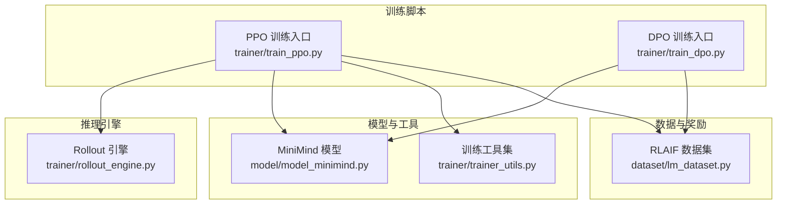
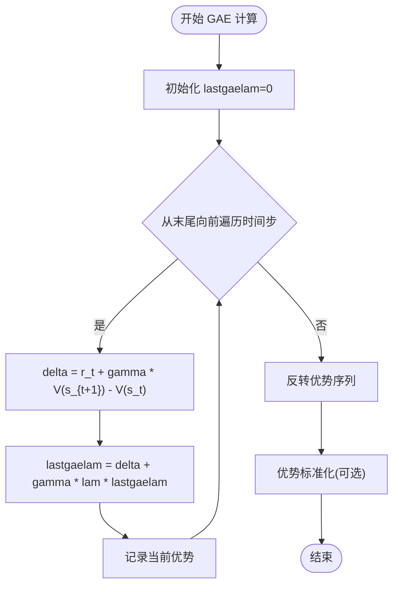
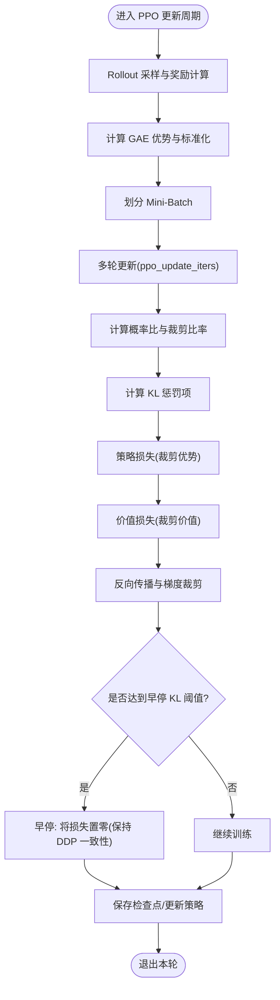
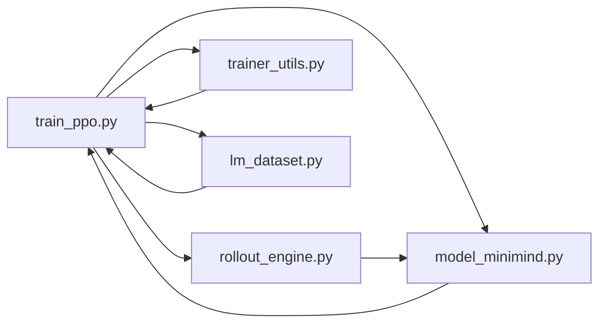

# PPO 近端策略优化

<cite>
**本文引用的文件列表**
- [train_ppo.py](file://trainer/train_ppo.py)
- [rollout_engine.py](file://trainer/rollout_engine.py)
- [trainer_utils.py](file://trainer/trainer_utils.py)
- [model_minimind.py](file://model/model_minimind.py)
- [lm_dataset.py](file://dataset/lm_dataset.py)
- [train_dpo.py](file://trainer/train_dpo.py)
- [README.md](file://README.md)
</cite>

## 更新摘要
**所做更改**
- 更新了数值精度处理部分，详细说明autocast上下文中的log概率计算改进
- 增强了调试日志功能，新增ratio统计信息监控
- 改进了稀疏奖励场景下的训练收敛性分析
- 更新了故障排查指南，包含新的调试技巧

## 目录
1. [引言](#引言)
2. [项目结构](#项目结构)
3. [核心组件](#核心组件)
4. [架构总览](#架构总览)
5. [详细组件分析](#详细组件分析)
6. [依赖关系分析](#依赖关系分析)
7. [性能考量](#性能考量)
8. [故障排查指南](#故障排查指南)
9. [结论](#结论)
10. [附录](#附录)

## 引言
本文件面向在 MiniMind 中实现 PPO（Proximal Policy Optimization）的工程师与研究者，系统梳理 PPO 的核心思想、在 RLHF（基于人类反馈的强化学习）与 RLAIF（基于AI反馈的强化学习）中的应用、以及本仓库中的实现细节与工程化要点。我们将从算法原理、实现流程、关键模块、参数配置、训练稳定性与调试技巧等方面进行深入讲解，并辅以可视化图示帮助读者建立整体认知。

**最新更新**：本版本包含了重要的训练稳定性改进，特别是在数值精度处理和稀疏奖励场景下的收敛性优化。

## 项目结构
围绕 PPO 的实现，本仓库的关键目录与文件如下：
- 训练入口与核心逻辑：trainer/train_ppo.py
- 推理/采样引擎：trainer/rollout_engine.py
- 训练工具与辅助：trainer/trainer_utils.py
- 模型定义（Actor/Critic共享主干）：model/model_minimind.py
- 数据集与奖励构造：dataset/lm_dataset.py
- 对比算法（DPO）：trainer/train_dpo.py
- 文档与背景：README.md



**图表来源**
- [train_ppo.py:1-451](file://trainer/train_ppo.py#L1-L451)
- [rollout_engine.py:1-225](file://trainer/rollout_engine.py#L1-L225)
- [model_minimind.py:1-288](file://model/model_minimind.py#L1-L288)
- [trainer_utils.py:1-177](file://trainer/trainer_utils.py#L1-L177)
- [lm_dataset.py:1-256](file://dataset/lm_dataset.py#L1-L256)
- [train_dpo.py:1-226](file://trainer/train_dpo.py#L1-L226)

**章节来源**
- [train_ppo.py:1-451](file://trainer/train_ppo.py#L1-L451)
- [rollout_engine.py:1-225](file://trainer/rollout_engine.py#L1-L225)
- [model_minimind.py:1-288](file://model/model_minimind.py#L1-L288)
- [trainer_utils.py:1-177](file://trainer/trainer_utils.py#L1-L177)
- [lm_dataset.py:1-256](file://dataset/lm_dataset.py#L1-L256)
- [train_dpo.py:1-226](file://trainer/train_dpo.py#L1-L226)

## 核心组件
- **Actor 策略网络**：基于 MiniMind 架构的因果语言模型，负责生成响应并输出 token 级别的对数概率。
- **Reference 策略网络**：固定参数的参考策略，用于 KL 惩罚项与旧策略对数概率的计算。
- **Critic 价值网络**：在本实现中，Critic 以 Actor 主干为基础，替换输出头为单维价值估计。
- **Rollout 引擎**：提供两种推理方式（PyTorch 原生与 SGLang HTTP），用于在线采样与计算 per-token logp。
- **奖励模型/奖励函数**：可选奖励模型或规则奖励，用于构造外部奖励并参与优势估计。
- **训练工具**：分布式初始化、断点续训、学习率调度、混合精度、梯度裁剪等。

**最新更新**：增强了数值精度处理和调试日志功能，提升了训练稳定性。

**章节来源**
- [train_ppo.py:36-49](file://trainer/train_ppo.py#L36-L49)
- [rollout_engine.py:46-94](file://trainer/rollout_engine.py#L46-L94)
- [rollout_engine.py:96-182](file://trainer/rollout_engine.py#L96-L182)
- [trainer_utils.py:63-117](file://trainer/trainer_utils.py#L63-L117)
- [model_minimind.py:229-288](file://model/model_minimind.py#L229-L288)

## 架构总览
PPO 在 MiniMind 中采用 On-Policy 的采样-更新循环，结合 GAE 优势估计与裁剪机制，实现稳定的策略优化。其核心流程如下：

```mermaid
sequenceDiagram
participant Loader as "数据加载器"
participant RE as "Rollout 引擎"
participant RM as "奖励模型/奖励函数"
participant Actor as "Actor 策略网络"
participant Ref as "Reference 策略网络"
participant Critic as "Critic 价值网络"
participant Opt as "优化器/调度器"
Loader->>RE : 提供 prompt 批
RE->>Actor : generate(temperature, max_new_tokens)
Actor-->>RE : 输出 completion_ids 与 per_token_logps
RE-->>Loader : 返回 RolloutResult
Loader->>RM : 计算外部奖励(可选)
RM-->>Loader : 返回奖励向量
Loader->>Critic : 评估 rollout 序列的价值
Critic-->>Loader : 返回旧值序列
Loader->>Ref : 计算旧策略对数概率
Ref-->>Loader : 返回旧 logp
Loader->>Actor : 前向得到新策略对数概率
Actor-->>Loader : 返回新 logp
Loader->>Loader : 计算 GAE 优势与裁剪比率
Loader->>Opt : 反向传播并更新 Actor/Critic
Opt-->>Actor : 更新策略参数
Opt-->>Critic : 更新价值参数
```

**图表来源**
- [train_ppo.py:78-301](file://trainer/train_ppo.py#L78-L301)
- [rollout_engine.py:66-90](file://trainer/rollout_engine.py#L66-L90)
- [rollout_engine.py:105-166](file://trainer/rollout_engine.py#L105-L166)
- [model_minimind.py:229-288](file://model/model_minimind.py#L229-L288)

## 详细组件分析

### PPO 算法核心与实现要点
- **信任区域优化与裁剪机制**
  - 通过裁剪概率比（ratio）与优势项的乘积，限制策略更新幅度，避免过大扰动。
  - 价值函数裁剪（value clipping）与均值归一化（advantage normalization）共同提升稳定性。
- **重要性采样与 KL 惩罚**
  - 使用 Reference 策略对 rollout 序列的对数概率作为重要性采样基准，计算 KL 惩罚项，控制策略漂移。
- **优势估计与 GAE**
  - 使用 GAE（广义优势估计）计算优势序列，结合折扣因子 gamma 与衰减因子 lam，平衡偏差与方差。
- **在线采样与奖励**
  - 通过 Rollout 引擎实时采样，结合奖励模型或规则奖励，形成稠密奖励信号，缓解稀疏奖励问题。

**最新更新**：在autocast上下文中进行log_softmax计算，避免了fp16/bf16直接计算造成的数值偏差，提升了训练稳定性。

**章节来源**
- [train_ppo.py:146-214](file://trainer/train_ppo.py#L146-L214)
- [train_ppo.py:51-76](file://trainer/train_ppo.py#L51-L76)
- [README.md:1084-1099](file://README.md#L1084-L1099)

### Critic 价值网络设计
- 继承 Actor 主干，替换输出头为单维价值估计，共享大部分参数，减少额外开销。
- 价值网络在 rollout 阶段仅用于计算旧值与优势，推理阶段不参与采样。

**章节来源**
- [train_ppo.py:36-49](file://trainer/train_ppo.py#L36-L49)
- [model_minimind.py:229-288](file://model/model_minimind.py#L229-L288)

### Rollout 引擎与采样
- **TorchRolloutEngine**：直接调用模型 generate，适合小规模或本地训练。
- **SGLangRolloutEngine**：通过 HTTP API 与 SGLang 服务通信，支持共享权重热更新，适合大规模/分布式采样。
- 两种引擎均提供 per-token logp 计算，便于 KL 惩罚与重要性采样。

**章节来源**
- [rollout_engine.py:46-94](file://trainer/rollout_engine.py#L46-L94)
- [rollout_engine.py:96-182](file://trainer/rollout_engine.py#L96-L182)
- [rollout_engine.py:21-34](file://trainer/rollout_engine.py#L21-L34)

### 奖励模型与奖励函数
- 支持外部奖励模型（如 InternLM2-1.8B-Reward）打分，或基于规则的奖励（如长度、思考标签格式、重复惩罚等）。
- 通过奖励函数与 rollout 序列对齐，形成 token 级奖励向量，用于优势估计。

**章节来源**
- [train_ppo.py:51-76](file://trainer/train_ppo.py#L51-L76)
- [trainer_utils.py:160-177](file://trainer/trainer_utils.py#L160-L177)
- [README.md:1007-1065](file://README.md#L1007-L1065)

### 优势估计与 GAE 计算流程


**图表来源**
- [train_ppo.py:146-157](file://trainer/train_ppo.py#L146-L157)

### PPO 训练流程与早停


**图表来源**
- [train_ppo.py:170-251](file://trainer/train_ppo.py#L170-L251)

### 与 DPO 的对比与适用场景
- **DPO 为 Off-Policy**，直接使用静态偏好对（chosen/rejected）进行训练，无需 Reward/Value 模型，实现简单、显存占用低。
- **PPO 为 On-Policy**，强调在线探索与优势估计，适合需要连续奖励信号与策略自适应的场景；在 MiniMind 中通过奖励模型或规则奖励提供稠密信号。
- 两者在 RLHF/RLAIF 中互补：DPO 用于偏好/安全对齐，PPO 用于探索式优化与策略稳定性。

**章节来源**
- [train_dpo.py:33-49](file://trainer/train_dpo.py#L33-L49)
- [README.md:947-976](file://README.md#L947-976)
- [README.md:1084-1099](file://README.md#L1084-L1099)

## 依赖关系分析
- train_ppo.py 依赖 rollout_engine 提供采样与 per-token logp；依赖 trainer_utils 提供分布式、断点续训、学习率调度；依赖 model_minimind 提供 Actor/Critic 主干；依赖 dataset 提供 RLAIF 数据。
- rollout_engine 与 SGLang 服务通信，支持权重热更新；Torch 引擎直接调用模型 generate。
- model_minimind 提供 MiniMind 架构（注意力、FFN/MoE、RMSNorm、RoPE 等），Actor/Critic 共享主干。
- trainer_utils 提供断点续训、分布式初始化、SkipBatchSampler 等工具。



**图表来源**
- [train_ppo.py:1-451](file://trainer/train_ppo.py#L1-L451)
- [rollout_engine.py:1-225](file://trainer/rollout_engine.py#L1-L225)
- [trainer_utils.py:1-177](file://trainer/trainer_utils.py#L1-L177)
- [model_minimind.py:1-288](file://model/model_minimind.py#L1-L288)
- [lm_dataset.py:1-256](file://dataset/lm_dataset.py#L1-L256)

**章节来源**
- [train_ppo.py:1-451](file://trainer/train_ppo.py#L1-L451)
- [rollout_engine.py:1-225](file://trainer/rollout_engine.py#L1-L225)
- [trainer_utils.py:1-177](file://trainer/trainer_utils.py#L1-L177)
- [model_minimind.py:1-288](file://model/model_minimind.py#L1-L288)
- [lm_dataset.py:1-256](file://dataset/lm_dataset.py#L1-L256)

## 性能考量
- **混合精度与梯度裁剪**：在 autocast 上下文中进行前向，使用 clip_grad_norm_ 控制梯度爆炸。
- **分布式与编译**：支持 torch.compile 加速与 DDP 包装，注意忽略频率相关缓冲区以避免同步问题。
- **早停与内存**：当 approx_KL 超过阈值时早停，避免无效通信与显存浪费。
- **采样与奖励**：SGLang 引擎可热更新权重，减少显存拷贝；奖励函数应尽量轻量，避免成为瓶颈。

**最新更新**：在autocast上下文中计算log_softmax，避免了fp16/bf16直接计算造成的数值偏差，提升了训练稳定性和收敛性。

**章节来源**
- [train_ppo.py:358-428](file://trainer/train_ppo.py#L358-L428)
- [train_ppo.py:195-219](file://trainer/train_ppo.py#L195-L219)
- [rollout_engine.py:168-182](file://trainer/rollout_engine.py#L168-L182)

## 故障排查指南
- **学习率与早停**
  - 若 KL 持续偏大，适当降低学习率或增大 KL 惩罚系数；早停阈值过低会导致频繁早停，过高则可能发散。
- **优势归一化**
  - 优势标准化有助于稳定训练，若发现不稳定，检查归一化是否按 token mask 正确加权。
- **梯度裁剪与 NaN**
  - 若出现 NaN，优先检查裁剪阈值与混合精度 dtype；必要时降低学习率或启用更严格的裁剪。
- **分布式一致性**
  - 早停时需将损失置零以保持 DDP 通信闭环，避免死锁。
- **SGLang 权重更新**
  - 确保共享存储路径正确，权重保存与更新接口返回码为 200；健康检查失败时及时重启服务。

**最新更新**：新增了以下调试技巧：

### 数值精度问题排查
- **autocast上下文中的log概率计算**：确保在autocast上下文中进行log_softmax计算，避免fp16/bf16直接计算造成的数值偏差
- **调试日志监控**：启用`--debug_log_ratio`参数监控首轮首个minibatch的log_ratio差异量级，验证ratio≈1是否成立

### 稀疏奖励场景优化
- **数学推理任务**：对于MATH500等超纲难度数据，避免直接使用rule-based二元奖励，容易导致奖励全零
- **奖励方差监控**：观察奖励分数的方差Var(r)，若持续接近0需调整数据或奖励机制
- **连续性奖励信号**：使用Reward Model输出连续分数（如-2.5到+3.0），而非二元的0/1

### 训练收敛性诊断
- **早期训练监控**：关注approx_kl、clipfrac、reward等指标的变化趋势
- **梯度流检查**：通过梯度裁剪和混合精度设置确保梯度流的稳定性
- **DDP同步问题**：确保所有GPU上的approx_kl同步，防止某卡break而其它卡继续导致死锁

**章节来源**
- [train_ppo.py:195-219](file://trainer/train_ppo.py#L195-L219)
- [train_ppo.py:216-219](file://trainer/train_ppo.py#L216-L219)
- [rollout_engine.py:168-182](file://trainer/rollout_engine.py#L168-L182)
- [train_ppo.py:183-194](file://trainer/train_ppo.py#L183-L194)

## 结论
MiniMind 的 PPO 实现以在线采样为核心，结合 GAE 优势估计、裁剪机制与 KL 惩罚，提供了稳定可控的策略优化路径。通过奖励模型或规则奖励，能够在通用任务中缓解奖励稀疏问题；Rollout 引擎支持本地与 SGLang 两种模式，兼顾灵活性与可扩展性。与 DPO 相比，PPO 更强调探索式学习与策略稳定性，适用于需要连续奖励信号与在线适应的场景。

**最新更新**：最新的改进显著提升了训练稳定性，特别是在数值精度处理和稀疏奖励场景下的收敛性方面。通过autocast上下文中的log概率计算和增强的调试日志功能，用户能够更好地监控和优化训练过程。

## 附录

### PPO 训练参数设置建议
- **裁剪参数**
  - clip_epsilon：典型取值 0.1~0.3，建议从 0.2 开始；过大易导致策略退化，过小影响更新效率。
  - cliprange_value：价值裁剪范围，建议与策略裁剪一致或略小。
- **优势估计**
  - gamma：折扣因子，建议 0.95~1.0；越接近 1，未来回报权重越大。
  - lam：GAE 衰减因子，建议 0.9~0.95；平衡偏差与方差。
- **KL 惩罚**
  - kl_coef：控制 KL 惩罚强度，建议 0.01~0.1；过大抑制探索，过小易发散。
- **早停与稳定性**
  - early_stop_kl：当 approx_KL 超过该阈值时早停，建议 0.1~0.3；根据显存与稳定性调整。
- **优化器与学习率**
  - 学习率：Actor 与 Critic 可分别设置，建议从较小值起步；使用余弦退火调度。
  - accumulation_steps：梯度累积步数，用于放大有效 batch size。
- **数据与采样**
  - mini_batch_size：每轮更新的 mini-batch 大小，建议与 batch_size 成比例。
  - ppo_update_iters：同一批 rollout 的重复更新次数，建议 2~4。
  - rollout_engine：本地或 SGLang，按资源与吞吐需求选择。

**章节来源**
- [train_ppo.py:303-346](file://trainer/train_ppo.py#L303-L346)
- [train_ppo.py:398-405](file://trainer/train_ppo.py#L398-L405)

### 训练流程与调试技巧
- **训练流程**
  - 初始化分布式与随机种子；加载 Actor/Critic/Reference 模型；构建 Rollout 引擎与数据加载器；进入训练循环。
  - 每步：采样 rollout → 计算奖励 → 估计优势 → 计算损失 → 反向传播 → 优化器更新 → 保存检查点。
- **调试技巧**
  - debug_mode：打印采样示例，观察 prompt、response、reward、优势分布。
  - debug_log_ratio：启用ratio统计信息监控，验证重要性采样的有效性。
  - 观察指标：reward、KL_ref、approx_KL、clipfrac、critic_loss、平均响应长度、学习率。
  - 断点续训：使用 lm_checkpoint 保存/恢复模型、优化器、调度器状态。
  - SGLang：定期 flush_cache，确保权重更新生效；健康检查失败时重启服务。

**最新更新**：新增了以下调试功能：

### 数值精度调试
- **autocast上下文优化**：在autocast上下文中进行log_softmax计算，避免fp16/bf16直接计算造成的数值偏差
- **ratio统计监控**：通过`--debug_log_ratio`参数监控首轮首个minibatch的log_ratio差异量级，包括max|lr|、mean|lr|、ratio_max、ratio_min等指标

### 稀疏奖励场景优化
- **连续性奖励信号**：使用Reward Model输出连续分数，而非二元的0/1，提供更丰富的梯度信号
- **奖励方差监控**：监控奖励分数的方差Var(r)，若持续接近0需调整数据或奖励机制
- **混合奖励策略**：结合多种奖励源，如thinking标签格式奖励和回答质量评分

**章节来源**
- [train_ppo.py:100-113](file://trainer/train_ppo.py#L100-L113)
- [train_ppo.py:255-279](file://trainer/train_ppo.py#L255-L279)
- [trainer_utils.py:63-117](file://trainer/trainer_utils.py#L63-L117)
- [rollout_engine.py:184-194](file://trainer/rollout_engine.py#L184-L194)
- [train_ppo.py:183-194](file://trainer/train_ppo.py#L183-L194)

### 最新改进特性

**增强的数值精度处理**
- 在第173-178行，在autocast上下文中进行log_softmax计算，避免直接对fp16/bf16 logits计算造成额外数值偏差
- 这一改进显著提升了训练稳定性，特别是在混合精度训练场景下

**改进的调试日志功能**
- 在第183-194行，添加了详细的ratio统计信息监控，包括：
  - max|lr|和mean|lr|：监控log_ratio的绝对值范围
  - ratio_max和ratio_min：监控概率比的极端值
  - dropout和training状态：监控模型配置和训练状态
- 通过`--debug_log_ratio`参数控制是否启用此功能

**优化的稀疏奖励收敛性**
- 在第52-76行的calculate_rewards函数中，实现了更精细的奖励计算逻辑：
  - 思维标签格式检查（20-300字符范围内）
  - 重复惩罚计算（rep_penalty）
  - 外部奖励模型评分融合
  - 长度合理性检查（20-800字符）
- 这些改进特别有利于数学推理等稀疏奖励任务的训练收敛

**更稳健的早停条件**
- 在第197-202行，使用`approx_kl_val`进行早停判断，并通过`dist.all_reduce`同步各卡的approx_kl，确保分布式一致性
- 避免了某些卡提前停止导致的DDP死锁问题

**优化的内存管理**
- 在第130行使用`torch.no_grad()`切断梯度，节省显存
- 及时删除中间变量，减少内存占用

**章节来源**
- [train_ppo.py:173-178](file://trainer/train_ppo.py#L173-L178)
- [train_ppo.py:183-194](file://trainer/train_ppo.py#L183-L194)
- [train_ppo.py:52-76](file://trainer/train_ppo.py#L52-L76)
- [train_ppo.py:197-202](file://trainer/train_ppo.py#L197-L202)
- [train_ppo.py:130](file://trainer/train_ppo.py#L130)
- [train_ppo.py:304-307](file://trainer/train_ppo.py#L304-L307)