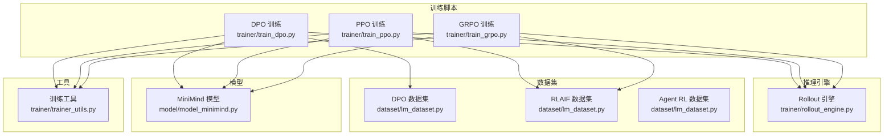
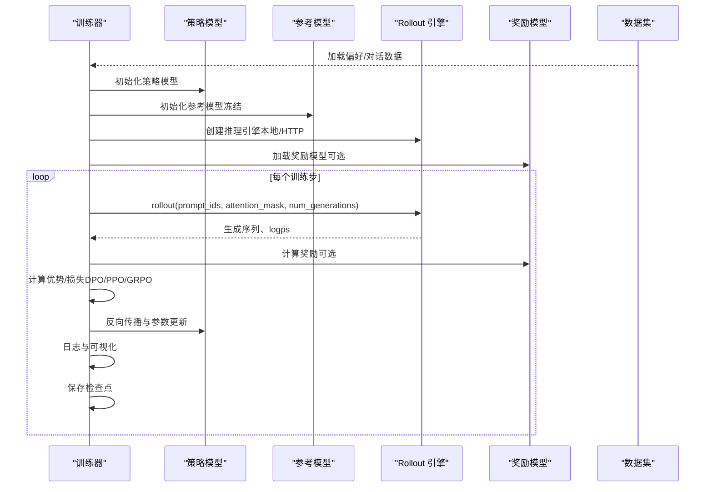
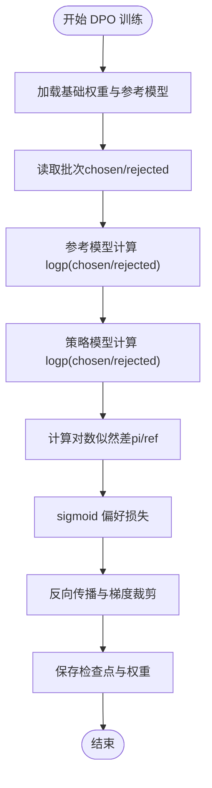
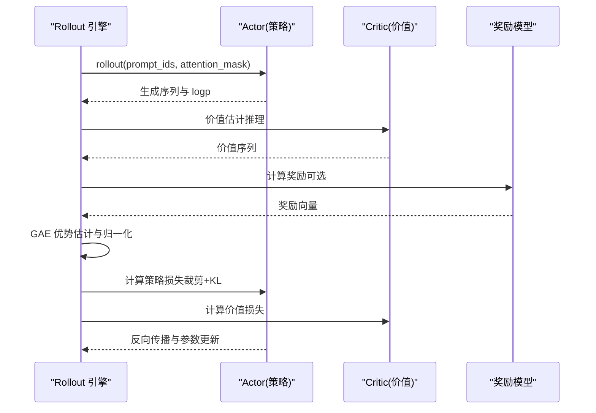
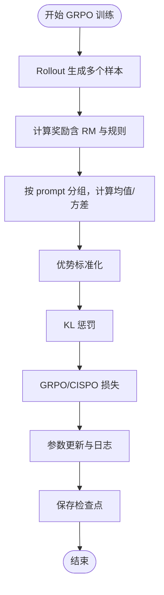
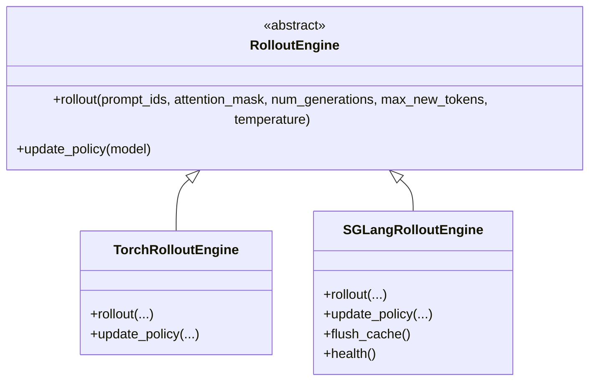
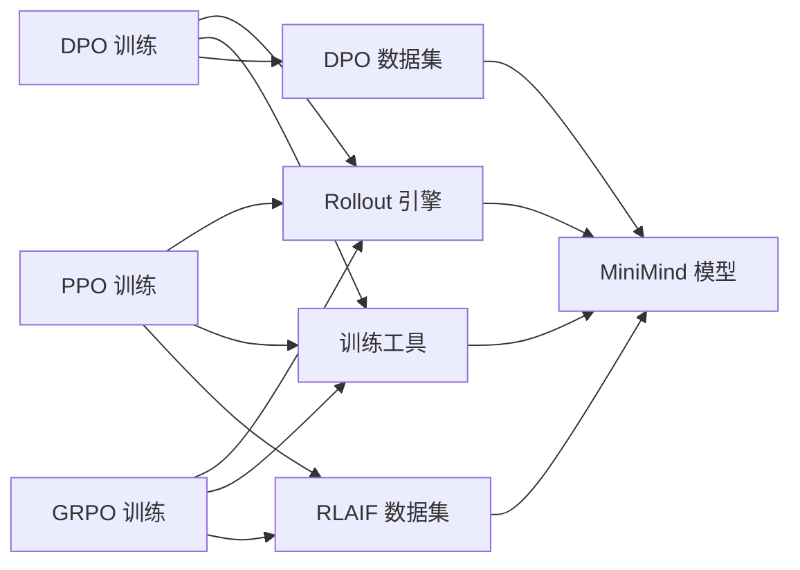

# RLHF 训练阶段

<cite>
**本文引用的文件**
- [train_dpo.py](file://trainer/train_dpo.py)
- [train_ppo.py](file://trainer/train_ppo.py)
- [train_grpo.py](file://trainer/train_grpo.py)
- [rollout_engine.py](file://trainer/rollout_engine.py)
- [trainer_utils.py](file://trainer/trainer_utils.py)
- [lm_dataset.py](file://dataset/lm_dataset.py)
- [model_minimind.py](file://model/model_minimind.py)
- [README.md](file://README.md)
</cite>

## 目录
1. [引言](#引言)
2. [项目结构](#项目结构)
3. [核心组件](#核心组件)
4. [架构总览](#架构总览)
5. [详细组件分析](#详细组件分析)
6. [依赖分析](#依赖分析)
7. [性能考量](#性能考量)
8. [故障排查指南](#故障排查指南)
9. [结论](#结论)
10. [附录](#附录)

## 引言
本节面向 MiniMind 的 RLHF（Reinforcement Learning from Human Feedback）训练阶段，系统阐述通过人类反馈引导模型学习更符合人类价值观的行为。文档聚焦三种主流算法：
- DPO（Direct Preference Optimization）：偏好优化，直接从偏好数据学习，无需显式奖励模型或参考模型的联合训练。
- PPO（Proximal Policy Optimization）：策略梯度方法，使用 Actor-Critic 架构，结合 Critic 价值估计与 KL 惩罚，稳定策略更新。
- GRPO（Guided Reinforcement Policy Optimization）：组内相对策略优化，通过组内奖励标准化与 KL 惩罚，提升样本多样性与稳定性。

同时，文档梳理 RLHF 数据的收集与标注流程（偏好数据、奖励模型训练）、训练流程与性能评估方法，帮助读者构建高质量的指令跟随模型。

## 项目结构
本仓库 RLHF 训练相关代码集中在 trainer 目录，配合数据集、模型与工具模块协同工作：
- 训练脚本：DPO、PPO、GRPO 三类算法的独立训练入口
- 推理引擎：可插拔的 rollout 引擎，支持本地 PyTorch 与 SGLang 两种后端
- 数据集：DPO、RLAIF、Agent RL 等数据集的加载与预处理
- 模型：MiniMind 架构与推理生成逻辑
- 工具：分布式初始化、断点续训、学习率调度、奖励模型封装等

图表来源
- [train_dpo.py](file://trainer/train_dpo.py)
- [train_ppo.py](file://trainer/train_ppo.py)
- [train_grpo.py](file://trainer/train_grpo.py)
- [rollout_engine.py](file://trainer/rollout_engine.py)
- [lm_dataset.py](file://dataset/lm_dataset.py)
- [model_minimind.py](file://model/model_minimind.py)
- [trainer_utils.py](file://trainer/trainer_utils.py)

章节来源
- [README.md](file://README.md)
- [train_dpo.py](file://trainer/train_dpo.py)
- [train_ppo.py](file://trainer/train_ppo.py)
- [train_grpo.py](file://trainer/train_grpo.py)
- [rollout_engine.py](file://trainer/rollout_engine.py)
- [lm_dataset.py](file://dataset/lm_dataset.py)
- [model_minimind.py](file://model/model_minimind.py)
- [trainer_utils.py](file://trainer/trainer_utils.py)

## 核心组件
- DPO 训练器：以偏好数据为输入，计算参考模型与策略模型在 chosen/rejected 上的对数似然差，通过 sigmoid 损失进行偏好优化，支持混合精度与分布式训练。
- PPO 训练器：采用 Actor-Critic 架构，Critic 输出价值估计，Actor 使用 KL 惩罚与裁剪策略梯度，支持早停与 GAE 优势估计。
- GRPO 训练器：在组内对奖励进行标准化，结合 KL 惩罚与裁剪比率，支持 GRPO 与 CISPO 两种损失变体。
- Rollout 引擎：统一的推理接口，支持本地 PyTorch 生成与 SGLang HTTP 推理，可热更新策略权重。
- 数据集：DPODataset、RLAIFDataset、AgentRLDataset，分别用于偏好学习、策略梯度与多轮工具调用强化学习。
- 模型：MiniMindForCausalLM，支持生成、推理与 MoE 辅助损失。
- 工具：分布式初始化、断点续训、学习率调度、奖励模型封装等。

章节来源
- [train_dpo.py](file://trainer/train_dpo.py)
- [train_ppo.py](file://trainer/train_ppo.py)
- [train_grpo.py](file://trainer/train_grpo.py)
- [rollout_engine.py](file://trainer/rollout_engine.py)
- [lm_dataset.py](file://dataset/lm_dataset.py)
- [model_minimind.py](file://model/model_minimind.py)
- [trainer_utils.py](file://trainer/trainer_utils.py)

## 架构总览
RLHF 三算法共享统一的训练流程：加载基础权重（SFT）→ Rollout 采样 → 计算奖励/优势 → 计算策略损失 → 梯度更新 → 保存检查点。不同算法在优势估计、损失构造与早停策略上有所差异。

图表来源
- [train_dpo.py](file://trainer/train_dpo.py)
- [train_ppo.py](file://trainer/train_ppo.py)
- [train_grpo.py](file://trainer/train_grpo.py)
- [rollout_engine.py](file://trainer/rollout_engine.py)
- [trainer_utils.py](file://trainer/trainer_utils.py)

## 详细组件分析

### DPO（偏好优化）
- 数学原理
  - 通过参考模型与策略模型在 chosen/rejected 序列上的对数似然差，构造偏好损失：sigmoid 形式的二元交叉熵，鼓励策略模型在偏好数据上提高 chosen 的概率，降低 rejected 的概率。
  - 通过掩码对序列有效 token 进行求和，避免 padding 干扰。
- 实现要点
  - 参考模型在训练期间冻结，仅用于计算参考对数似然。
  - 混合精度与梯度累积，支持分布式训练与 torch.compile。
  - 断点续训与可视化集成。
- 适用场景
  - 偏好数据充足且标注质量高；追求训练稳定性与收敛速度。
- 关键函数与路径
  - 对数似然计算：[logits_to_log_probs](file://trainer/train_dpo.py)
  - 偏好损失计算：[dpo_loss](file://trainer/train_dpo.py)
  - 训练循环与日志：[train_epoch](file://trainer/train_dpo.py)
  - 数据集：[DPODataset](file://dataset/lm_dataset.py)

图表来源
- [train_dpo.py](file://trainer/train_dpo.py)
- [lm_dataset.py](file://dataset/lm_dataset.py)

章节来源
- [train_dpo.py](file://trainer/train_dpo.py)
- [lm_dataset.py](file://dataset/lm_dataset.py)

### PPO（策略梯度）
- 数学原理
  - 使用 Actor-Critic 架构：Actor 为策略模型，Critic 为价值模型，输出序列每个 token 的价值估计。
  - 采用 GAE（广义优势估计）计算优势，结合 KL 惩罚与裁剪策略梯度，限制更新幅度，避免策略发散。
  - 早停机制：当近似 KL 超过阈值时停止该批更新，防止过度更新。
- 实现要点
  - Critic 为策略模型的线性输出头，仅在 rollout 阶段推理使用。
  - 支持 mini-batch 与多轮更新，结合 Cosine 学习率调度。
  - 可插拔 rollout 引擎，支持本地与 SGLang。
- 适用场景
  - 需要稳定策略更新与价值估计；对奖励信号依赖较低。
- 关键函数与路径
  - Critic 模型定义：[CriticModel](file://trainer/train_ppo.py)
  - 优势计算与早停：[ppo_train_epoch](file://trainer/train_ppo.py)
  - 数据集：[RLAIFDataset](file://dataset/lm_dataset.py)

图表来源
- [train_ppo.py](file://trainer/train_ppo.py)
- [rollout_engine.py](file://trainer/rollout_engine.py)
- [lm_dataset.py](file://dataset/lm_dataset.py)

章节来源
- [train_ppo.py](file://trainer/train_ppo.py)
- [rollout_engine.py](file://trainer/rollout_engine.py)
- [lm_dataset.py](file://dataset/lm_dataset.py)

### GRPO（组内相对策略优化）
- 数学原理
  - 对每个 prompt 的多个生成样本，计算组内奖励均值与方差，进行标准化得到优势，结合 KL 惩罚与裁剪比率（GRPO 或 CISPO）进行策略更新。
  - 通过组内比较抑制样本间噪声，提升训练稳定性。
- 实现要点
  - 支持 GRPO 与 CISPO 两种损失变体，CISPO 通过上界裁剪比率，缓解极端比例影响。
  - 可插拔 rollout 引擎，支持本地与 SGLang。
- 适用场景
  - 样本多样性与组内一致性要求较高；需要在奖励噪声较大时保持稳定。
- 关键函数与路径
  - 奖励计算与优势标准化：[calculate_rewards](file://trainer/train_grpo.py)
  - 组内优势与损失：[grpo_train_epoch](file://trainer/train_grpo.py)
  - 数据集：[RLAIFDataset](file://dataset/lm_dataset.py)

图表来源
- [train_grpo.py](file://trainer/train_grpo.py)
- [rollout_engine.py](file://trainer/rollout_engine.py)
- [lm_dataset.py](file://dataset/lm_dataset.py)

章节来源
- [train_grpo.py](file://trainer/train_grpo.py)
- [rollout_engine.py](file://trainer/rollout_engine.py)
- [lm_dataset.py](file://dataset/lm_dataset.py)

### Rollout 引擎（可插拔）
- 功能
  - 统一的推理接口，支持本地 PyTorch 生成与 SGLang HTTP 推理。
  - 支持热更新策略权重（SGLang），便于在线策略迭代。
- 类型
  - TorchRolloutEngine：本地推理，支持 autocast 与 logp 计算。
  - SGLangRolloutEngine：HTTP 推理，支持权重同步与缓存刷新。
- 关键函数与路径
  - 抽象接口与工厂：[RolloutEngine/create_rollout_engine](file://trainer/rollout_engine.py)
  - 计算 token 级 logp：[compute_per_token_logps](file://trainer/rollout_engine.py)

图表来源
- [rollout_engine.py](file://trainer/rollout_engine.py)

章节来源
- [rollout_engine.py](file://trainer/rollout_engine.py)

### 数据集与奖励模型
- DPO 数据集：加载 chosen/rejected 对，构造输入与掩码，用于 DPO 训练。
- RLAIF 数据集：构造对话提示，用于 PPO/GRPO rollout 采样。
- Agent RL 数据集：多轮对话+工具调用+目标值，用于复杂强化学习场景。
- 奖励模型：封装第三方奖励模型，提供评分接口，用于奖励计算。

章节来源
- [lm_dataset.py](file://dataset/lm_dataset.py)
- [trainer_utils.py](file://trainer/trainer_utils.py)

### 模型与生成
- MiniMind 架构：Decoder-only、RMSNorm、SwiGLU、RoPE/YaRN、可选 MoE。
- 生成接口：支持温度、top-k/top-p、重复惩罚、cache 推理等。

章节来源
- [model_minimind.py](file://model/model_minimind.py)

## 依赖分析
- 训练脚本依赖
  - rollout_engine：统一推理后端
  - trainer_utils：分布式、断点续训、学习率、奖励模型封装
  - lm_dataset：数据加载与预处理
  - model_minimind：模型与生成
- 算法耦合
  - DPO 与参考模型强耦合（冻结参考）
  - PPO 与 Critic 强耦合（价值估计）
  - GRPO 与组内奖励标准化强耦合
- 外部依赖
  - SGLang HTTP 推理（可选）
  - SwanLab（可视化，替代 W&B）

图表来源
- [train_dpo.py](file://trainer/train_dpo.py)
- [train_ppo.py](file://trainer/train_ppo.py)
- [train_grpo.py](file://trainer/train_grpo.py)
- [rollout_engine.py](file://trainer/rollout_engine.py)
- [trainer_utils.py](file://trainer/trainer_utils.py)
- [lm_dataset.py](file://dataset/lm_dataset.py)
- [model_minimind.py](file://model/model_minimind.py)

章节来源
- [train_dpo.py](file://trainer/train_dpo.py)
- [train_ppo.py](file://trainer/train_ppo.py)
- [train_grpo.py](file://trainer/train_grpo.py)
- [rollout_engine.py](file://trainer/rollout_engine.py)
- [trainer_utils.py](file://trainer/trainer_utils.py)
- [lm_dataset.py](file://dataset/lm_dataset.py)
- [model_minimind.py](file://model/model_minimind.py)

## 性能考量
- 训练效率
  - 混合精度（bfloat16/float16）与 autocast，显著降低显存占用与加速训练。
  - 梯度累积与分布式训练（DDP），提升吞吐与稳定性。
  - torch.compile（可选）进一步加速推理与训练。
- 推理效率
  - SGLang HTTP 推理支持热更新权重，适合在线策略迭代。
  - 本地 PyTorch 推理适合小规模或离线场景。
- 内存与显存
  - 注意长序列与多生成样本的内存峰值，合理设置 max_seq_len/max_gen_len 与 num_generations。
- 早停与稳定性
  - PPO 的早停与 KL 惩罚、GRPO 的组内标准化与裁剪比率，有助于避免策略发散。

[本节为通用性能建议，不直接分析具体文件]

## 故障排查指南
- 分布式训练
  - 确认 NCCL 环境变量与后端，检查 LOCAL_RANK 与设备绑定。
  - 断点续训时注意 world_size 变化导致的 step 调整。
- 推理后端
  - SGLang 未启动或健康检查失败时，回退到本地 PyTorch 推理。
  - 权重同步失败时，检查共享存储路径与权限。
- 混合精度
  - CPU 训练禁用 autocast，确保数值稳定性。
- 梯度与损失
  - 梯度爆炸时启用梯度裁剪；NaN/Inf 时检查学习率与损失缩放。
- 数据与掩码
  - 确保 DPO 掩码与序列长度匹配，避免 padding 干扰。

章节来源
- [trainer_utils.py](file://trainer/trainer_utils.py)
- [rollout_engine.py](file://trainer/rollout_engine.py)
- [train_ppo.py](file://trainer/train_ppo.py)
- [train_grpo.py](file://trainer/train_grpo.py)
- [train_dpo.py](file://trainer/train_dpo.py)

## 结论
MiniMind 的 RLHF 训练通过 DPO、PPO、GRPO 三种算法，覆盖从偏好学习到策略梯度再到组内相对优化的完整路径。借助可插拔的 rollout 引擎与完善的工具链，用户可在不同硬件与场景下高效构建高质量指令跟随模型。建议根据数据特性与资源约束选择合适算法：偏好数据丰富选 DPO，需要稳定策略更新选 PPO，样本多样性与组内一致性要求高选 GRPO。

[本节为总结性内容，不直接分析具体文件]

## 附录
- RLHF 数据流程
  - 偏好数据：从 SFT 数据中抽取，标注 chosen/rejected 对，用于 DPO 训练。
  - RLAIF 数据：从 SFT 数据中筛选，构造对话提示，用于 PPO/GRPO rollout。
  - Agent RL 数据：多轮对话+工具调用+目标值，用于复杂强化学习。
  - 奖励模型：加载第三方奖励模型，提供评分接口，辅助奖励计算。
- 训练流程与评估
  - 训练流程：加载基础权重 → Rollout 采样 → 计算奖励/优势 → 计算损失 → 梯度更新 → 保存检查点。
  - 评估方法：可结合下游任务指标（如 C-Eval、C-MMLU）与生成质量（长度、重复惩罚、奖励均值）进行综合评估。

章节来源
- [README.md](file://README.md)
- [lm_dataset.py](file://dataset/lm_dataset.py)
- [trainer_utils.py](file://trainer/trainer_utils.py)