# 完整训练流水线

<cite>
**本文档引用的文件**
- [README.md](file://README.md)
- [model_minimind.py](file://model/model_minimind.py)
- [model_lora.py](file://model/model_lora.py)
- [lm_dataset.py](file://dataset/lm_dataset.py)
- [trainer_utils.py](file://trainer/trainer_utils.py)
- [rollout_engine.py](file://trainer/rollout_engine.py)
- [train_pretrain.py](file://trainer/train_pretrain.py)
- [train_full_sft.py](file://trainer/train_full_sft.py)
- [train_lora.py](file://trainer/train_lora.py)
- [train_dpo.py](file://trainer/train_dpo.py)
- [train_ppo.py](file://trainer/train_ppo.py)
- [train_grpo.py](file://trainer/train_grpo.py)
- [train_agent.py](file://trainer/train_agent.py)
- [train_distillation.py](file://trainer/train_distillation.py)
</cite>

## 目录
1. [引言](#引言)
2. [项目结构](#项目结构)
3. [核心组件](#核心组件)
4. [架构概览](#架构概览)
5. [详细组件分析](#详细组件分析)
6. [依赖关系分析](#依赖关系分析)
7. [性能考虑](#性能考虑)
8. [故障排除指南](#故障排除指南)
9. [结论](#结论)
10. [附录](#附录)

## 引言

MiniMind 是一个从零开始构建的超小语言模型训练系统，能够在单卡 NVIDIA 3090 上仅用约 2 小时完成 64M 参数模型的完整训练流程。该项目覆盖了从预训练到强化学习的全阶段训练代码，包括：

- **预训练（Pretrain）**：无监督学习语言模型的基础表示
- **监督微调（SFT）**：对齐对话格式和指令遵循能力
- **LoRA 微调**：参数高效微调技术
- **RLHF（DPO）**：基于偏好的直接优化
- **RLAIF（PPO/GRPO/CISPO）**：基于奖励模型的强化学习
- **工具调用（Tool Use）**：多轮工具交互能力
- **代理强化学习（Agentic RL）**：复杂任务的自主决策
- **自适应思考与模型蒸馏**：知识蒸馏和能力迁移

该项目的核心优势在于完全使用 PyTorch 原生实现，不依赖第三方高层抽象，为学习者提供了从底层理解到实际应用的完整路径。

## 项目结构

项目采用清晰的模块化组织结构，按照功能域进行划分：

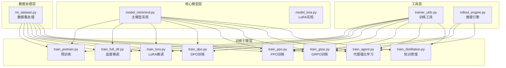

**图表来源**
- [model_minimind.py:1-280](file://model/model_minimind.py#L1-L280)
- [lm_dataset.py:1-256](file://dataset/lm_dataset.py#L1-L256)
- [trainer_utils.py:1-177](file://trainer/trainer_utils.py#L1-L177)
- [rollout_engine.py:1-213](file://trainer/rollout_engine.py#L1-L213)

**章节来源**
- [README.md:75-112](file://README.md#L75-L112)
- [README.md:277-367](file://README.md#L277-L367)

## 核心组件

### 模型架构

MiniMind 采用 Transformer Decoder-Only 架构，具有以下关键特性：

- **预标准化 + RMSNorm**：提高训练稳定性和收敛速度
- **SwiGLU 激活函数**：提供更强的非线性表达能力
- **RoPE 旋转位置编码**：支持长序列处理和 YaRN 外推
- **可选 MoE 架构**：4 experts / top-1 routing 的专家系统

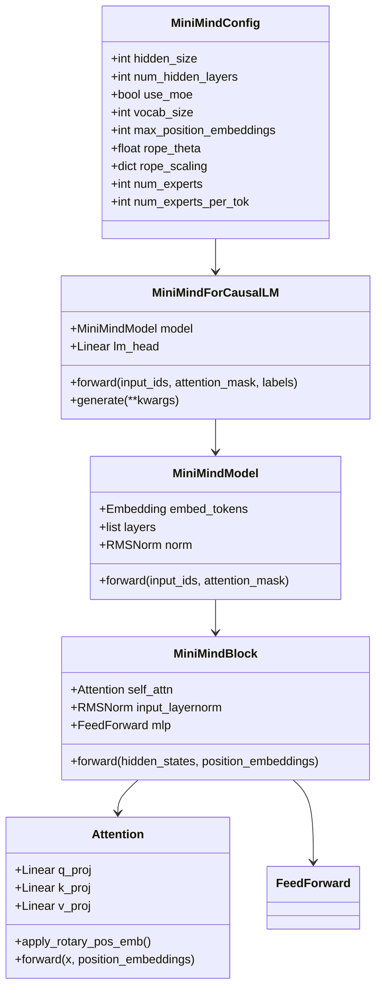

**图表来源**
- [model_minimind.py:10-280](file://model/model_minimind.py#L10-L280)

### 数据处理管道

数据处理层提供了统一的数据格式和预处理逻辑：

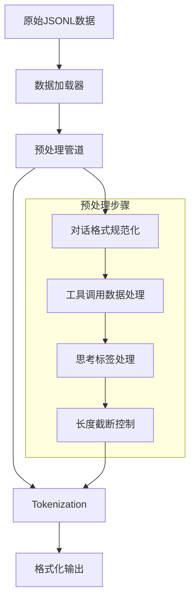

**图表来源**
- [lm_dataset.py:37-256](file://dataset/lm_dataset.py#L37-L256)

**章节来源**
- [model_minimind.py:1-280](file://model/model_minimind.py#L1-L280)
- [lm_dataset.py:1-256](file://dataset/lm_dataset.py#L1-L256)

## 架构概览

MiniMind 的训练流水线采用阶段化设计，每个阶段都有明确的目标和输出：

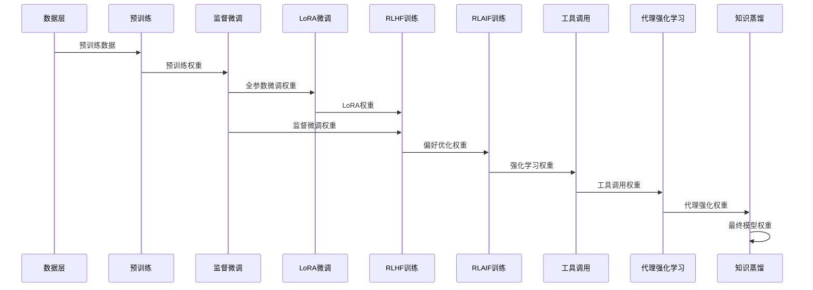

**图表来源**
- [train_pretrain.py:82-170](file://trainer/train_pretrain.py#L82-L170)
- [train_full_sft.py:83-171](file://trainer/train_full_sft.py#L83-L171)
- [train_lora.py:77-184](file://trainer/train_lora.py#L77-L184)
- [train_dpo.py:130-226](file://trainer/train_dpo.py#L130-L226)
- [train_ppo.py:303-444](file://trainer/train_ppo.py#L303-L444)
- [train_grpo.py:205-332](file://trainer/train_grpo.py#L205-L332)
- [train_agent.py:371-488](file://trainer/train_agent.py#L371-L488)
- [train_distillation.py:145-246](file://trainer/train_distillation.py#L145-L246)

## 详细组件分析

### 预训练阶段（Pretrain）

预训练是语言模型学习基础语言规律的关键阶段，目标是让模型掌握词汇接龙能力和语言统计规律。

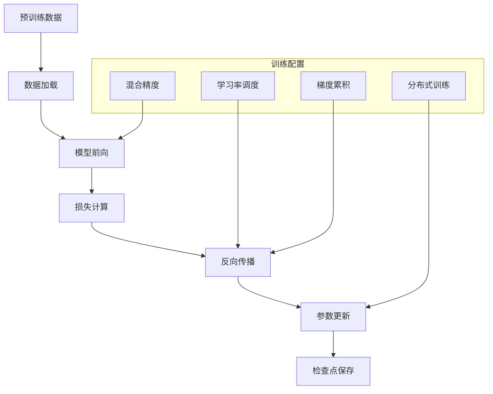

**图表来源**
- [train_pretrain.py:23-81](file://trainer/train_pretrain.py#L23-L81)

**训练特点**：
- 使用交叉熵损失函数
- 支持混合精度训练（bfloat16/float16）
- 实现了完整的检查点保存和断点续训
- 支持分布式数据并行训练

**预期效果**：
- 模型能够进行基础的语言生成
- 学习到基本的语法和语义规律
- 为后续微调提供良好的基础表示

**章节来源**
- [train_pretrain.py:82-170](file://trainer/train_pretrain.py#L82-L170)
- [README.md:677-704](file://README.md#L677-L704)

### 监督微调阶段（SFT）

监督微调阶段专注于对齐对话格式和指令遵循能力，是模型实用化的关键步骤。

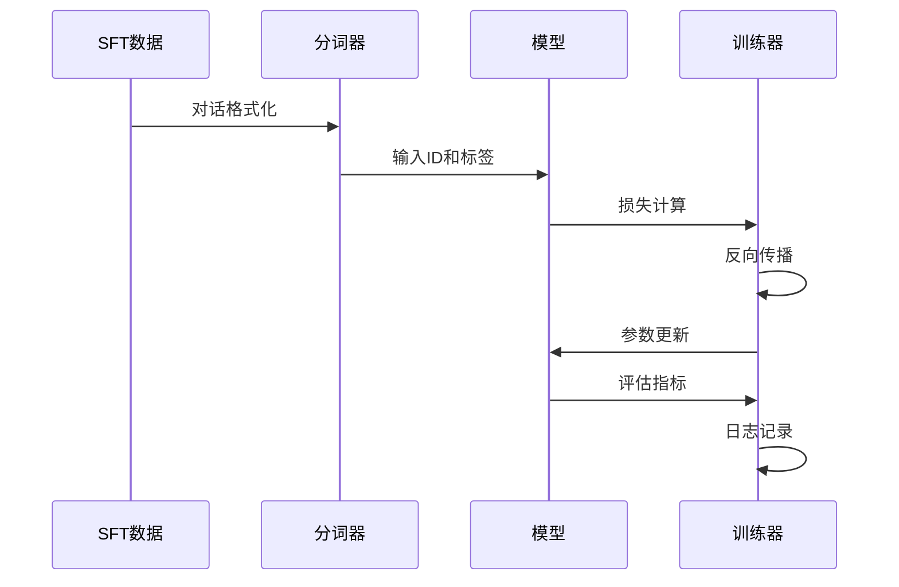

**图表来源**
- [train_full_sft.py:23-82](file://trainer/train_full_sft.py#L23-L82)
- [lm_dataset.py:58-120](file://dataset/lm_dataset.py#L58-L120)

**训练特点**：
- 支持多轮对话格式
- 集成工具调用和思考标签
- 实现了完整的训练监控和可视化
- 支持 LoRA 微调的基座模型

**预期效果**：
- 模型能够遵循指令和格式规范
- 具备基础的对话理解和生成能力
- 支持工具调用和思考过程

**章节来源**
- [train_full_sft.py:83-171](file://trainer/train_full_sft.py#L83-L171)
- [lm_dataset.py:58-120](file://dataset/lm_dataset.py#L58-L120)

### LoRA 微调

LoRA（Low-Rank Adaptation）是一种参数高效微调技术，能够在保持基础模型不变的情况下快速适配新领域。

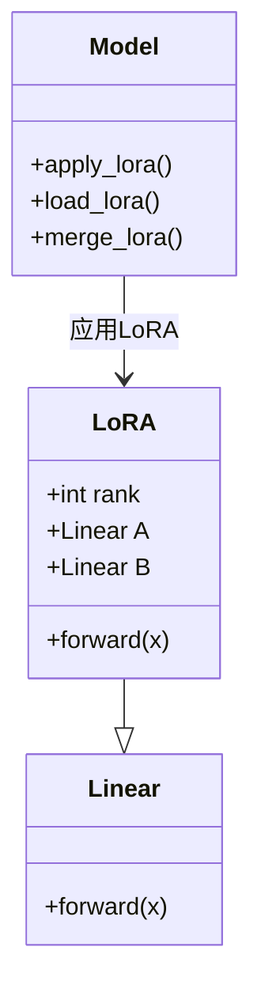

**图表来源**
- [model_lora.py:5-66](file://model/model_lora.py#L5-L66)

**实现特点**：
- 仅训练低秩增量参数
- 支持冻结基础模型权重
- 实现了 LoRA 权重的保存和合并
- 支持跨领域的能力迁移

**预期效果**：
- 以较小的计算成本实现领域适配
- 保持基础模型的通用能力
- 支持快速部署和切换

**章节来源**
- [model_lora.py:1-66](file://model/model_lora.py#L1-L66)
- [train_lora.py:77-184](file://trainer/train_lora.py#L77-L184)

### RLHF（DPO）训练

DPO（Direct Preference Optimization）是 RLHF 的直接优化方法，避免了复杂的奖励建模过程。

```mermaid
flowchart TD
A[偏好数据] --> B[数据预处理]
B --> C[策略模型]
C --> D[参考模型]
D --> E[日志概率计算]
E --> F[DPO损失计算]
F --> G[反向传播]
G --> H[参数更新]
subgraph "DPO算法"
I[log π(a|x) - log r(a|x)]
J[logsigmoid函数]
K[偏好优化]
end
F --> I
I --> J
J --> K
```

**图表来源**
- [train_dpo.py:33-50](file://trainer/train_dpo.py#L33-L50)

**算法原理**：
- 直接优化策略相对于参考模型的偏好
- 使用 logsigmoid 损失函数
- 避免了奖励模型的训练复杂性
- 提供更稳定的训练过程

**预期效果**：
- 模型能够更好地遵循人类偏好
- 减少训练过程中的不确定性
- 提高训练效率和稳定性

**章节来源**
- [train_dpo.py:130-226](file://trainer/train_dpo.py#L130-L226)

### RLAIF（PPO/GRPO/CISPO）训练

RLAIF 集成了多种强化学习算法，包括 PPO、GRPO 和 CISPO，提供灵活的强化学习训练方案。

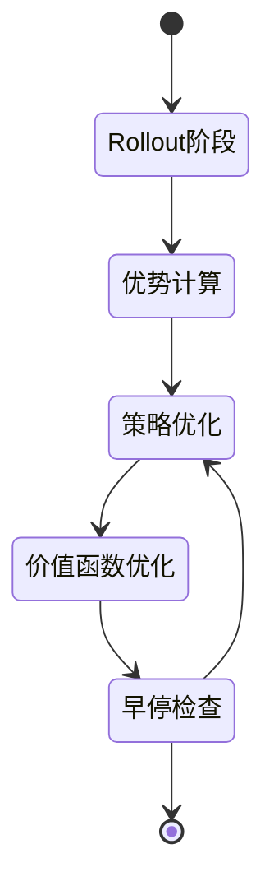

**图表来源**
- [train_ppo.py:78-301](file://trainer/train_ppo.py#L78-L301)
- [train_grpo.py:70-203](file://trainer/train_grpo.py#L70-L203)

**算法特点**：
- **PPO**：使用裁剪机制确保训练稳定性
- **GRPO**：基于组相对策略优化的多样本训练
- **CISPO**：结合了 PPO 和 GRPO 的优势
- 支持早停机制防止过拟合

**预期效果**：
- 提升模型的对话质量和一致性
- 增强模型的推理和规划能力
- 支持复杂的多轮交互场景

**章节来源**
- [train_ppo.py:303-444](file://trainer/train_ppo.py#L303-L444)
- [train_grpo.py:205-332](file://trainer/train_grpo.py#L205-L332)

### 代理强化学习（Agent RL）

代理强化学习专注于复杂任务的自主决策能力，支持工具调用和多轮交互。

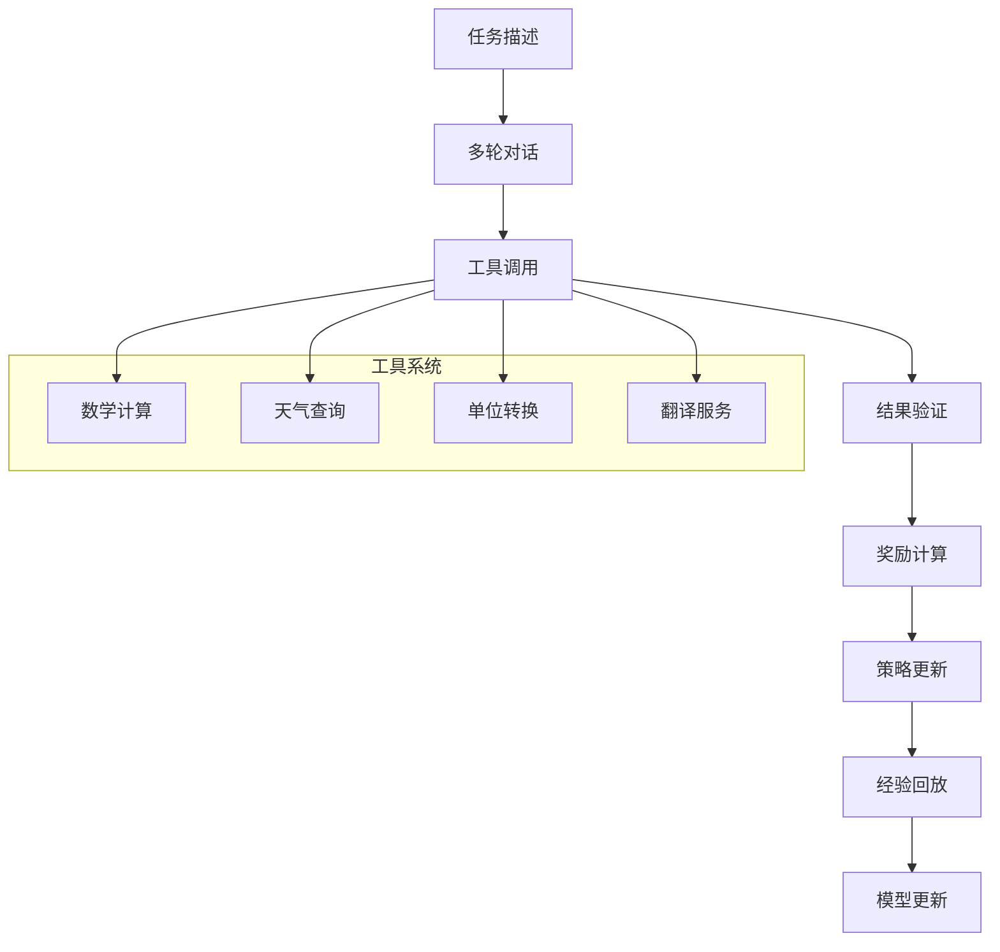

**图表来源**
- [train_agent.py:97-180](file://trainer/train_agent.py#L97-L180)

**实现特点**：
- 支持多轮工具调用的复杂任务
- 集成奖励模型评分机制
- 实现了完整的工具执行和验证
- 支持思考过程的引导和控制

**预期效果**：
- 模型能够处理复杂的多步骤任务
- 具备工具调用和结果验证能力
- 支持最终目标导向的推理过程

**章节来源**
- [train_agent.py:371-488](file://trainer/train_agent.py#L371-L488)

### 知识蒸馏

知识蒸馏实现了从大型教师模型到小型学生模型的知识迁移，提高小模型的性能。

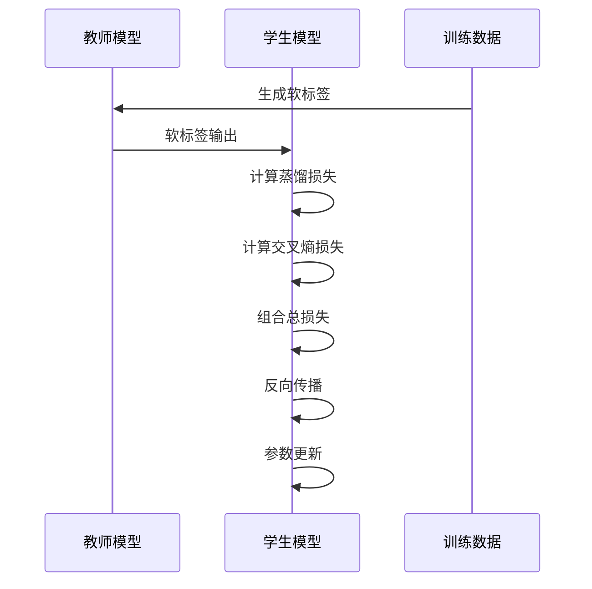

**图表来源**
- [train_distillation.py:24-36](file://trainer/train_distillation.py#L24-L36)

**蒸馏策略**：
- **软标签蒸馏**：使用教师模型的概率分布
- **温度缩放**：平滑概率分布提高迁移效果
- **混合损失**：CE + α·KL 的组合策略
- **MoE 蒸馏**：支持专家系统的知识迁移

**预期效果**：
- 学生模型获得教师模型的知识
- 提高小模型的生成质量和稳定性
- 实现参数量和性能的平衡

**章节来源**
- [train_distillation.py:145-246](file://trainer/train_distillation.py#L145-L246)

## 依赖关系分析

训练系统中的组件依赖关系体现了清晰的层次结构：

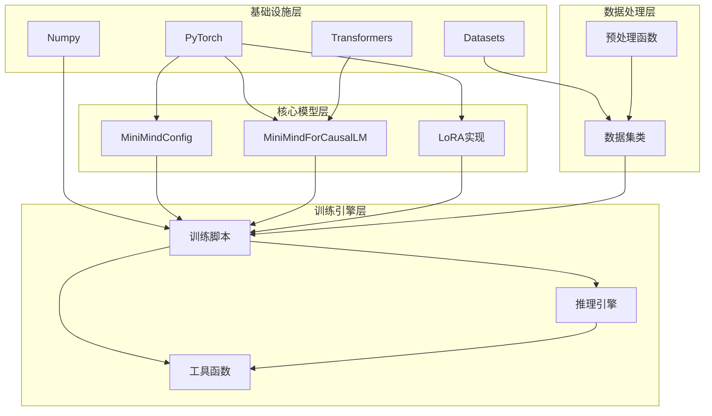

**图表来源**
- [trainer_utils.py:1-177](file://trainer/trainer_utils.py#L1-L177)
- [rollout_engine.py:1-213](file://trainer/rollout_engine.py#L1-L213)

**依赖特点**：
- **松耦合设计**：各组件间依赖关系清晰
- **可插拔架构**：推理引擎和数据集可替换
- **向后兼容**：支持不同版本的依赖库
- **模块化组织**：功能按模块独立实现

**章节来源**
- [trainer_utils.py:1-177](file://trainer/trainer_utils.py#L1-L177)
- [rollout_engine.py:1-213](file://trainer/rollout_engine.py#L1-L213)

## 性能考虑

### 训练效率优化

MiniMind 在多个方面进行了性能优化：

1. **混合精度训练**：支持 bfloat16 和 float16，减少显存占用
2. **梯度累积**：在有限显存下增大有效批量大小
3. **分布式训练**：支持多卡数据并行和张量并行
4. **检查点策略**：定期保存模型状态，支持断点续训

### 内存管理

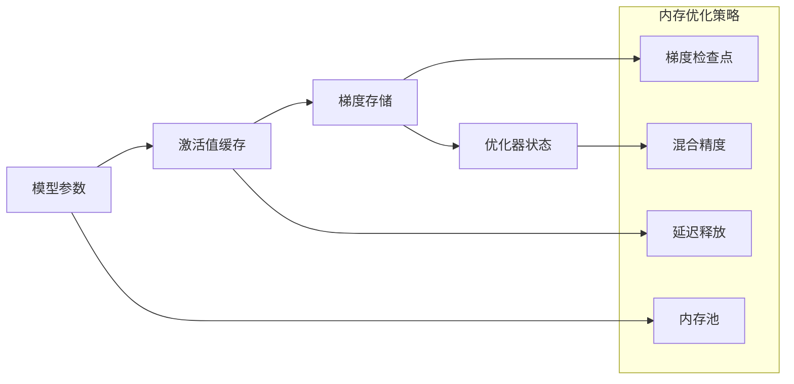

**优化措施**：
- 使用 torch.cuda.empty_cache() 及时释放内存
- 实现 SkipBatchSampler 支持断点续训
- 采用 half() 精度保存模型权重
- 优化数据加载和预处理流程

### 训练稳定性

- **学习率调度**：使用余弦退火策略
- **梯度裁剪**：防止梯度爆炸
- **早停机制**：PPO 中的 KL 散度限制
- **数值稳定性**：logsoftmax 和 logsigmoid 的稳定实现

## 故障排除指南

### 常见问题及解决方案

**1. 显存不足问题**
- 降低 batch_size 或使用梯度累积
- 启用混合精度训练
- 减少 max_seq_len 参数
- 使用更小的模型配置

**2. 分布式训练问题**
- 检查 NCCL 环境变量设置
- 确认 GPU 设备编号正确
- 验证网络连接和防火墙设置
- 检查 CUDA 和驱动版本兼容性

**3. 模型加载错误**
- 确认权重文件路径正确
- 检查模型配置与权重匹配
- 验证文件权限和磁盘空间
- 使用 strict=False 处理部分加载

**4. 训练不收敛**
- 调整学习率和学习率调度
- 检查数据质量和预处理
- 验证损失函数实现正确性
- 确认梯度更新正常

**章节来源**
- [trainer_utils.py:63-117](file://trainer/trainer_utils.py#L63-L117)
- [README.md:302-321](file://README.md#L302-L321)

## 结论

MiniMind 提供了一个完整且实用的 LLM 训练系统，从零开始涵盖了现代大模型训练的所有关键阶段。该系统的主要优势包括：

1. **教育价值**：完全使用 PyTorch 原生实现，便于学习和理解
2. **实用性**：支持从 64M 到 198M 参数的多种模型规模
3. **完整性**：覆盖预训练到强化学习的全阶段训练
4. **可扩展性**：模块化设计支持功能扩展和定制

通过遵循本文档的指导，用户可以在个人设备上成功复现完整的 LLM 训练流程，从基础的预训练开始，逐步完成监督微调、强化学习等高级训练阶段，最终获得具备实用能力的对话模型。

## 附录

### 训练参数配置

| 阶段 | 主要参数 | 建议值 | 说明 |
|------|----------|--------|------|
| 预训练 | epochs, batch_size, learning_rate | 2, 32, 5e-4 | 基础语言学习 |
| SFT | epochs, batch_size, learning_rate | 2, 16, 1e-5 | 对话格式对齐 |
| LoRA | epochs, batch_size, learning_rate | 10, 32, 1e-4 | 参数高效微调 |
| DPO | epochs, batch_size, learning_rate | 1, 4, 4e-8 | 偏好优化 |
| PPO | epochs, batch_size, learning_rate | 1, 2, 3e-7 | 强化学习 |

### 数据格式要求

**预训练数据** (`pretrain_t2t.jsonl`):
```json
{"text": "示例文本内容"}
```

**SFT数据** (`sft_t2t.jsonl`):
```json
{
    "conversations": [
        {"role": "user", "content": "你好"},
        {"role": "assistant", "content": "你好！"}
    ]
}
```

**DPO数据** (`dpo.jsonl`):
```json
{
  "chosen": [
    {"content": "Q", "role": "user"}, 
    {"content": "good answer", "role": "assistant"}
  ], 
  "rejected": [
    {"content": "Q", "role": "user"}, 
    {"content": "bad answer", "role": "assistant"}
  ]
}
```