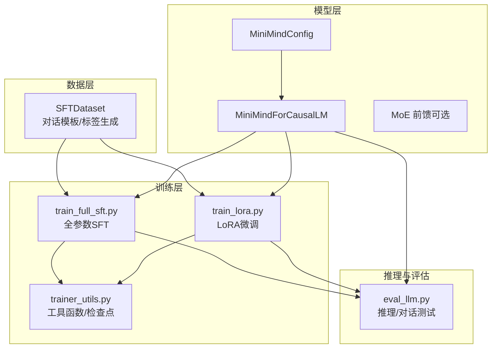
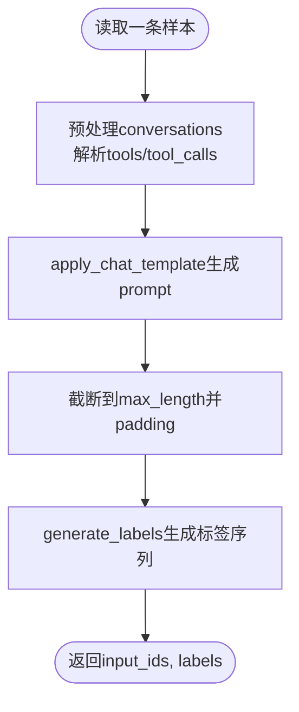
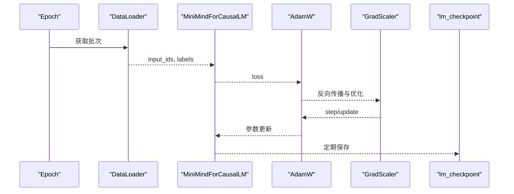
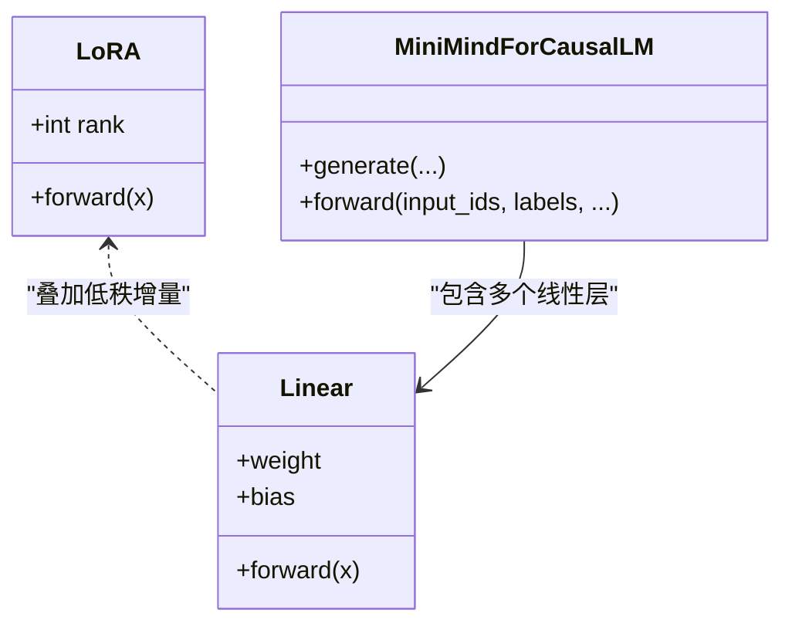
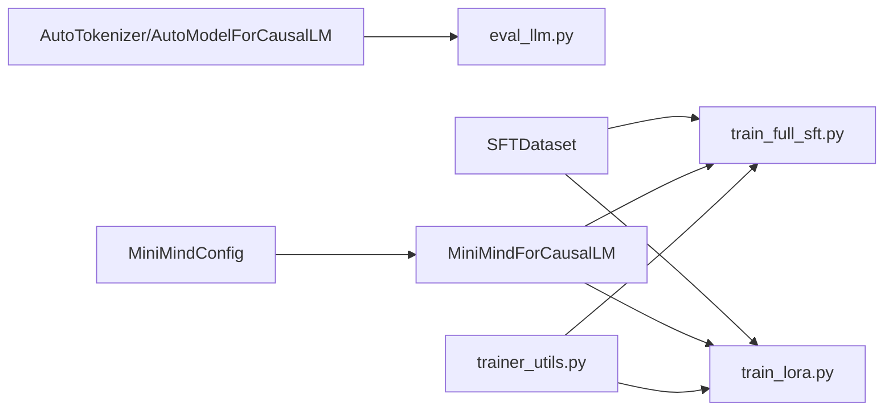

# 监督微调阶段

<cite>
**本文引用的文件**
- [README.md](file://README.md)
- [train_full_sft.py](file://trainer/train_full_sft.py)
- [train_lora.py](file://trainer/train_lora.py)
- [model_minimind.py](file://model/model_minimind.py)
- [model_lora.py](file://model/model_lora.py)
- [lm_dataset.py](file://dataset/lm_dataset.py)
- [trainer_utils.py](file://trainer/trainer_utils.py)
- [eval_llm.py](file://eval_llm.py)
</cite>

## 目录
1. [引言](#引言)
2. [项目结构](#项目结构)
3. [核心组件](#核心组件)
4. [架构总览](#架构总览)
5. [详细组件分析](#详细组件分析)
6. [依赖关系分析](#依赖关系分析)
7. [性能考量](#性能考量)
8. [故障排查指南](#故障排查指南)
9. [结论](#结论)
10. [附录](#附录)

## 引言
监督微调（Supervised Fine-Tuning, SFT）是将预训练语言模型对齐到人类指令与对话规范的关键步骤。其核心目标是通过高质量的人类指令数据，优化模型的指令遵循能力与对话质量，使其在多轮对话、工具调用、思考链等复杂交互场景中表现更稳定、更可控。

本阶段文档聚焦 MiniMind 的 SFT 实现，涵盖：
- SFT 数据格式规范与对话模板
- 全参数微调与 LoRA 微调的实现差异与适用场景
- 训练算法与关键超参（损失、优化器、学习率调度）
- 完整训练流程与评估方法

## 项目结构
MiniMind 的训练链路采用“阶段化、模块化”设计，SFT 作为第二阶段，紧随预训练之后，负责将预训练模型对齐到人类偏好与指令格式。



**图表来源**
- [lm_dataset.py:58-120](file://dataset/lm_dataset.py#L58-L120)
- [model_minimind.py:10-45](file://model/model_minimind.py#L10-L45)
- [model_minimind.py:229-247](file://model/model_minimind.py#L229-L247)
- [train_full_sft.py:134-156](file://trainer/train_full_sft.py#L134-L156)
- [train_lora.py:127-168](file://trainer/train_lora.py#L127-L168)
- [trainer_utils.py:63-117](file://trainer/trainer_utils.py#L63-L117)
- [eval_llm.py:12-31](file://eval_llm.py#L12-L31)

**章节来源**
- [README.md:331-338](file://README.md#L331-L338)
- [README.md:705-735](file://README.md#L705-L735)

## 核心组件
- 数据集与对话模板
  - SFT 数据采用统一的多轮对话格式，支持 system、user、assistant、tool 等角色，以及 reasoning_content、tool_calls 等字段。
  - 数据集通过 apply_chat_template 应用模板，生成可用于因果语言建模的输入序列，并通过标签生成逻辑仅对助手回复部分计算交叉熵损失。
- 模型与损失
  - MiniMindForCausalLM 基于 MiniMindModel，输出 logits 并在 labels 存在时计算交叉熵损失；当使用 MoE 时，还会返回辅助 router 损失。
- 训练脚本
  - 全参数 SFT：AdamW 优化器，余弦学习率调度，混合精度与梯度累积，支持断点续训与 DDP。
  - LoRA 微调：仅训练低秩增量参数，冻结主干权重，参数量显著降低，适合领域适配。

**章节来源**
- [lm_dataset.py:58-120](file://dataset/lm_dataset.py#L58-L120)
- [model_minimind.py:229-247](file://model/model_minimind.py#L229-L247)
- [train_full_sft.py:134-156](file://trainer/train_full_sft.py#L134-L156)
- [train_lora.py:127-168](file://trainer/train_lora.py#L127-L168)

## 架构总览
SFT 的端到端流程如下：

```mermaid
sequenceDiagram
participant U as "用户"
participant DS as "SFTDataset"
participant TOK as "分词器"
participant MD as "MiniMindForCausalLM"
participant OPT as "AdamW优化器"
participant CK as "检查点/日志"
U->>DS : 提供conversations
DS->>TOK : apply_chat_template
TOK-->>DS : 输入ids/模板
DS-->>MD : input_ids, labels
MD-->>OPT : loss/backward
OPT-->>MD : 更新参数
MD-->>CK : 保存权重/日志
CK-->>U : 可用的full_sft权重
```

**图表来源**
- [lm_dataset.py:71-119](file://dataset/lm_dataset.py#L71-L119)
- [model_minimind.py:238-246](file://model/model_minimind.py#L238-L246)
- [train_full_sft.py:23-81](file://trainer/train_full_sft.py#L23-L81)
- [trainer_utils.py:63-117](file://trainer/trainer_utils.py#L63-L117)

## 详细组件分析

### 数据格式与对话模板
- 数据来源与格式
  - SFT 数据统一为 JSONL，每条样本包含 conversations 数组，元素为 role/content 形式的多轮对话，支持 system/tools/tool_calls/reasoning_content 等字段。
- 模板与标签生成
  - 使用 apply_chat_template 生成完整对话字符串，随后将 input_ids 截断到 max_length，并通过 generate_labels 仅对助手回复部分设置标签，其余位置填充忽略索引，确保仅对助手输出计算损失。
- 系统提示与工具调用
  - 支持在首轮插入系统提示，工具定义与调用以 tools/tool_calls 字段表达，便于训练工具调用与思考链能力。



**图表来源**
- [lm_dataset.py:9-35](file://dataset/lm_dataset.py#L9-L35)
- [lm_dataset.py:71-119](file://dataset/lm_dataset.py#L71-L119)

**章节来源**
- [README.md:441-461](file://README.md#L441-L461)
- [lm_dataset.py:58-120](file://dataset/lm_dataset.py#L58-L120)

### 全参数微调（Full SFT）
- 模型与配置
  - 使用 MiniMindForCausalLM，支持 MoE 前馈与 router 辅助损失；训练时可选择 bfloat16/float16 混合精度。
- 训练循环
  - 余弦退火学习率调度；梯度累积减少显存占用；梯度裁剪防止爆炸；定期保存检查点与日志。
- 断点续训
  - 保存模型、优化器、scaler、wandb/run_id 等状态，支持跨 GPU 数量恢复。



**图表来源**
- [train_full_sft.py:23-81](file://trainer/train_full_sft.py#L23-L81)
- [trainer_utils.py:63-117](file://trainer/trainer_utils.py#L63-L117)

**章节来源**
- [train_full_sft.py:83-171](file://trainer/train_full_sft.py#L83-L171)
- [trainer_utils.py:40-42](file://trainer/trainer_utils.py#L40-L42)

### LoRA 微调
- LoRA 结构
  - 在线性层上注入低秩增量 A、B，仅训练低秩参数，冻结主干权重，显著降低参数量与显存占用。
- 训练策略
  - 仅对 lora 参数启用 requires_grad；优化器仅传入 lora_params；训练周期通常较短，适合领域适配。
- 合并与推理
  - 支持将 LoRA 权重合并到主干权重，导出完整权重；推理时可加载 LoRA 并与主干融合。



**图表来源**
- [model_lora.py:6-18](file://model/model_lora.py#L6-L18)
- [model_lora.py:21-33](file://model/model_lora.py#L21-L33)
- [model_minimind.py:229-247](file://model/model_minimind.py#L229-L247)

**章节来源**
- [train_lora.py:127-184](file://trainer/train_lora.py#L127-L184)
- [model_lora.py:45-66](file://model/model_lora.py#L45-L66)

### 损失函数与优化器
- 损失函数
  - 交叉熵损失，仅对助手回复部分计算；当使用 MoE 时，模型额外返回 router 辅助损失，二者相加作为总损失。
- 优化器与学习率
  - AdamW 优化器；余弦退火学习率调度；支持混合精度与梯度累积；梯度裁剪防止不稳定。
- 训练稳定性
  - 混合精度、梯度裁剪、断点续训与 DDP 支持共同保障训练稳定性与效率。

**章节来源**
- [model_minimind.py:242-246](file://model/model_minimind.py#L242-L246)
- [trainer_utils.py:40-42](file://trainer/trainer_utils.py#L40-L42)
- [train_full_sft.py:34-48](file://trainer/train_full_sft.py#L34-L48)

### 训练流程与评估指标
- 训练流程
  - 预训练 → 全参数 SFT（或 LoRA 微调）→ 可选知识蒸馏/强化学习 → 推理与评估。
- 评估方法
  - 推理脚本支持多轮对话、思考链开关、工具调用等；可结合下游评测集（如 C-Eval、C-MMLU）进行客观评估。
  - 也可通过人工评估对话质量、指令遵循度、工具调用成功率等主观指标。

**章节来源**
- [README.md:705-735](file://README.md#L705-L735)
- [eval_llm.py:32-94](file://eval_llm.py#L32-L94)

## 依赖关系分析
- 组件耦合
  - SFTDataset 与分词器紧密耦合，负责模板与标签生成；MiniMindForCausalLM 与 Trainer 工具函数配合，实现检查点与分布式训练。
- 外部依赖
  - 使用 transformers 的 AutoTokenizer/AutoModelForCausalLM 作为推理兼容层；训练阶段以原生实现为主，保持可复现性。



**图表来源**
- [eval_llm.py:12-31](file://eval_llm.py#L12-L31)
- [lm_dataset.py:58-120](file://dataset/lm_dataset.py#L58-L120)
- [model_minimind.py:10-45](file://model/model_minimind.py#L10-L45)
- [model_minimind.py:229-247](file://model/model_minimind.py#L229-L247)
- [trainer_utils.py:63-117](file://trainer/trainer_utils.py#L63-L117)

**章节来源**
- [README.md:331-338](file://README.md#L331-L338)
- [README.md:705-735](file://README.md#L705-L735)

## 性能考量
- 训练效率
  - 混合精度与梯度累积可显著降低显存占用；DDP 多卡训练可加速收敛。
- 数据与模型规模
  - SFT 数据规模与质量直接影响对齐效果；MoE 在容量与训练开销间提供权衡。
- 推理与部署
  - 全参数 SFT 适合通用对齐；LoRA 更适合快速领域适配与部署。

[本节为通用指导，不直接分析具体文件]

## 故障排查指南
- 检查点与续训
  - 若训练中断，确保 checkpoints 目录存在且命名规范；跨 GPU 数量恢复时，脚本会自动调整 step。
- 梯度异常
  - 若出现 NaN/梯度爆炸，检查学习率、梯度裁剪阈值与混合精度设置。
- 标签与损失
  - 若损失异常或收敛缓慢，检查 generate_labels 是否正确仅对助手回复部分设为标签。

**章节来源**
- [trainer_utils.py:63-117](file://trainer/trainer_utils.py#L63-L117)
- [train_full_sft.py:34-48](file://trainer/train_full_sft.py#L34-L48)
- [lm_dataset.py:88-104](file://dataset/lm_dataset.py#L88-L104)

## 结论
MiniMind 的 SFT 实现以清晰的数据模板与稳定的训练流程为核心，既支持全参数对齐以获得更强的通用能力，也提供 LoRA 微调以满足快速领域适配的需求。通过合理的超参与监控手段，可在中小规模设备上高效完成 SFT 训练，并为进一步的强化学习与推理部署打下坚实基础。

[本节为总结性内容，不直接分析具体文件]

## 附录
- 快速开始
  - 准备预训练权重与 SFT 数据，执行全参数 SFT 或 LoRA 微调脚本；训练完成后使用 eval_llm.py 进行对话测试。
- 参考配置
  - hidden_size、num_hidden_layers、use_moe、max_seq_len 等参数可在训练脚本中按需调整。

**章节来源**
- [README.md:331-338](file://README.md#L331-L338)
- [README.md:705-735](file://README.md#L705-L735)
- [train_full_sft.py:83-107](file://trainer/train_full_sft.py#L83-L107)
- [train_lora.py:77-101](file://trainer/train_lora.py#L77-L101)