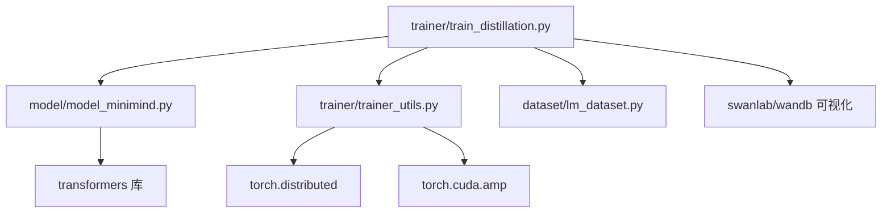
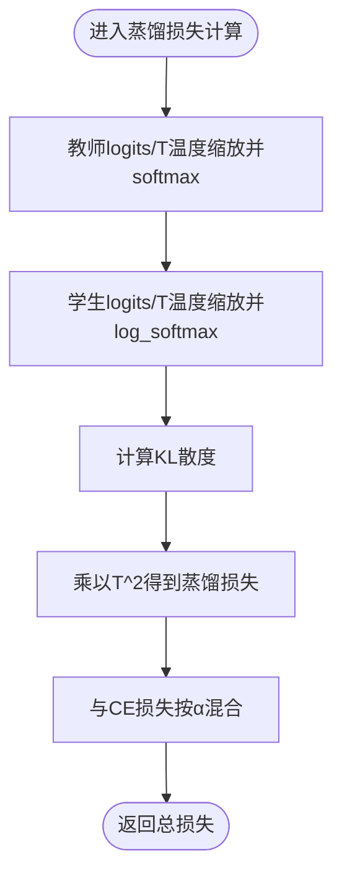
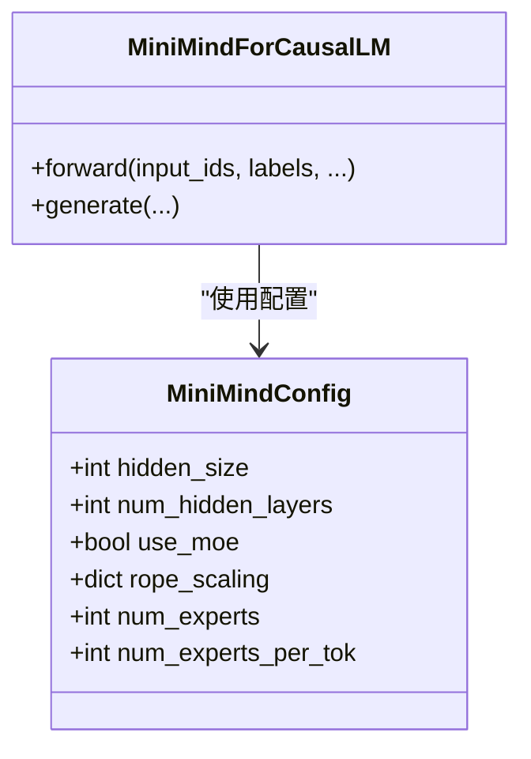
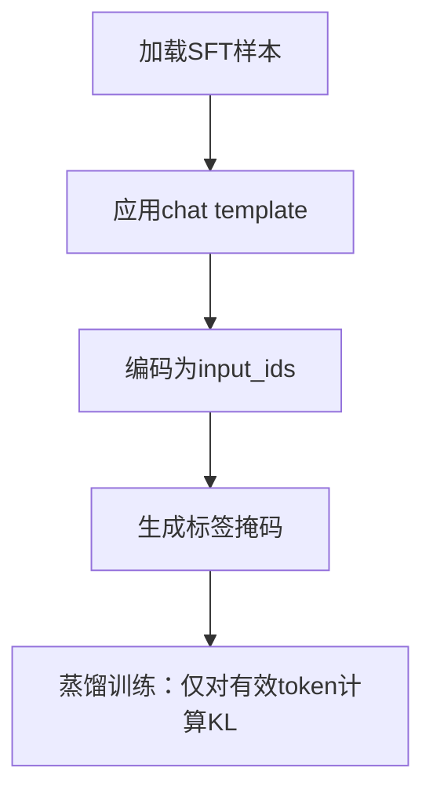
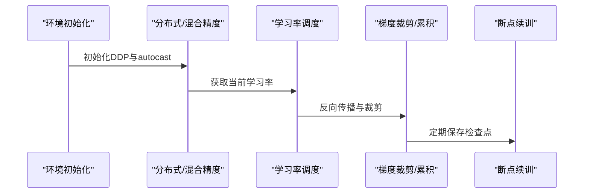
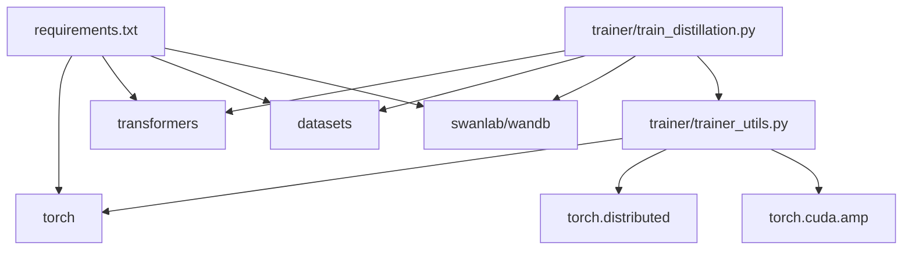

# 知识蒸馏阶段

<cite>
**本文引用的文件**
- [train_distillation.py](file://trainer/train_distillation.py)
- [model_minimind.py](file://model/model_minimind.py)
- [trainer_utils.py](file://trainer/trainer_utils.py)
- [lm_dataset.py](file://dataset/lm_dataset.py)
- [README.md](file://README.md)
- [requirements.txt](file://requirements.txt)
</cite>

## 目录
1. [引言](#引言)
2. [项目结构](#项目结构)
3. [核心组件](#核心组件)
4. [架构总览](#架构总览)
5. [详细组件分析](#详细组件分析)
6. [依赖分析](#依赖分析)
7. [性能考量](#性能考量)
8. [故障排查指南](#故障排查指南)
9. [结论](#结论)
10. [附录](#附录)

## 引言
本节聚焦 MiniMind 的知识蒸馏（Knowledge Distillation, KD）阶段，系统阐述白盒蒸馏的原理与实现：通过大型教师模型对小型学生模型进行软标签指导，实现模型压缩与推理加速。文档将详细解释温度参数调节、软标签计算、损失函数设计等关键技术，结合代码实现说明教师/学生模型的选择与初始化、蒸馏训练配置、训练稳定性保障与效果评估方法，并提供最佳实践建议。

## 项目结构
MiniMind 的蒸馏训练位于训练器模块，核心文件包括蒸馏训练脚本、模型定义、训练工具与数据集封装。下图展示与蒸馏相关的文件与模块关系。



图表来源
- [train_distillation.py:1-246](file://trainer/train_distillation.py#L1-L246)
- [model_minimind.py:1-280](file://model/model_minimind.py#L1-L280)
- [trainer_utils.py:1-177](file://trainer/trainer_utils.py#L1-L177)
- [lm_dataset.py:1-256](file://dataset/lm_dataset.py#L1-L256)

章节来源
- [train_distillation.py:145-246](file://trainer/train_distillation.py#L145-L246)
- [model_minimind.py:10-45](file://model/model_minimind.py#L10-L45)
- [trainer_utils.py:119-131](file://trainer/trainer_utils.py#L119-L131)
- [lm_dataset.py:58-119](file://dataset/lm_dataset.py#L58-L119)

## 核心组件
- 蒸馏损失函数：基于 KL 散度的白盒蒸馏损失，结合温度缩放与 CE 混合损失，实现对教师分布的软监督。
- 学生/教师模型：MiniMindConfig 驱动的模型配置，支持 Dense 与 MoE 两种结构，蒸馏阶段可跨结构组合。
- 数据集：SFTDataset 提供对话格式数据，标签掩码与损失计算对蒸馏训练至关重要。
- 训练工具：分布式训练、混合精度、学习率调度、断点续训、检查点保存等基础设施。

章节来源
- [train_distillation.py:24-35](file://trainer/train_distillation.py#L24-L35)
- [model_minimind.py:10-45](file://model/model_minimind.py#L10-L45)
- [lm_dataset.py:58-119](file://dataset/lm_dataset.py#L58-L119)
- [trainer_utils.py:40-41](file://trainer/trainer_utils.py#L40-L41)
- [trainer_utils.py:63-116](file://trainer/trainer_utils.py#L63-L116)

## 架构总览
下图展示蒸馏训练的端到端流程：数据加载、学生模型前向、教师模型前向（仅推理）、软标签与损失计算、反向传播与优化、日志与检查点。

```mermaid
sequenceDiagram
participant Loader as "数据加载器"
participant Student as "学生模型"
participant Teacher as "教师模型"
participant Loss as "蒸馏损失函数"
participant Opt as "优化器/调度器"
Loader->>Student : 输入序列
Student->>Student : 前向计算 logits
Student-->>Teacher : 输入序列
Teacher->>Teacher : 前向计算 logitseval,no_grad
Teacher-->>Loss : 教师 logits
Student-->>Loss : 学生 logits
Loss-->>Opt : 混合损失CE + KL
Opt-->>Student : 反向传播与参数更新
Opt-->>Loader : 日志/检查点/可视化
```

图表来源
- [train_distillation.py:38-143](file://trainer/train_distillation.py#L38-L143)
- [train_distillation.py:24-35](file://trainer/train_distillation.py#L24-L35)

章节来源
- [train_distillation.py:38-143](file://trainer/train_distillation.py#L38-L143)

## 详细组件分析

### 蒸馏损失函数与温度参数
- 软标签计算：使用教师模型 logits 除以温度 T 并 softmax，得到教师分布；学生模型 logits 除以温度 T 并 log_softmax，计算 KL 散度。
- 温度缩放：KL 乘以 T^2，平衡温度对分布平滑程度与梯度尺度的影响。
- 混合损失：总损失为 α·CE + (1-α)·T^2·KL，其中 CE 为交叉熵，α 控制监督信号与蒸馏信号的比重。



图表来源
- [train_distillation.py:24-35](file://trainer/train_distillation.py#L24-L35)

章节来源
- [train_distillation.py:24-35](file://trainer/train_distillation.py#L24-L35)

### 教师/学生模型初始化与配置
- 模型配置：MiniMindConfig 支持 hidden_size、num_hidden_layers、use_moe、RoPE/YaRN 等关键参数，蒸馏阶段可灵活组合 Dense 与 MoE。
- 模型加载：init_model 从 out 目录加载已有权重（如 full_sft），支持 MoE 后缀区分。
- 教师模型冻结：蒸馏阶段教师模型设为 eval 且 requires_grad=False，避免梯度泄漏。



图表来源
- [model_minimind.py:10-45](file://model/model_minimind.py#L10-L45)
- [model_minimind.py:229-246](file://model/model_minimind.py#L229-L246)
- [trainer_utils.py:119-131](file://trainer/trainer_utils.py#L119-L131)

章节来源
- [model_minimind.py:10-45](file://model/model_minimind.py#L10-L45)
- [trainer_utils.py:119-131](file://trainer/trainer_utils.py#L119-L131)
- [train_distillation.py:203-209](file://trainer/train_distillation.py#L203-L209)

### 数据加载与标签掩码
- SFTDataset：将多轮对话应用 chat template，生成 input_ids 与 labels；标签掩码忽略 pad 与非生成区域，仅对有效 token 计算损失。
- 蒸馏阶段：仅使用有效 token 参与 KL 计算，提高蒸馏信号的针对性与稳定性。



图表来源
- [lm_dataset.py:58-119](file://dataset/lm_dataset.py#L58-L119)
- [train_distillation.py:69-89](file://trainer/train_distillation.py#L69-L89)

章节来源
- [lm_dataset.py:58-119](file://dataset/lm_dataset.py#L58-L119)
- [train_distillation.py:69-89](file://trainer/train_distillation.py#L69-L89)

### 训练流程与稳定性保障
- 分布式与混合精度：支持 DDP 训练与 bfloat16/float16 混合精度，提升吞吐与显存效率。
- 学习率调度：余弦退火调度，保证训练后期稳定收敛。
- 梯度裁剪与梯度累积：防止爆炸梯度，提升大 batch 训练稳定性。
- 断点续训：自动保存/恢复模型、优化器、scaler、wandb run 等状态。



图表来源
- [train_distillation.py:178-246](file://trainer/train_distillation.py#L178-L246)
- [trainer_utils.py:40-41](file://trainer/trainer_utils.py#L40-L41)
- [trainer_utils.py:63-116](file://trainer/trainer_utils.py#L63-L116)

章节来源
- [train_distillation.py:178-246](file://trainer/train_distillation.py#L178-L246)
- [trainer_utils.py:40-41](file://trainer/trainer_utils.py#L40-L41)
- [trainer_utils.py:63-116](file://trainer/trainer_utils.py#L63-L116)

### 蒸馏训练配置要点
- 教师/学生维度与层数：支持不同 hidden_size 与 num_hidden_layers 的组合，如 Dense→Dense、MoE→Dense、更大教师→更小学生等。
- MoE 与 Dense 组合：学生可使用 MoE，教师可使用 Dense，蒸馏时对齐词表维度并使用 KL。
- 温度与蒸馏比例：温度 T 推荐 1.0–2.0，α 控制 CE 与 KL 的比重，建议从 0.5 起步，依据验证集性能调整。
- 数据与序列长度：max_seq_len 与数据分布相关，建议在中文场景下 340 左右，兼顾长文本与显存。

章节来源
- [train_distillation.py:162-172](file://trainer/train_distillation.py#L162-L172)
- [train_distillation.py:203-209](file://trainer/train_distillation.py#L203-L209)
- [README.md:588-604](file://README.md#L588-L604)

## 依赖分析
- 外部依赖：transformers、datasets、swanlab/wandb、torch 等，满足模型加载、数据处理与可视化需求。
- 内部依赖：蒸馏脚本依赖模型配置与工具函数，数据集封装与模型结构紧密耦合。



图表来源
- [requirements.txt:1-32](file://requirements.txt#L1-L32)
- [train_distillation.py:17-19](file://trainer/train_distillation.py#L17-L19)
- [trainer_utils.py:11-16](file://trainer/trainer_utils.py#L11-L16)

章节来源
- [requirements.txt:1-32](file://requirements.txt#L1-L32)
- [train_distillation.py:17-19](file://trainer/train_distillation.py#L17-L19)
- [trainer_utils.py:11-16](file://trainer/trainer_utils.py#L11-L16)

## 性能考量
- 温度与蒸馏比例：温度过高会导致分布过于平滑，影响学生模型的判别能力；温度过低则可能抑制软标签的引导作用。建议在 1.0–2.0 范围内搜索最优值。
- α 的权衡：α 过大偏向监督信号，可能削弱教师分布的引导；α 过小可能导致蒸馏信号淹没在噪声中。建议从 0.5 起步，结合验证集困惑度与下游任务指标微调。
- 模型结构组合：MoE→Dense 的蒸馏在激活参数上更优，但需注意教师输出与学生词表维度对齐；Dense→Dense 组合更稳定。
- 训练稳定性：合理设置梯度裁剪阈值与学习率调度策略，避免训练震荡；使用混合精度与梯度累积提升吞吐。
- 可视化与监控：使用 swanlab/wandb 记录损失曲线、学习率与 ETA，便于及时发现异常。

## 故障排查指南
- 教师/学生维度不匹配：若教师词表维度大于学生，蒸馏时会截断教师 logits 至学生维度；若小于学生，需检查权重加载与配置一致性。
- 混合精度与 NaN：bfloat16/float16 下可能出现数值不稳定，建议检查梯度裁剪与损失缩放；必要时切换为 CPU autocast 或降低学习率。
- 分布式训练异常：确保 NCCL 环境变量与本地 rank 设置正确；检查 world_size 与 GPU 数量变化导致的 step 自动转换逻辑。
- 断点续训失败：确认 checkpoints 目录存在且权限正常；若 world_size 变化，检查 resume 数据中的 step 是否已按比例转换。

章节来源
- [train_distillation.py:64-65](file://trainer/train_distillation.py#L64-L65)
- [trainer_utils.py:108-116](file://trainer/trainer_utils.py#L108-L116)

## 结论
MiniMind 的知识蒸馏实现以白盒蒸馏为核心，通过温度缩放与 KL 散度对教师分布进行软监督，结合 CE 混合损失，实现模型压缩与性能保持。训练脚本提供了完善的分布式、混合精度、断点续训与可视化支持。实践中应重点关注温度与蒸馏比例的调优、模型结构组合与维度对齐、以及训练稳定性保障，以获得最佳的蒸馏效果。

## 附录
- 使用建议
  - 教师模型建议使用已充分训练的 SFT 权重（如 full_sft），学生模型从相同权重初始化，确保初始性能基线。
  - 温度与 α 的搜索建议：先固定 α=0.5，温度在 1.0–2.0 间扫描；随后固定温度，调整 α 观察验证集指标。
  - 数据与序列长度：根据任务与显存情况调整 max_seq_len，中文场景建议 340 左右。
  - 可视化：启用 swanlab/wandb 记录关键指标，便于训练过程监控与调参。

章节来源
- [train_distillation.py:162-172](file://trainer/train_distillation.py#L162-L172)
- [README.md:588-604](file://README.md#L588-L604)