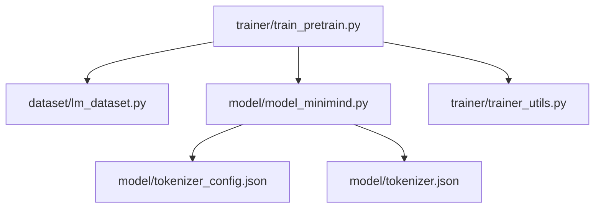
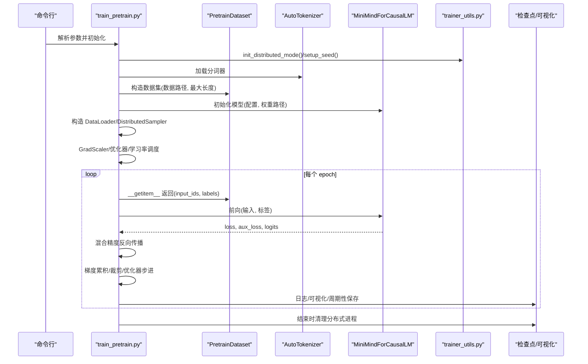
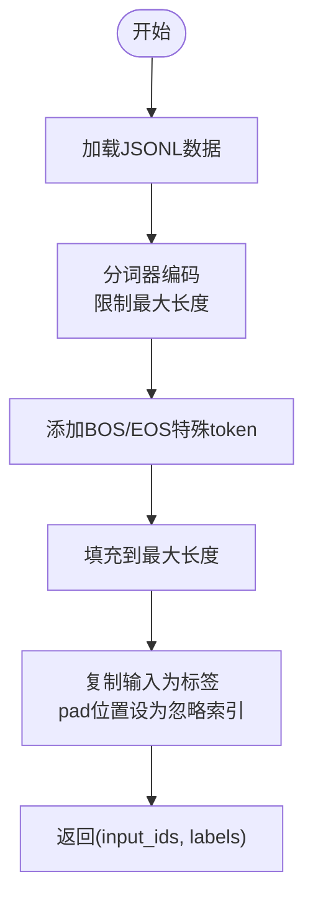
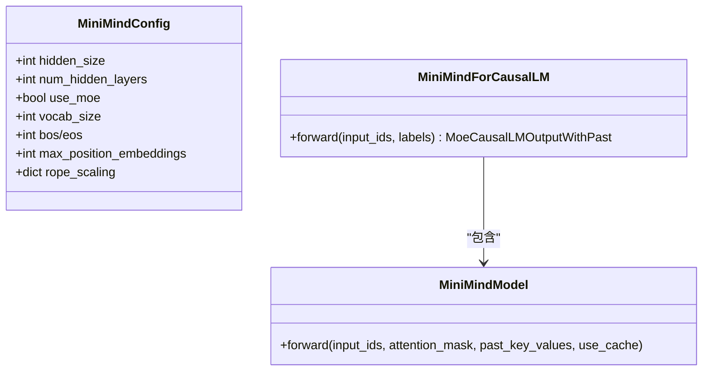
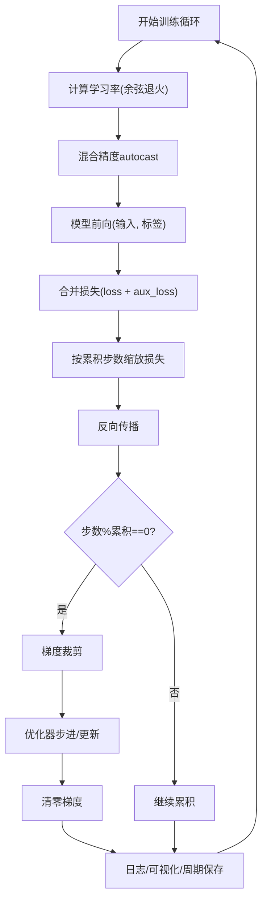
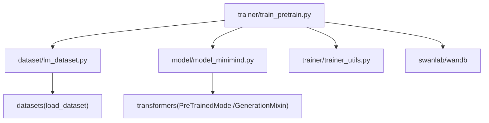

# 预训练阶段

<cite>
**本文引用的文件**
- [README.md](file://README.md)
- [train_pretrain.py](file://trainer/train_pretrain.py)
- [lm_dataset.py](file://dataset/lm_dataset.py)
- [model_minimind.py](file://model/model_minimind.py)
- [trainer_utils.py](file://trainer/trainer_utils.py)
- [tokenizer_config.json](file://model/tokenizer_config.json)
- [tokenizer.json](file://model/tokenizer.json)
</cite>

## 目录
1. [引言](#引言)
2. [项目结构](#项目结构)
3. [核心组件](#核心组件)
4. [架构总览](#架构总览)
5. [详细组件分析](#详细组件分析)
6. [依赖分析](#依赖分析)
7. [性能考量](#性能考量)
8. [故障排查指南](#故障排查指南)
9. [结论](#结论)
10. [附录](#附录)

## 引言
本节面向 MiniMind 的预训练阶段，系统阐述自回归语言建模的学习目标与原理，数据格式与处理流程，核心算法实现（损失函数、梯度更新、混合精度），以及配置参数与分布式训练策略。文档同时提供完整的训练流程图与预期效果说明，帮助读者从零开始搭建并运行有效的预训练。

## 项目结构
预训练相关代码集中在 trainer、dataset、model 三个子目录：
- trainer/train_pretrain.py：预训练入口与训练循环
- dataset/lm_dataset.py：预训练数据集与数据处理
- model/model_minimind.py：MiniMind 模型结构与前向逻辑
- trainer/trainer_utils.py：训练工具函数（学习率、分布式、断点续训、模型初始化等）
- model/tokenizer_config.json 与 model/tokenizer.json：分词器配置与词表

图表来源
- [train_pretrain.py:1-170](file://trainer/train_pretrain.py#L1-L170)
- [lm_dataset.py:1-256](file://dataset/lm_dataset.py#L1-L256)
- [model_minimind.py:1-280](file://model/model_minimind.py#L1-L280)
- [trainer_utils.py:1-177](file://trainer/trainer_utils.py#L1-L177)
- [tokenizer_config.json:1-335](file://model/tokenizer_config.json#L1-L335)
- [tokenizer.json:1-800](file://model/tokenizer.json#L1-L800)

章节来源
- [README.md:323-327](file://README.md#L323-L327)
- [README.md:400-424](file://README.md#L400-L424)

## 核心组件
- 预训练数据集（PretrainDataset）：从 JSONL 文本数据加载，进行 Tokenization，构造自回归输入与标签
- MiniMind 模型（MiniMindForCausalLM）：Decoder-only 架构，前向返回交叉熵损失与辅助损失（MoE 路由辅助）
- 训练循环（train_epoch）：学习率调度、混合精度、梯度累积、梯度裁剪、断点续训与检查点保存
- 工具函数（trainer_utils）：分布式初始化、随机种子设置、学习率余弦退火、模型/优化器/标量检查点保存与加载

章节来源
- [lm_dataset.py:37-55](file://dataset/lm_dataset.py#L37-L55)
- [model_minimind.py:229-246](file://model/model_minimind.py#L229-L246)
- [train_pretrain.py:23-80](file://trainer/train_pretrain.py#L23-L80)
- [trainer_utils.py:40-42](file://trainer/trainer_utils.py#L40-L42)

## 架构总览
预训练的整体流程从数据加载到模型训练再到可视化与断点续训，形成闭环。

图表来源
- [train_pretrain.py:82-170](file://trainer/train_pretrain.py#L82-L170)
- [lm_dataset.py:37-55](file://dataset/lm_dataset.py#L37-L55)
- [model_minimind.py:229-246](file://model/model_minimind.py#L229-L246)
- [trainer_utils.py:44-62](file://trainer/trainer_utils.py#L44-L62)

## 详细组件分析

### 数据格式与处理流程
- 数据格式
  - 预训练 JSONL：每行一条对象，字段包含 text，内容为自然语言文本
  - 示例格式参见 README 的“预训练数据”部分
- 数据加载与 Tokenization
  - 使用 datasets 加载 JSONL，按最大长度截断并添加特殊 token（BOS/EOS）
  - 输入序列：[BOS] + 文本tokens + [EOS] + padding
  - 标签序列：与 input_ids 相同，pad 位置设为忽略索引
- 数据清洗与预处理
  - 本文件未包含清洗逻辑，清洗通常在数据准备阶段完成（如去重、过滤、长度控制）

图表来源
- [lm_dataset.py:42-55](file://dataset/lm_dataset.py#L42-L55)
- [README.md:417-424](file://README.md#L417-L424)

章节来源
- [lm_dataset.py:37-55](file://dataset/lm_dataset.py#L37-L55)
- [README.md:400-424](file://README.md#L400-L424)

### 模型与损失函数
- 模型结构
  - Decoder-only，RMSNorm + SwiGLU，RoPE + YaRN 外推，支持 MoE
  - 前向返回 hidden_states、past_key_values、aux_loss（MoE 路由辅助）
- 损失函数
  - 交叉熵损失，忽略 pad 位置
  - 输出 logits 切片到与 labels 对齐，计算 CE 损失
  - 返回值包含主损失与 aux_loss（MoE 路由辅助）

图表来源
- [model_minimind.py:10-45](file://model/model_minimind.py#L10-L45)
- [model_minimind.py:229-246](file://model/model_minimind.py#L229-L246)
- [model_minimind.py:195-227](file://model/model_minimind.py#L195-L227)

章节来源
- [model_minimind.py:229-246](file://model/model_minimind.py#L229-L246)

### 训练循环与优化策略
- 学习率调度
  - 余弦退火：cosine decay 从初始学习率降至 10% 的最小值
- 混合精度
  - bfloat16 或 float16（CPU 使用非 autocast）
- 梯度累积
  - 每 accumulation_steps 步执行一次优化器步进与梯度清零
- 梯度裁剪
  - 梯度范数裁剪，防止爆炸
- 断点续训
  - 检查点保存模型、优化器、GradScaler、epoch、step、wandb run id
  - 支持跨 GPU 数量恢复（自动转换 step）
- 分布式训练
  - DDP 包装模型，忽略特定缓冲参数
  - NCCL 后端，本地 rank 设备

图表来源
- [train_pretrain.py:23-80](file://trainer/train_pretrain.py#L23-L80)
- [trainer_utils.py:40-42](file://trainer/trainer_utils.py#L40-L42)

章节来源
- [train_pretrain.py:23-80](file://trainer/train_pretrain.py#L23-L80)
- [trainer_utils.py:63-117](file://trainer/trainer_utils.py#L63-L117)

### 配置参数与使用建议
- 关键参数
  - epochs、batch_size、learning_rate、device、dtype、num_workers
  - accumulation_steps、grad_clip、log_interval、save_interval
  - hidden_size、num_hidden_layers、max_seq_len、use_moe
  - data_path、from_weight、from_resume、use_wandb、use_compile
- 使用建议
  - 单卡/多卡：torchrun --nproc_per_node N train_pretrain.py
  - 断点续训：--from_resume 1
  - 可视化：--use_wandb（默认使用 SwanLab）
  - 混合精度：dtype=float16 或 bfloat16（GPU）
  - 梯度累积：根据显存与吞吐权衡设置
  - 分布式：DDP，NCCL 后端

章节来源
- [train_pretrain.py:82-106](file://trainer/train_pretrain.py#L82-L106)
- [README.md:354-367](file://README.md#L354-L367)

## 依赖分析
- 模块间依赖
  - train_pretrain.py 依赖 lm_dataset、model_minimind、trainer_utils
  - model_minimind 依赖 transformers 的 PreTrainedModel/GenerationMixin 与输出类型
  - lm_dataset 依赖 datasets 加载 JSONL
  - trainer_utils 提供分布式、学习率、检查点等通用能力
- 外部依赖
  - torch、torch.distributed、datasets、transformers、swanlab/wandb

图表来源
- [train_pretrain.py:16-18](file://trainer/train_pretrain.py#L16-L18)
- [model_minimind.py:4](file://model/model_minimind.py#L4)
- [lm_dataset.py:6](file://dataset/lm_dataset.py#L6)
- [trainer_utils.py:15](file://trainer/trainer_utils.py#L15)

章节来源
- [train_pretrain.py:16-18](file://trainer/train_pretrain.py#L16-L18)
- [model_minimind.py:4](file://model/model_minimind.py#L4)
- [lm_dataset.py:6](file://dataset/lm_dataset.py#L6)
- [trainer_utils.py:15](file://trainer/trainer_utils.py#L15)

## 性能考量
- 混合精度
  - GPU 上使用 autocast，float16 或 bfloat16 提升吞吐与显存利用率
- 梯度累积
  - 在显存受限时扩大有效 batch size，注意学习率与步长的匹配
- 梯度裁剪
  - 防止数值不稳定，建议按经验设置阈值
- 分布式训练
  - DDP 提升吞吐，注意忽略特定缓冲参数以避免同步开销
- 学习率调度
  - 余弦退火平滑收敛，避免前期震荡
- 编译加速
  - 可选 torch.compile，加速推理/训练（取决于硬件与 PyTorch 版本）

[本节为通用指导，无需列出章节来源]

## 故障排查指南
- 训练中断后续训
  - 确认 checkpoints 目录存在 _resume.pth 检查点
  - 启动时添加 --from_resume 1，自动恢复模型、优化器、标量与 step
  - 跨 GPU 数量恢复时，step 会按世界大小自动转换
- 分布式初始化失败
  - 确保 NCCL 环境变量与后端可用
  - 检查 LOCAL_RANK 与 CUDA 设备绑定
- 混合精度异常
  - CPU 环境禁用 autocast；GPU 上确认 dtype 设置正确
- 损失不下降或 NaN
  - 检查梯度裁剪阈值、学习率、数据 pad 处理是否正确
  - 确认 tokenizer 的 pad_token_id 与标签忽略索引一致
- 可视化问题
  - 默认使用 SwanLab（国内可用），如需 WandB 请按 README 说明替换导入

章节来源
- [trainer_utils.py:63-117](file://trainer/trainer_utils.py#L63-L117)
- [train_pretrain.py:109-111](file://trainer/train_pretrain.py#L109-L111)
- [README.md:360-367](file://README.md#L360-L367)

## 结论
MiniMind 的预训练通过自回归语言建模，结合混合精度、梯度累积与分布式训练，实现了在小模型规模下的高效训练。数据以 JSONL 文本为主，经 Tokenization 构造自回归样本；模型采用 RMSNorm + SwiGLU + RoPE + YaRN，支持 MoE；训练循环提供断点续训、可视化与灵活的分布式配置。按照本文流程与参数建议，可从零开始稳定地完成预训练并获得良好的语言表示能力。

[本节为总结性内容，无需列出章节来源]

## 附录
- 预训练数据格式示例与来源参见 README 的“预训练数据”部分
- 分词器配置与词表位于 model/tokenizer_config.json 与 model/tokenizer.json

章节来源
- [README.md:400-424](file://README.md#L400-L424)
- [tokenizer_config.json:1-335](file://model/tokenizer_config.json#L1-L335)
- [tokenizer.json:1-800](file://model/tokenizer.json#L1-L800)