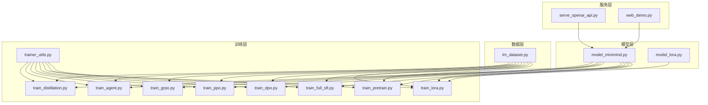
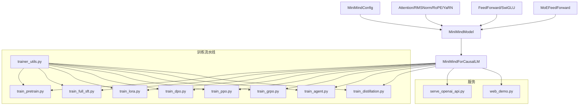
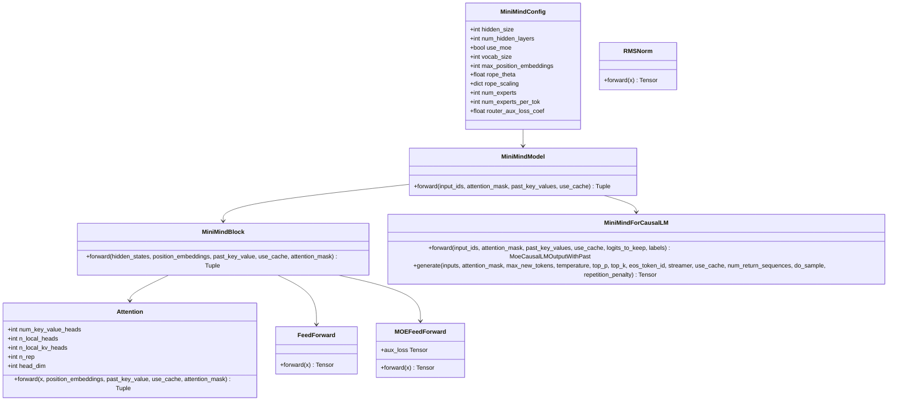
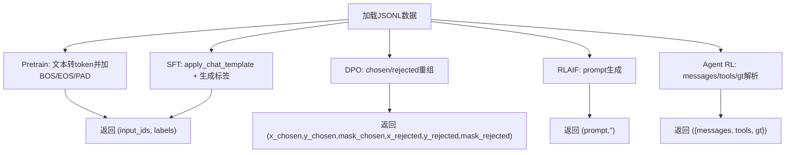
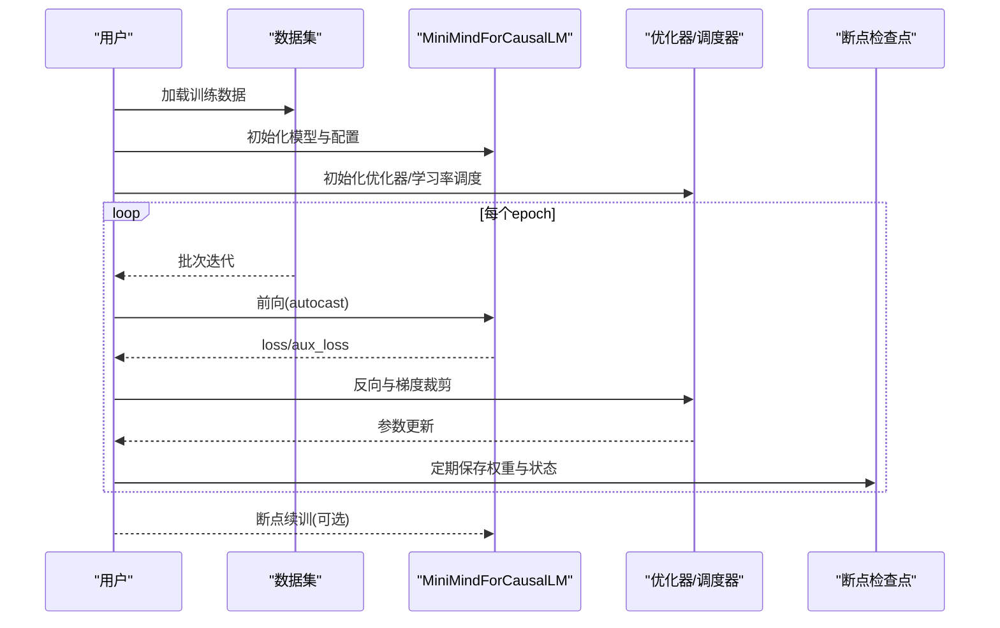
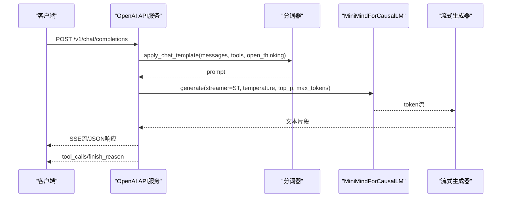
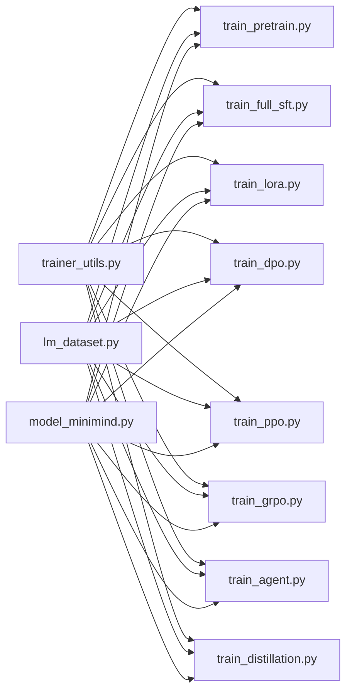

# 核心特性

<cite>
**本文引用的文件**
- [README.md](file://README.md)
- [model_minimind.py](file://model/model_minimind.py)
- [model_lora.py](file://model/model_lora.py)
- [lm_dataset.py](file://dataset/lm_dataset.py)
- [train_pretrain.py](file://trainer/train_pretrain.py)
- [train_full_sft.py](file://trainer/train_full_sft.py)
- [train_lora.py](file://trainer/train_lora.py)
- [train_dpo.py](file://trainer/train_dpo.py)
- [train_ppo.py](file://trainer/train_ppo.py)
- [train_grpo.py](file://trainer/train_grpo.py)
- [train_agent.py](file://trainer/train_agent.py)
- [train_distillation.py](file://trainer/train_distillation.py)
- [trainer_utils.py](file://trainer/trainer_utils.py)
- [serve_openai_api.py](file://scripts/serve_openai_api.py)
- [web_demo.py](file://scripts/web_demo.py)
</cite>

## 目录
1. [引言](#引言)
2. [项目结构](#项目结构)
3. [核心组件](#核心组件)
4. [架构总览](#架构总览)
5. [详细组件分析](#详细组件分析)
6. [依赖关系分析](#依赖关系分析)
7. [性能考量](#性能考量)
8. [故障排查指南](#故障排查指南)
9. [结论](#结论)
10. [附录](#附录)

## 引言
本项目以“大道至简”为核心理念，致力于用极低成本与极短时间训练出超小体量的 LLM，并提供从 0 开始的完整训练链路与可复现的实现。项目主线模型体积仅为 GPT-3 的约 1/2700，单卡 3090 上可在约 2 小时内完成从零到一的完整对话模型训练，满足个人开发者快速上手与持续迭代的需求。训练链路覆盖预训练、监督微调、LoRA、RLHF（DPO）、RLAIF（PPO/GRPO/CISPO）、Tool Use、Agentic RL、自适应思考与模型蒸馏等全过程，所有关键算法与核心模块均从 PyTorch 原生实现，不依赖第三方高层封装，同时兼容主流生态（transformers、trl、peft、llama.cpp、vllm、ollama、Llama-Factory 等）。

## 项目结构
项目采用清晰的功能分层组织：
- model：模型定义与 LoRA 实现，包含结构配置、注意力、FFN、MoE、生成接口等
- dataset：数据集加载与预处理，涵盖预训练、SFT、DPO、RLAIF、Agent RL 等
- trainer：完整训练脚本与工具函数，包含预训练、SFT、LoRA、DPO、PPO、GRPO、Agent RL、蒸馏与断点续训等
- scripts：推理与服务脚本，包含 OpenAI 兼容 API 服务与 Streamlit Web Demo
- README.md：项目介绍、特性说明、训练与数据说明、模型参数与训练开销等

图表来源
- [model_minimind.py:1-280](file://model/model_minimind.py#L1-L280)
- [model_lora.py:1-66](file://model/model_lora.py#L1-L66)
- [lm_dataset.py:1-256](file://dataset/lm_dataset.py#L1-L256)
- [train_pretrain.py:1-170](file://trainer/train_pretrain.py#L1-L170)
- [train_full_sft.py:1-171](file://trainer/train_full_sft.py#L1-L171)
- [train_lora.py:1-184](file://trainer/train_lora.py#L1-L184)
- [train_dpo.py:1-226](file://trainer/train_dpo.py#L1-L226)
- [train_ppo.py:1-444](file://trainer/train_ppo.py#L1-L444)
- [train_grpo.py:1-332](file://trainer/train_grpo.py#L1-L332)
- [train_agent.py:1-488](file://trainer/train_agent.py#L1-L488)
- [train_distillation.py:1-246](file://trainer/train_distillation.py#L1-L246)
- [trainer_utils.py:1-177](file://trainer/trainer_utils.py#L1-L177)
- [serve_openai_api.py:1-246](file://scripts/serve_openai_api.py#L1-L246)
- [web_demo.py:1-421](file://scripts/web_demo.py#L1-L421)

章节来源
- [README.md:34-97](file://README.md#L34-L97)
- [README.md:556-613](file://README.md#L556-L613)

## 核心组件
- 超轻量化设计：主线模型参数量约 64M（Dense），MoE 版本约 198M；词表仅 6400，RoPE 最大位置 32768，YaRN 外推，支持 YaRN 长序列推理
- 完整训练流水线：预训练 → SFT → LoRA → DPO → RLAIF（PPO/GRPO/CISPO）→ Tool Use → Agentic RL → 自适应思考 → 蒸馏
- 多模态扩展：视觉多模态版本、扩散语言模型（dLM）、线性注意力模型等实验性拓展
- 从 0 实现：所有关键算法与核心模块均基于 PyTorch 原生实现，不依赖第三方高层抽象
- 兼容性：兼容 transformers、trl、peft、llama.cpp、vllm、ollama、Llama-Factory 等生态

章节来源
- [README.md:34-97](file://README.md#L34-L97)
- [README.md:556-613](file://README.md#L556-L613)

## 架构总览
MiniMind 的训练与推理架构以“模块化 + 可插拔”为核心设计原则：
- 模型层：MiniMindConfig + MiniMindForCausalLM + Attention/FFN/MoE + 位置编码与 YaRN 外推
- 数据层：统一的 Dataset 类，支持预训练、SFT、DPO、RLAIF、Agent RL 等格式
- 训练层：各阶段训练脚本与统一的 trainer_utils（断点续训、DDP、混合精度、学习率调度等）
- 服务层：OpenAI 兼容 API 与 Streamlit Web Demo，支持 thinking、tool_calls、reasoning_content

图表来源
- [model_minimind.py:10-280](file://model/model_minimind.py#L10-L280)
- [train_pretrain.py:1-170](file://trainer/train_pretrain.py#L1-L170)
- [train_full_sft.py:1-171](file://trainer/train_full_sft.py#L1-L171)
- [train_lora.py:1-184](file://trainer/train_lora.py#L1-L184)
- [train_dpo.py:1-226](file://trainer/train_dpo.py#L1-L226)
- [train_ppo.py:1-444](file://trainer/train_ppo.py#L1-L444)
- [train_grpo.py:1-332](file://trainer/train_grpo.py#L1-L332)
- [train_agent.py:1-488](file://trainer/train_agent.py#L1-L488)
- [train_distillation.py:1-246](file://trainer/train_distillation.py#L1-L246)
- [trainer_utils.py:1-177](file://trainer/trainer_utils.py#L1-L177)
- [serve_openai_api.py:1-246](file://scripts/serve_openai_api.py#L1-L246)
- [web_demo.py:1-421](file://scripts/web_demo.py#L1-L421)

## 详细组件分析

### 模型与结构（MiniMindConfig/MiniMindForCausalLM）
- 结构：Decoder-only，预标准化 + RMSNorm，SwiGLU 激活，RoPE 旋转位置编码，YaRN 外推，q_heads=8，kv_heads=4，max_position_embeddings=32768，rope_theta=1e6
- MoE：4 experts / top-1 routing，路由辅助损失系数可配置
- 生成接口：继承 GenerationMixin，支持温度、top-k/top-p、eos、重复惩罚、流式输出等

图表来源
- [model_minimind.py:10-280](file://model/model_minimind.py#L10-L280)

章节来源
- [model_minimind.py:10-280](file://model/model_minimind.py#L10-L280)
- [README.md:556-576](file://README.md#L556-L576)

### 数据集与预处理（lm_dataset.py）
- PretrainDataset：将文本转为 text → next token 预测格式，自动填充 bos/eos/pad
- SFTDataset：支持 system/user/assistant/tool_calls/reasoning_content 等多轮对话格式，自动为 assistant 输出部分打标签
- DPODataset：将偏好样本重组为 chosen/rejected 对比格式
- RLAIFDataset/AgentRLDataset：为强化学习阶段提供 prompt 与工具定义

图表来源
- [lm_dataset.py:37-256](file://dataset/lm_dataset.py#L37-L256)

章节来源
- [lm_dataset.py:37-256](file://dataset/lm_dataset.py#L37-L256)

### 训练流水线（从 0 实现）
- 预训练（Pretrain）：next-token 语言建模，支持 MoE 辅助损失，混合精度与梯度累积
- 监督微调（SFT）：多轮对话 + 思考标签 + Tool Calling，支持 YaRN 外推
- LoRA：参数高效微调，仅训练低秩增量，支持断点续训与合并导出
- DPO：直接偏好优化，参考模型冻结，KL 惩罚与温度缩放
- RLAIF：PPO/GRPO/CISPO，Critic 价值头，奖励模型评分，GAE 优势估计
- Agent RL：多轮 Tool-Use 场景，奖励函数包含工具调用正确性、答案一致性与重复惩罚
- 蒸馏：CE + KL 混合损失，支持 MoE 与 dense 组合蒸馏

图表来源
- [train_pretrain.py:23-81](file://trainer/train_pretrain.py#L23-L81)
- [train_full_sft.py:23-82](file://trainer/train_full_sft.py#L23-L82)
- [train_lora.py:24-77](file://trainer/train_lora.py#L24-L77)
- [train_dpo.py:52-129](file://trainer/train_dpo.py#L52-L129)
- [train_ppo.py:78-301](file://trainer/train_ppo.py#L78-L301)
- [train_grpo.py:70-200](file://trainer/train_grpo.py#L70-L200)
- [train_agent.py:241-370](file://trainer/train_agent.py#L241-L370)
- [train_distillation.py:38-144](file://trainer/train_distillation.py#L38-L144)
- [trainer_utils.py:63-117](file://trainer/trainer_utils.py#L63-L117)

章节来源
- [train_pretrain.py:82-170](file://trainer/train_pretrain.py#L82-L170)
- [train_full_sft.py:83-171](file://trainer/train_full_sft.py#L83-L171)
- [train_lora.py:77-184](file://trainer/train_lora.py#L77-L184)
- [train_dpo.py:130-226](file://trainer/train_dpo.py#L130-L226)
- [train_ppo.py:303-444](file://trainer/train_ppo.py#L303-L444)
- [train_grpo.py:205-332](file://trainer/train_grpo.py#L205-L332)
- [train_agent.py:371-488](file://trainer/train_agent.py#L371-L488)
- [train_distillation.py:145-246](file://trainer/train_distillation.py#L145-L246)
- [trainer_utils.py:119-177](file://trainer/trainer_utils.py#L119-L177)

### 推理与服务（OpenAI 兼容 API 与 Web Demo）
- OpenAI 兼容 API：支持流式/非流式响应，支持 thinking、tool_calls、reasoning_content，可选 LoRA 合并
- Web Demo：Streamlit 实现，支持多轮对话、工具选择、思考展示、流式输出与工具调用结果渲染

图表来源
- [serve_openai_api.py:50-169](file://scripts/serve_openai_api.py#L50-L169)
- [web_demo.py:312-421](file://scripts/web_demo.py#L312-L421)

章节来源
- [serve_openai_api.py:1-246](file://scripts/serve_openai_api.py#L1-L246)
- [web_demo.py:1-421](file://scripts/web_demo.py#L1-L421)

## 依赖关系分析
- 模块耦合：训练脚本统一依赖 trainer_utils（断点续训、DDP、混合精度、学习率调度、模型初始化），数据集与模型解耦，便于替换与扩展
- 外部依赖：PyTorch 原生实现，transformers 仅用于加载与分词器；推理服务依赖 FastAPI/uvicorn/streamlit
- 可移植性：支持单机单卡/多卡（DDP/DeepSpeed），支持 SwanLab/W&B 可视化，支持 torch.compile 加速（部分脚本）

图表来源
- [trainer_utils.py:1-177](file://trainer/trainer_utils.py#L1-L177)
- [lm_dataset.py:1-256](file://dataset/lm_dataset.py#L1-L256)
- [model_minimind.py:1-280](file://model/model_minimind.py#L1-L280)

章节来源
- [trainer_utils.py:1-177](file://trainer/trainer_utils.py#L1-L177)
- [lm_dataset.py:1-256](file://dataset/lm_dataset.py#L1-L256)
- [model_minimind.py:1-280](file://model/model_minimind.py#L1-L280)

## 性能考量
- 训练效率：单卡 3090 上预训练 + SFT + Tool Call + RLAIF 总时长约 2 小时；MoE 在原生 PyTorch 下约比 Dense 慢 50%
- 显存与吞吐：混合精度（bfloat16/float16）、梯度累积、DDP/DeepSpeed、torch.compile（按脚本支持）可显著提升吞吐
- 长序列：YaRN 外推支持 2048+ 上下文长度，推理阶段可免训练扩展
- 可视化：默认使用 SwanLab（兼容 W&B），支持动态启停与跨 GPU 恢复

## 故障排查指南
- 断点续训：所有训练脚本支持自动检测与恢复，检查 checkpoints 目录与 resume 文件；跨 GPU 数量恢复会自动调整 step
- 分布式训练：确保 NCCL 环境变量与 LOCAL_RANK 设置正确；DDP 模式下忽略 freqs_cos/freqs_sin 参数同步
- 混合精度：CPU/CUDA 环境下 autocast 使用条件不同，注意 dtype 选择与 scaler 使用
- LoRA：与 torch.compile 存在兼容性限制，建议关闭 compile；冻结非 LoRA 参数，仅训练低秩分支
- PPO/GRPO：早停 KL 阈值与裁剪参数需合理设置，避免死锁与梯度爆炸

章节来源
- [trainer_utils.py:63-117](file://trainer/trainer_utils.py#L63-L117)
- [train_lora.py:162-168](file://trainer/train_lora.py#L162-L168)
- [train_ppo.py:423-428](file://trainer/train_ppo.py#L423-L428)
- [train_grpo.py:313-316](file://trainer/train_grpo.py#L313-L316)

## 结论
MiniMind 以“从 0 实现 + 全流程覆盖 + 超轻量化 + 生态兼容”为核心优势，提供从预训练到强化学习再到推理服务的完整闭环。项目不仅适合入门学习与快速复现，也为进一步扩展（如多模态、线性注意力、蒸馏与推理引擎集成）提供了清晰的模块化基础。

## 附录
- 模型参数与训练开销：详见 README 中的参数表与训练开销表格
- 数据集与下载：README 提供数据集下载链接与推荐组合
- 多模态拓展：README 提及视觉多模态版本、扩散语言模型与线性注意力模型的讨论链接

章节来源
- [README.md:616-670](file://README.md#L616-L670)
- [README.md:371-555](file://README.md#L371-L555)