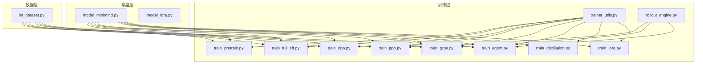
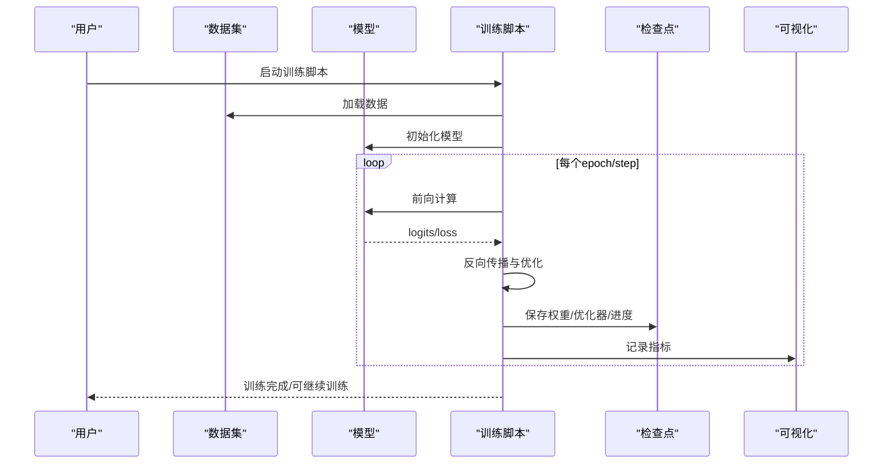
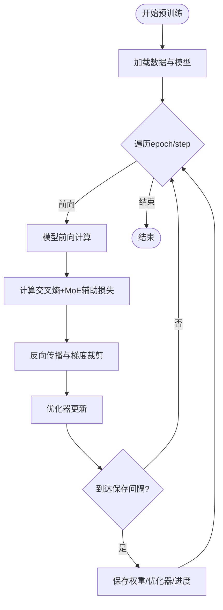
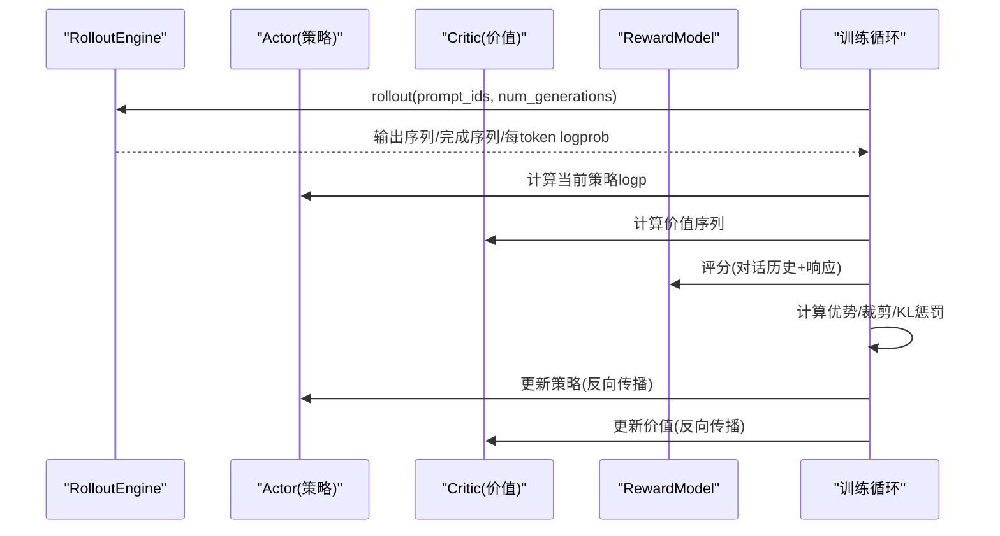
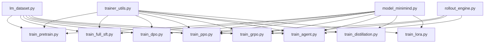

# 算法实现特色

<cite>
**本文档引用的文件**
- [README.md](file://README.md)
- [model_minimind.py](file://model/model_minimind.py)
- [model_lora.py](file://model/model_lora.py)
- [train_pretrain.py](file://trainer/train_pretrain.py)
- [train_full_sft.py](file://trainer/train_full_sft.py)
- [train_dpo.py](file://trainer/train_dpo.py)
- [train_ppo.py](file://trainer/train_ppo.py)
- [train_grpo.py](file://trainer/train_grpo.py)
- [train_agent.py](file://trainer/train_agent.py)
- [train_distillation.py](file://trainer/train_distillation.py)
- [train_lora.py](file://trainer/train_lora.py)
- [trainer_utils.py](file://trainer/trainer_utils.py)
- [lm_dataset.py](file://dataset/lm_dataset.py)
- [rollout_engine.py](file://trainer/rollout_engine.py)
</cite>

## 目录
1. [引言](#引言)
2. [项目结构](#项目结构)
3. [核心组件](#核心组件)
4. [架构概览](#架构概览)
5. [详细组件分析](#详细组件分析)
6. [依赖分析](#依赖分析)
7. [性能考量](#性能考量)
8. [故障排查指南](#故障排查指南)
9. [结论](#结论)

## 引言
本项目以“从零实现”为核心理念，所有关键训练算法与核心模块均使用 PyTorch 原生实现，不依赖第三方高层抽象接口。这种设计带来了对底层机制的深度掌控、清晰的代码可读性、便捷的调试能力与良好的扩展灵活性。项目覆盖从预训练到监督微调（SFT）、LoRA 微调、知识蒸馏、MoE 专家系统，再到 RLHF（DPO）与 RLAIF（PPO/GRPO/CISPO）等完整训练链路，形成一套可复现、可理解、可扩展的 LLM 训练体系。

## 项目结构
项目采用按功能域划分的模块化组织方式：
- model：模型定义与 LoRA 实现
- trainer：训练脚本与工具函数
- dataset：数据集加载与预处理
- scripts：推理与服务端脚本
- images：项目资源与结构图

**图表来源**
- [model_minimind.py:1-280](file://model/model_minimind.py#L1-L280)
- [model_lora.py:1-66](file://model/model_lora.py#L1-L66)
- [train_pretrain.py:1-170](file://trainer/train_pretrain.py#L1-L170)
- [train_full_sft.py:1-171](file://trainer/train_full_sft.py#L1-L171)
- [train_dpo.py:1-226](file://trainer/train_dpo.py#L1-L226)
- [train_ppo.py:1-444](file://trainer/train_ppo.py#L1-L444)
- [train_grpo.py:1-332](file://trainer/train_grpo.py#L1-L332)
- [train_agent.py:1-488](file://trainer/train_agent.py#L1-L488)
- [train_distillation.py:1-246](file://trainer/train_distillation.py#L1-L246)
- [train_lora.py:1-184](file://trainer/train_lora.py#L1-L184)
- [trainer_utils.py:1-177](file://trainer/trainer_utils.py#L1-L177)
- [lm_dataset.py:1-256](file://dataset/lm_dataset.py#L1-L256)
- [rollout_engine.py:1-213](file://trainer/rollout_engine.py#L1-L213)

**章节来源**
- [README.md:34-40](file://README.md#L34-L40)
- [README.md:85-96](file://README.md#L85-L96)

## 核心组件
- 模型核心：MiniMindConfig、RMSNorm、RoPE 旋转位置编码、Attention、FeedForward、MoEFeedForward、MiniMindBlock、MiniMindModel、MiniMindForCausalLM
- 训练工具：分布式初始化、学习率调度、检查点管理、模型加载、数据采样器
- 推理引擎：TorchRolloutEngine、SGLangRolloutEngine
- LoRA 实现：LoRA 模块、apply_lora、load_lora、merge_lora

优势体现：
- 深度理解：所有注意力、前馈、MoE、生成逻辑均由 PyTorch 原生实现，便于理解内部机制
- 可读性强：模块化设计，类与函数职责清晰，便于阅读与维护
- 调试便利：可直接在关键节点插入日志与断点，定位问题
- 扩展灵活：可按需替换或扩展模块，如替换注意力实现、自定义路由策略

**章节来源**
- [model_minimind.py:10-280](file://model/model_minimind.py#L10-L280)
- [trainer_utils.py:1-177](file://trainer/trainer_utils.py#L1-L177)
- [rollout_engine.py:1-213](file://trainer/rollout_engine.py#L1-L213)
- [model_lora.py:1-66](file://model/model_lora.py#L1-L66)

## 架构概览
训练系统采用“数据 → 模型 → 训练循环 → 检查点/可视化”的流水线式架构。核心算法通过统一的训练脚本入口组织，数据集抽象屏蔽了不同任务的数据格式差异，推理引擎支持本地 PyTorch 与 SGLang 两种后端，便于在不同硬件与吞吐需求下灵活切换。

**图表来源**
- [train_pretrain.py:23-81](file://trainer/train_pretrain.py#L23-L81)
- [train_full_sft.py:23-82](file://trainer/train_full_sft.py#L23-L82)
- [trainer_utils.py:63-117](file://trainer/trainer_utils.py#L63-L117)

## 详细组件分析

### 预训练（Pretrain）
- 目标：学习语言建模与统计规律，为下游任务奠定基础
- 关键实现：
  - 模型前向返回交叉熵损失与 MoE 辅助损失
  - 混合精度与梯度累积，支持多卡分布式
  - 学习率余弦退火，定期保存权重与检查点
- 训练流程要点：
  - 数据集为 text→next token 的格式
  - 每步损失包含主损失与 MoE 辅助损失
  - 断点续训自动恢复优化器与学习率状态

**图表来源**
- [train_pretrain.py:23-81](file://trainer/train_pretrain.py#L23-L81)
- [model_minimind.py:238-246](file://model/model_minimind.py#L238-L246)

**章节来源**
- [train_pretrain.py:82-170](file://trainer/train_pretrain.py#L82-L170)
- [model_minimind.py:195-227](file://model/model_minimind.py#L195-L227)

### 监督微调（SFT）
- 目标：对齐指令与对话格式，提升可控性与任务完成能力
- 关键实现：
  - Chat 模板生成与标签化损失掩码
  - 与预训练相同的训练循环与检查点机制
- 数据处理：
  - conversations→chat template→input_ids/labels
  - 仅在 assistant 回答区域计算损失

**章节来源**
- [train_full_sft.py:83-171](file://trainer/train_full_sft.py#L83-L171)
- [lm_dataset.py:58-119](file://dataset/lm_dataset.py#L58-L119)

### 偏好优化（DPO）
- 目标：直接优化偏好，避免奖励模型依赖
- 关键实现：
  - 参考模型冻结，策略模型计算 log probs
  - 计算 chosen 与 rejected 的 log prob 差值
  - 使用 log-sigmoid 的偏好损失，结合 MoE 辅助损失
- 训练要点：
  - 双样本批处理（chosen/rejected）
  - 学习率较低，避免遗忘

**章节来源**
- [train_dpo.py:52-128](file://trainer/train_dpo.py#L52-L128)
- [lm_dataset.py:122-193](file://dataset/lm_dataset.py#L122-L193)

### 强化学习（PPO/GRPO/CISPO）
- PPO（Proximal Policy Optimization）
  - Actor-Critic 架构：Actor 为策略模型，Critic 为价值头
  - 使用 rollout 引擎生成响应，计算优势与裁剪策略损失
  - 早停机制防止 KL 突增
- GRPO/CISPO（Group Relative Policy Optimization）
  - 基于组内相对优势的策略优化
  - 支持 GRPO 与 CISPO 两种损失变体
  - 多样本生成与组内标准化

**图表来源**
- [train_ppo.py:78-280](file://trainer/train_ppo.py#L78-L280)
- [train_grpo.py:70-200](file://trainer/train_grpo.py#L70-L200)
- [rollout_engine.py:46-94](file://trainer/rollout_engine.py#L46-L94)

**章节来源**
- [train_ppo.py:303-444](file://trainer/train_ppo.py#L303-L444)
- [train_grpo.py:205-332](file://trainer/train_grpo.py#L205-L332)
- [rollout_engine.py:196-213](file://trainer/rollout_engine.py#L196-L213)

### 代理强化学习（Agent RL）
- 目标：多轮工具调用与思考链的强化学习
- 关键实现：
  - 工具定义与模拟执行，奖励综合格式、工具对齐与最终验证
  - 多轮对话 rollout，组内优势标准化
  - 支持 GRPO/CISPO 损失与早停

**章节来源**
- [train_agent.py:371-488](file://trainer/train_agent.py#L371-L488)
- [lm_dataset.py:226-252](file://dataset/lm_dataset.py#L226-L252)

### LoRA 微调
- 目标：参数高效微调，仅训练低秩增量参数
- 关键实现：
  - 在线为线性层注入 LoRA 模块，重写 forward
  - 冻结主模型参数，仅优化 LoRA 参数
  - 支持权重合并与保存

**章节来源**
- [model_lora.py:6-66](file://model/model_lora.py#L6-L66)
- [train_lora.py:127-184](file://trainer/train_lora.py#L127-L184)

### 知识蒸馏
- 目标：用教师模型指导学生模型，提升生成质量与稳定性
- 关键实现：
  - KL 散度蒸馏，温度缩放
  - CE 损失与蒸馏损失的加权组合
  - 支持 MoE 与 Dense 混合蒸馏

**章节来源**
- [train_distillation.py:38-143](file://trainer/train_distillation.py#L38-L143)
- [trainer_utils.py:160-177](file://trainer/trainer_utils.py#L160-L177)

### 模型与数据组件
- 模型组件
  - RMSNorm、RoPE、Attention、FeedForward、MoEFeedForward、MiniMindBlock、MiniMindModel、MiniMindForCausalLM
  - 生成接口集成，支持温度、top-k/top-p、重复惩罚等
- 数据组件
  - PretrainDataset、SFTDataset、DPODataset、RLAIFDataset、AgentRLDataset
  - Chat 模板与标签化损失掩码生成

**章节来源**
- [model_minimind.py:49-280](file://model/model_minimind.py#L49-L280)
- [lm_dataset.py:37-252](file://dataset/lm_dataset.py#L37-L252)

## 依赖分析
- 组件耦合
  - 训练脚本依赖 trainer_utils 提供的统一初始化、分布式、检查点与模型加载
  - 推理引擎与训练脚本解耦，通过抽象接口可插拔替换
  - 数据集与模型解耦，通过 tokenizer 与模板生成统一接口
- 外部依赖
  - transformers、datasets、requests（SGLang 推理）
  - torch 与 torch.distributed（分布式训练）
- 循环依赖
  - 无循环导入，模块间通过函数与类接口通信

**图表来源**
- [trainer_utils.py:1-177](file://trainer/trainer_utils.py#L1-L177)
- [lm_dataset.py:1-256](file://dataset/lm_dataset.py#L1-L256)
- [rollout_engine.py:1-213](file://trainer/rollout_engine.py#L1-L213)
- [model_minimind.py:1-280](file://model/model_minimind.py#L1-L280)

**章节来源**
- [trainer_utils.py:1-177](file://trainer/trainer_utils.py#L1-L177)
- [rollout_engine.py:1-213](file://trainer/rollout_engine.py#L1-L213)

## 性能考量
- 混合精度与梯度累积：在 GPU 上使用 bfloat16/float16 与 GradScaler，减少显存占用并提升吞吐
- Flash Attention：在满足条件时使用 scaled_dot_product_attention，加速注意力计算
- 分布式训练：支持 DDP，忽略特定缓冲区参与同步，减少通信开销
- 推理加速：提供 Torch 与 SGLang 两种 rollout 引擎，SGLang 可在独立服务中加速生成
- MoE 注意力：在训练时引入 router 辅助损失，平衡专家负载，但需注意 kernel 启停与调度开销

[本节为通用性能讨论，无需列出具体文件来源]

## 故障排查指南
- 分布式训练异常
  - 检查 NCCL 环境变量与 GPU 设备号映射
  - 确认本地 rank 与 world size 设置
- 检查点恢复问题
  - 断点续训会自动调整 step 以适配 GPU 数量变化
  - 确保检查点文件存在且权重键名匹配
- 推理引擎健康检查
  - SGLang 引擎提供健康检查与缓存刷新接口
- 梯度爆炸与 NaN
  - 启用梯度裁剪，适当降低学习率
  - 检查损失掩码与标签一致性

**章节来源**
- [trainer_utils.py:44-62](file://trainer/trainer_utils.py#L44-L62)
- [trainer_utils.py:107-117](file://trainer/trainer_utils.py#L107-L117)
- [rollout_engine.py:184-194](file://trainer/rollout_engine.py#L184-L194)

## 结论
MiniMind 通过“从零实现”的 PyTorch 原生算法，构建了覆盖预训练、SFT、DPO、PPO/GRPO/CISPO、Agent RL、LoRA、知识蒸馏与 MoE 的完整训练链路。该实现方式在深度理解、代码可读性、调试便利性与扩展灵活性方面具有显著优势，为 LLM 训练提供了清晰、可复现、可扩展的实践范式。对比第三方框架封装，原生实现更贴近底层机制，有助于开发者建立扎实的工程基础与问题诊断能力。