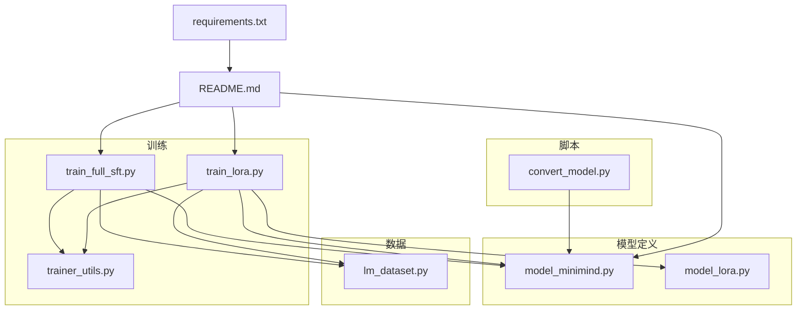
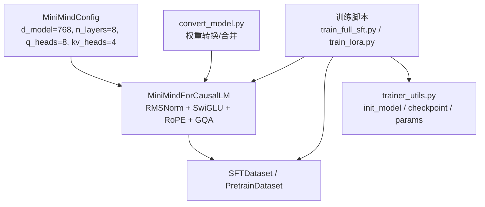
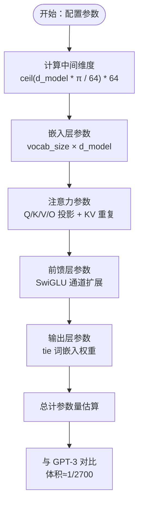
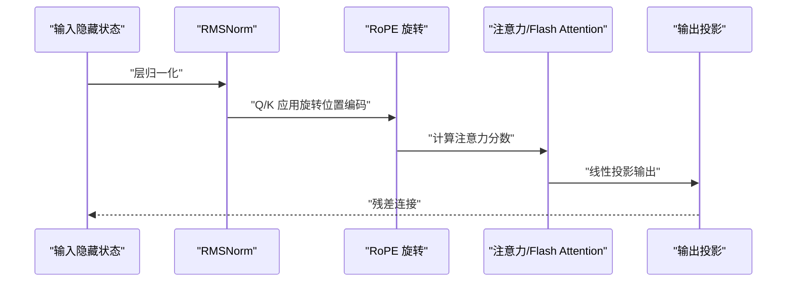
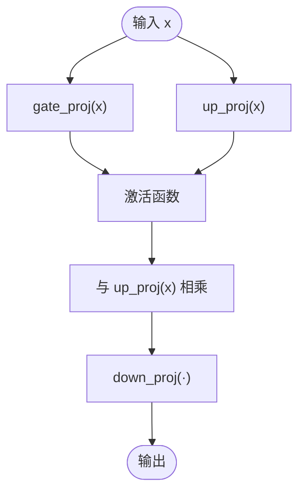
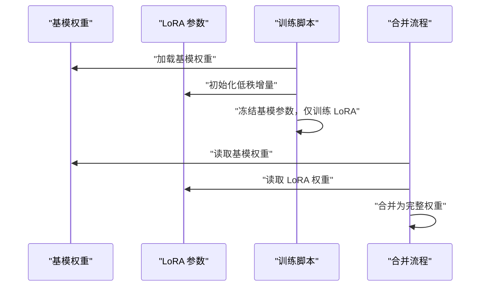
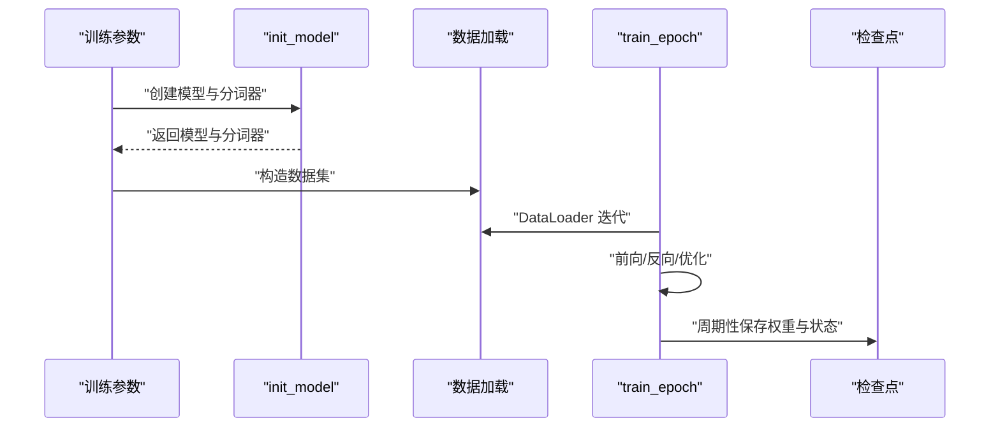
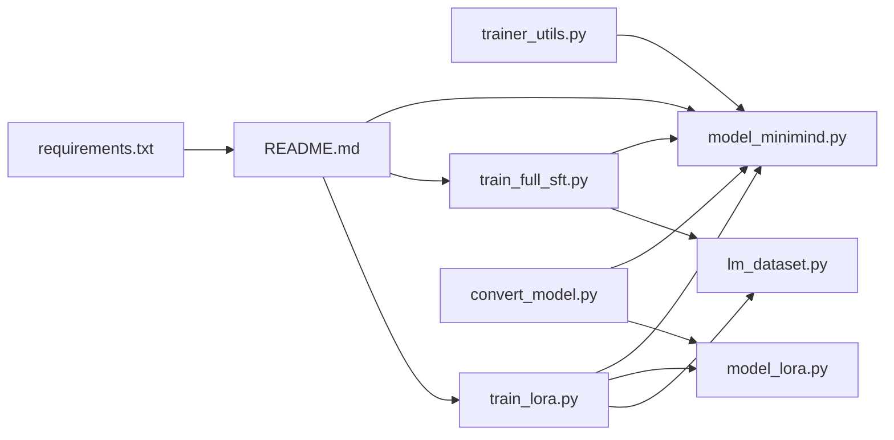

# 超轻量化设计

<cite>
**本文引用的文件**
- [model_minimind.py](file://model/model_minimind.py)
- [model_lora.py](file://model/model_lora.py)
- [train_lora.py](file://trainer/train_lora.py)
- [train_full_sft.py](file://trainer/train_full_sft.py)
- [trainer_utils.py](file://trainer/trainer_utils.py)
- [lm_dataset.py](file://dataset/lm_dataset.py)
- [convert_model.py](file://scripts/convert_model.py)
- [README.md](file://README.md)
- [requirements.txt](file://requirements.txt)
</cite>

## 目录
1. [引言](#引言)
2. [项目结构](#项目结构)
3. [核心组件](#核心组件)
4. [架构总览](#架构总览)
5. [详细组件分析](#详细组件分析)
6. [依赖关系分析](#依赖关系分析)
7. [性能考量](#性能考量)
8. [故障排查指南](#故障排查指南)
9. [结论](#结论)
10. [附录](#附录)

## 引言
本文件聚焦 MiniMind 的超轻量化设计，系统阐述其在参数规模、训练成本与推理效率方面的技术突破。主线最小版本体积仅为 GPT-3 的 1/2700，参数量约 64M 的极小模型通过精心的架构设计与参数分配，在保证性能的同时显著降低训练与部署门槛。本文将从模型配置、核心组件（预标准化 + RMSNorm、SwiGLU、RoPE + YaRN）、训练策略（全参数微调、LoRA、MoE）等方面，深入解析 MiniMind 的轻量化实现路径，并提供与其他主流大模型的参数量对比，突出其在个人设备上快速训练与部署的优势。

## 项目结构
MiniMind 代码库采用清晰的功能模块划分：模型定义与推理在 model 子目录，训练脚本集中在 trainer 子目录，数据集处理在 dataset 子目录，推理与转换脚本在 scripts 子目录，README 提供总体介绍与参数量对比，requirements.txt 管理依赖。

**图表来源**
- [model_minimind.py:1-280](file://model/model_minimind.py#L1-L280)
- [model_lora.py:1-66](file://model/model_lora.py#L1-L66)
- [train_full_sft.py:1-171](file://trainer/train_full_sft.py#L1-L171)
- [train_lora.py:1-184](file://trainer/train_lora.py#L1-L184)
- [trainer_utils.py:1-177](file://trainer/trainer_utils.py#L1-L177)
- [lm_dataset.py:1-256](file://dataset/lm_dataset.py#L1-L256)
- [convert_model.py:1-145](file://scripts/convert_model.py#L1-L145)
- [README.md:1-800](file://README.md#L1-L800)
- [requirements.txt:1-32](file://requirements.txt#L1-L32)

**章节来源**
- [README.md:1-800](file://README.md#L1-L800)
- [requirements.txt:1-32](file://requirements.txt#L1-L32)

## 核心组件
本节从超轻量化视角，梳理 MiniMind 的关键组件与设计取舍，包括模型配置、注意力与前馈结构、规范化与激活函数、位置编码与外推策略，以及 LoRA 与 MoE 的参数高效策略。

- 模型配置与参数分配
  - d_model=768、n_layers=8、q_heads=8、kv_heads=4 的设计在训练稳定性与参数量之间取得平衡，避免过深或过宽带来的训练不稳与内存压力。
  - 词表大小 6400，显著低于主流大模型（如 Llama3 128k、Qwen2 151k），有效压缩 embedding 与输出层参数占比。
  - 中间维度通过 ceil(hidden_size * π / 64) * 64 的规则计算，兼顾 SwiGLU 的通道扩展与整数对齐，降低乘法复杂度。
  - RoPE theta=1e6，支持 YaRN 外推，最大位置 32768，满足长文本生成需求。

- 规范化与激活
  - 预标准化 + RMSNorm：在每个子层前进行 RMSNorm，缓解深层梯度问题，提升训练稳定性。
  - SwiGLU 激活函数：通过 gate_proj 与 up_proj 的乘积实现门控特征变换，参数高效且表达能力强。

- 注意力与 KV 重用
  - 头数分配：q_heads=8、kv_heads=4，采用分组查询注意力（Grouped-Query Attention），减少 KV 缓存与计算开销，同时保持多头并行优势。
  - KV 重复：通过 repeat_kv 将 kv_heads 扩展到 q_heads，降低推理 KV 缓存占用。

- 位置编码与外推
  - RoPE 旋转位置编码：对 Q/K 进行二维旋转，捕获相对位置信息；YaRN 外推在推理时对高频分量进行缩放，提升长序列泛化。

- 参数高效策略
  - LoRA：仅训练低秩增量参数，冻结主干权重，大幅降低训练参数量与显存占用。
  - MoE：在前馈层引入专家路由，以更低激活参数获得更高容量，当前默认 4 专家、top-1 路由，训练时开销可控。

**章节来源**
- [model_minimind.py:10-45](file://model/model_minimind.py#L10-L45)
- [model_minimind.py:90-134](file://model/model_minimind.py#L90-L134)
- [model_minimind.py:135-146](file://model/model_minimind.py#L135-L146)
- [model_minimind.py:49-59](file://model/model_minimind.py#L49-L59)
- [model_minimind.py:61-77](file://model/model_minimind.py#L61-L77)
- [model_minimind.py:85-88](file://model/model_minimind.py#L85-L88)
- [README.md:556-586](file://README.md#L556-L586)

## 架构总览
MiniMind 的推理与训练流程围绕“配置 → 模型 → 数据 → 训练/推理”展开。训练脚本通过统一的工具函数加载模型、应用 LoRA 或全参数微调，并结合混合精度与分布式训练提升效率。

**图表来源**
- [model_minimind.py:10-45](file://model/model_minimind.py#L10-L45)
- [model_minimind.py:229-280](file://model/model_minimind.py#L229-L280)
- [lm_dataset.py:58-119](file://dataset/lm_dataset.py#L58-L119)
- [train_full_sft.py:23-81](file://trainer/train_full_sft.py#L23-L81)
- [train_lora.py:24-76](file://trainer/train_lora.py#L24-L76)
- [trainer_utils.py:119-131](file://trainer/trainer_utils.py#L119-L131)
- [convert_model.py:16-96](file://scripts/convert_model.py#L16-L96)

## 详细组件分析

### 模型配置与参数量估算
- 配置要点
  - d_model=768、n_layers=8、q_heads=8、kv_heads=4、中间维度按规则计算、词表 6400、RoPE theta=1e6、最大位置 32768。
  - 通过词表与中间维度的整数对齐策略，降低乘法与内存访问开销。
- 参数量对比
  - MiniMind-3 Dense 约 64M；MiniMind-3 MoE 约 198M / A64M（激活专家参数约 64M）。
  - 与 GPT-3（约 175B）相比，主线最小版本体积约为 1/2700，训练成本与部署门槛大幅降低。

**图表来源**
- [model_minimind.py:12-26](file://model/model_minimind.py#L12-L26)
- [model_minimind.py:90-107](file://model/model_minimind.py#L90-L107)
- [model_minimind.py:135-146](file://model/model_minimind.py#L135-L146)
- [README.md:579-586](file://README.md#L579-L586)

**章节来源**
- [model_minimind.py:10-45](file://model/model_minimind.py#L10-L45)
- [README.md:579-586](file://README.md#L579-L586)

### 注意力与位置编码
- 注意力模块
  - Q/K/V 投影后进行 RMSNorm，随后应用 RoPE 旋转，KV 重复以匹配 Q 头数，支持 Flash Attention 与常规注意力两种路径。
  - 支持 causal 掩码与注意力掩码，适配不同训练/推理场景。
- RoPE 与 YaRN
  - YaRN 在推理时对高频分量进行缩放，提升长序列外推能力；训练时可关闭或启用不同缩放策略。

**图表来源**
- [model_minimind.py:90-134](file://model/model_minimind.py#L90-L134)
- [model_minimind.py:61-83](file://model/model_minimind.py#L61-L83)

**章节来源**
- [model_minimind.py:90-134](file://model/model_minimind.py#L90-L134)
- [model_minimind.py:61-83](file://model/model_minimind.py#L61-L83)

### 前馈与 MoE
- Dense 前馈
  - SwiGLU 激活：gate_proj 与 up_proj 的乘积实现门控特征变换，参数高效且表达能力强。
- MoE 前馈
  - 专家路由：top-1 路由，专家数量 4，激活专家参数约 64M，训练时引入辅助损失以维持负载均衡。

**图表来源**
- [model_minimind.py:135-146](file://model/model_minimind.py#L135-L146)

**章节来源**
- [model_minimind.py:135-176](file://model/model_minimind.py#L135-L176)

### LoRA 参数高效微调
- LoRA 结构
  - 低秩矩阵 A 与 B，A 高斯初始化、B 全零初始化，前向为原线性层输出 + A(B(x))。
- 应用与合并
  - 训练时仅更新 LoRA 参数，冻结主干权重；训练完成后可将 LoRA 与基模合并为完整权重，便于部署。

**图表来源**
- [model_lora.py:6-18](file://model/model_lora.py#L6-L18)
- [train_lora.py:21-65](file://trainer/train_lora.py#L21-L65)
- [convert_model.py:105-112](file://scripts/convert_model.py#L105-L112)

**章节来源**
- [model_lora.py:1-66](file://model/model_lora.py#L1-L66)
- [train_lora.py:1-184](file://trainer/train_lora.py#L1-L184)
- [convert_model.py:105-112](file://scripts/convert_model.py#L105-L112)

### 训练流程与参数统计
- 全参数微调
  - 训练脚本负责数据加载、混合精度、梯度裁剪、断点续训与检查点保存；支持 torch.compile 与 DDP。
- LoRA 微调
  - 仅收集 LoRA 参数参与优化，冻结非 LoRA 参数，显著降低训练成本与显存占用。
- 参数统计
  - 训练工具函数提供模型参数总量与可训练参数量统计，便于监控与对比。

**图表来源**
- [train_full_sft.py:23-81](file://trainer/train_full_sft.py#L23-L81)
- [train_lora.py:24-76](file://trainer/train_lora.py#L24-L76)
- [trainer_utils.py:119-131](file://trainer/trainer_utils.py#L119-L131)

**章节来源**
- [train_full_sft.py:1-171](file://trainer/train_full_sft.py#L1-L171)
- [train_lora.py:1-184](file://trainer/train_lora.py#L1-L184)
- [trainer_utils.py:18-29](file://trainer/trainer_utils.py#L18-L29)

## 依赖关系分析
- 模块耦合
  - 训练脚本依赖模型定义与数据集模块，工具函数提供模型初始化、参数统计与检查点管理。
  - 转换脚本依赖模型定义与 LoRA 合并逻辑，实现与 Transformers 生态的互操作。
- 外部依赖
  - 主要依赖 transformers、datasets、torch 等，版本在 requirements.txt 中明确。

**图表来源**
- [trainer_utils.py:119-131](file://trainer/trainer_utils.py#L119-L131)
- [train_full_sft.py:16-18](file://trainer/train_full_sft.py#L16-L18)
- [train_lora.py:16-18](file://trainer/train_lora.py#L16-L18)
- [lm_dataset.py:1-7](file://dataset/lm_dataset.py#L1-L7)
- [convert_model.py:10-12](file://scripts/convert_model.py#L10-L12)
- [README.md:1-800](file://README.md#L1-L800)
- [requirements.txt:1-32](file://requirements.txt#L1-L32)

**章节来源**
- [requirements.txt:1-32](file://requirements.txt#L1-L32)
- [README.md:1-800](file://README.md#L1-L800)

## 性能考量
- 训练效率
  - 分组查询注意力（GQA）与 KV 重复显著降低 KV 缓存与计算开销，适合长序列训练与推理。
  - RMSNorm 与 SwiGLU 的组合在参数量与表达能力之间取得良好平衡。
- 推理效率
  - YaRN 外推提升长文本生成能力；LoRA 合并后可直接部署，减少运行时开销。
- 成本控制
  - 词表与中间维度的整数对齐策略降低乘法与内存访问开销；LoRA 与 MoE 进一步压缩训练与部署成本。

[本节为通用性能讨论，不直接分析具体文件]

## 故障排查指南
- 训练断点续训
  - 使用检查点保存与恢复，支持跨 GPU 数量恢复；注意检查 resume 文件与 world_size 的一致性。
- 混合精度与梯度裁剪
  - 混合精度 dtype 与 GradScaler 需与设备类型匹配；梯度裁剪阈值过大可能导致梯度爆炸，过小可能导致梯度消失。
- LoRA 参数冻结
  - 确保仅 LoRA 参数参与优化，基模参数 requires_grad=False；合并 LoRA 时核对权重形状与设备。

**章节来源**
- [trainer_utils.py:63-116](file://trainer/trainer_utils.py#L63-L116)
- [train_full_sft.py:34-50](file://trainer/train_full_sft.py#L34-L50)
- [train_lora.py:138-146](file://trainer/train_lora.py#L138-L146)
- [convert_model.py:105-112](file://scripts/convert_model.py#L105-L112)

## 结论
MiniMind 通过“配置-架构-训练-部署”的系统性轻量化设计，在保证性能的同时实现了参数量与成本的极致压缩。主线最小版本体积约为 GPT-3 的 1/2700，64M 参数的极小模型配合 LoRA 与 MoE，既满足个人设备快速训练与部署的需求，又兼容主流生态（Transformers、llama.cpp、vllm、ollama）。其预标准化 + RMSNorm、SwiGLU、RoPE + YaRN 等核心组件，以及精心的参数分配策略，共同构成了可复现、可理解、可扩展的超轻量化实现路径。

[本节为总结性内容，不直接分析具体文件]

## 附录
- 参数量与对比
  - MiniMind-3 Dense 约 64M；MiniMind-3 MoE 约 198M / A64M；GPT-3 约 175B；主线最小版本体积约为 1/2700。
- 训练开销（单卡 3090）
  - MiniMind-3：预训练 + SFT + ToolCall + RLAIF 约 2.31 小时，成本约 3.0 元；MiniMind-3-MoE 约 3.23 小时，成本约 4.2 元。
- 推理与部署
  - 支持 Transformers 格式与 PyTorch 格式互转；LoRA 合并后可直接部署；YaRN 外推提升长文本生成能力。

**章节来源**
- [README.md:579-586](file://README.md#L579-L586)
- [README.md:625-647](file://README.md#L625-L647)