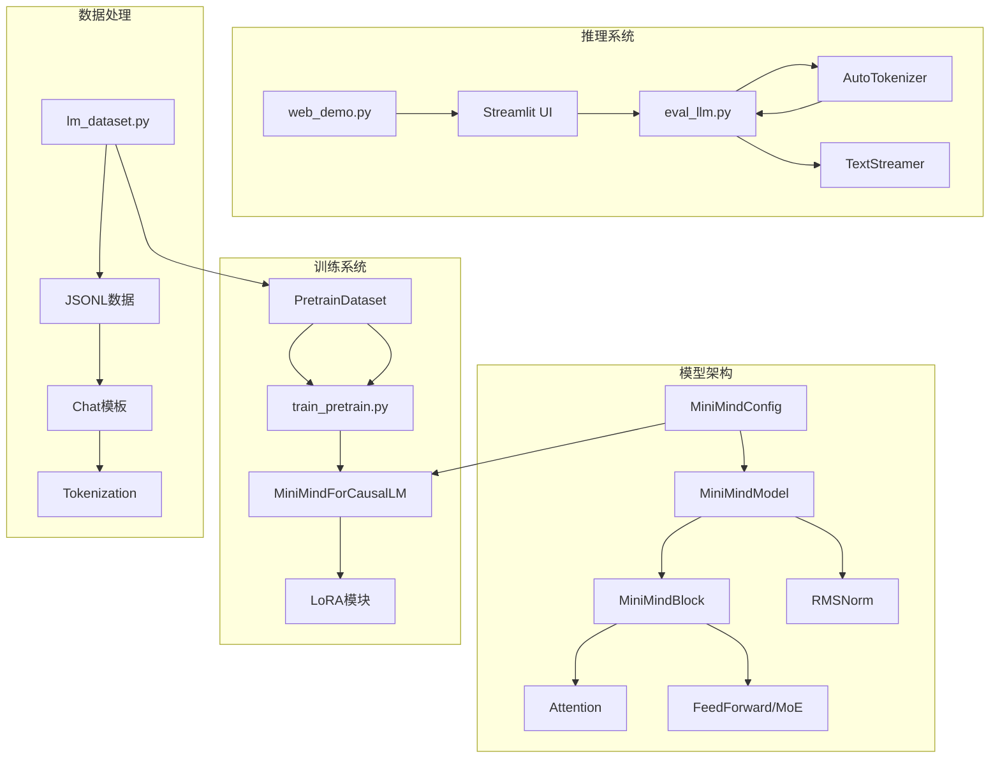
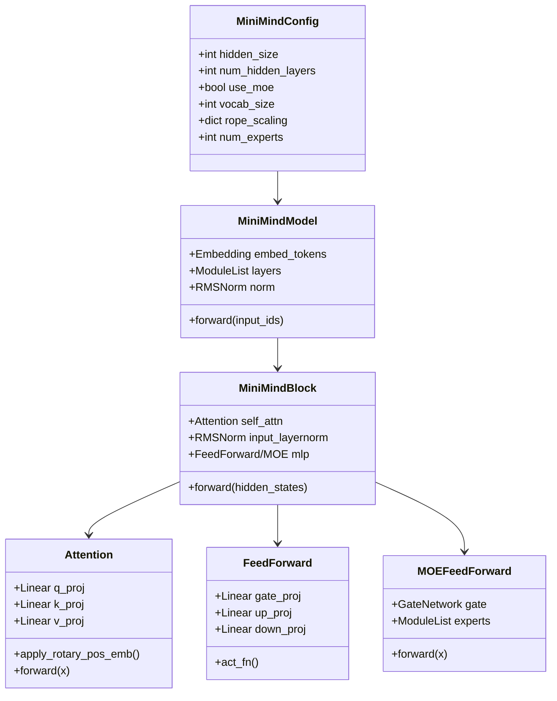
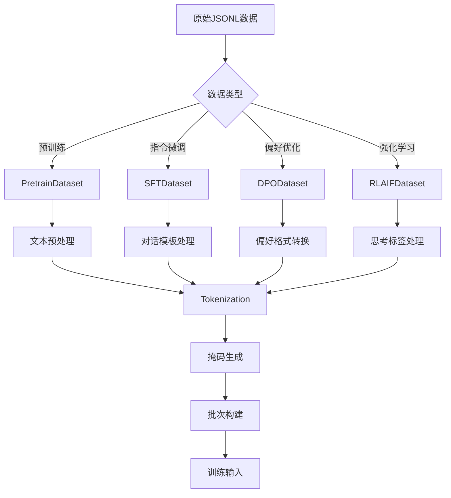
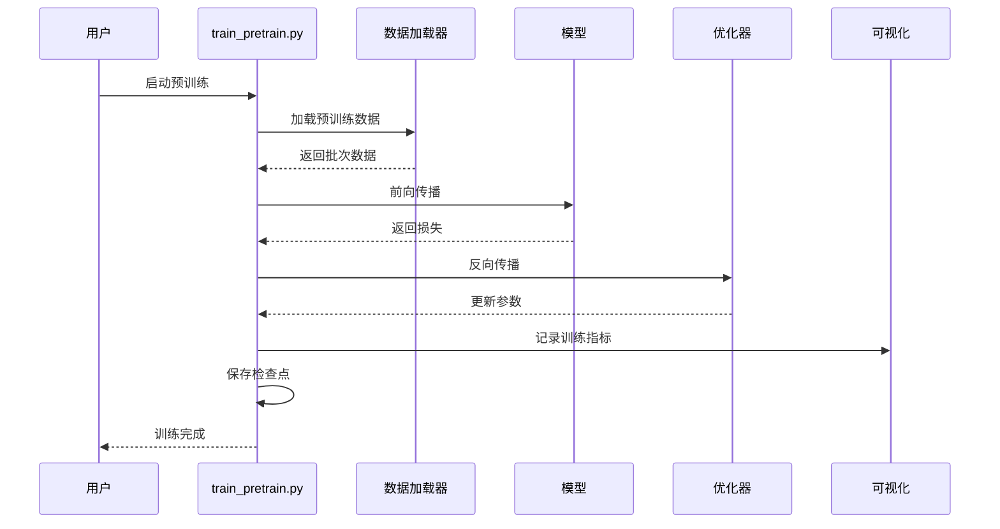
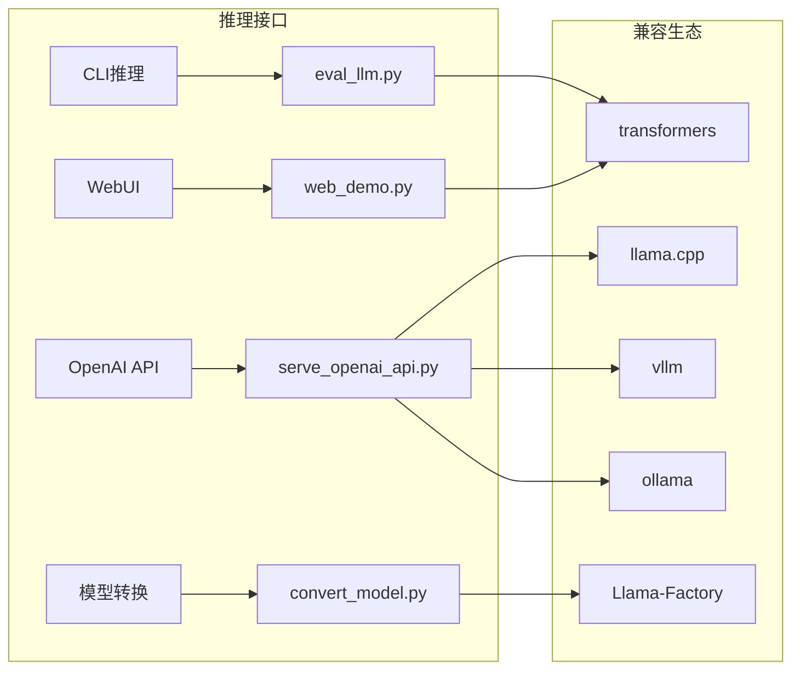
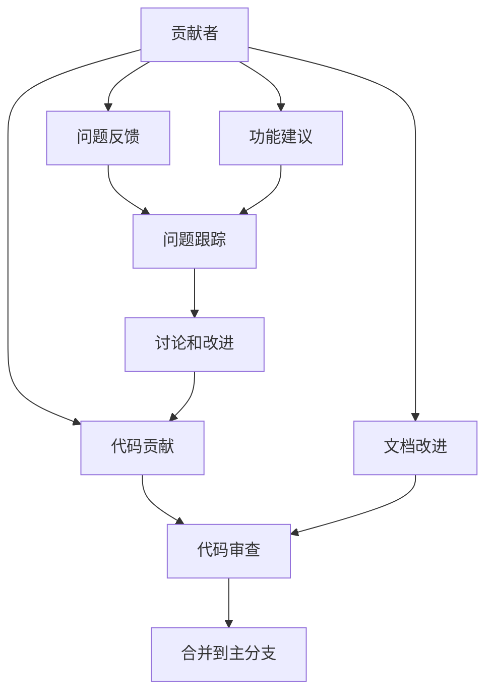

# 项目介绍

<cite>
**本文档引用的文件**
- [README.md](file://README.md)
- [README_en.md](file://README_en.md)
- [requirements.txt](file://requirements.txt)
- [model_minimind.py](file://model/model_minimind.py)
- [model_lora.py](file://model/model_lora.py)
- [lm_dataset.py](file://dataset/lm_dataset.py)
- [train_pretrain.py](file://trainer/train_pretrain.py)
- [trainer_utils.py](file://trainer/trainer_utils.py)
- [eval_llm.py](file://eval_llm.py)
- [web_demo.py](file://scripts/web_demo.py)
- [CODE_OF_CONDUCT.md](file://CODE_OF_CONDUCT.md)
</cite>

## 目录
1. [项目概述](#项目概述)
2. [核心理念与价值主张](#核心理念与价值主张)
3. [技术架构概览](#技术架构概览)
4. [核心组件详解](#核心组件详解)
5. [训练流程与数据管线](#训练流程与数据管线)
6. [推理与部署能力](#推理与部署能力)
7. [教育与实践意义](#教育与实践意义)
8. [开源承诺与社区贡献](#开源承诺与社区贡献)
9. [性能与成本效益分析](#性能与成本效益分析)
10. [未来发展方向](#未来发展方向)

## 项目概述

MiniMind 是一个专注于超小参数量大语言模型训练与推理的开源项目。该项目的核心目标是实现"从零开始仅用3块钱成本与2小时训练时间即可训练出约64M参数的超小语言模型"，让普通个人GPU也能快速完成训练与复现。

### 项目定位

MiniMind 定位为：
- **超小参数量LLM训练与推理系统**：参数量控制在64M级别，体积仅为GPT-3的1/2700
- **教育导向的实践平台**：提供完整的训练链路，涵盖从预训练到强化学习的全过程
- **开源复现项目**：所有核心算法代码均从0使用PyTorch原生实现，不依赖第三方库的高层抽象接口

### 技术特色

- **极简架构**：基于Transformer Decoder-only结构，采用预标准化+RMSNorm
- **MoE支持**：提供4专家的MoE前馈层，实现更高容量与更低激活参数的平衡
- **全栈兼容**：兼容transformers、trl、peft等主流框架，以及llama.cpp、vllm、ollama等推理引擎
- **可扩展性**：支持单机单卡与单机多卡训练，具备断点续训能力

## 核心理念与价值主张

### 降低学习门槛

项目的核心理念是"用乐高自己拼出一架飞机，远比坐在头等舱里飞行更让人兴奋"。MiniMind致力于：

1. **从零开始训练**：不仅仅是推理层面，而是真正理解每一行代码
2. **可复现性**：提供完整的训练流程，任何人都能复现相同结果
3. **可理解性**：所有算法从0实现，便于深入理解底层原理
4. **可扩展性**：为后续研究和创新提供坚实基础

### 成本效益最大化

- **硬件成本**：单卡NVIDIA 3090即可完成训练，成本约3元人民币
- **时间成本**：2小时即可完成从零到一的完整训练流程
- **学习成本**：提供完整的教程和示例，降低学习曲线

## 技术架构概览

**图表来源**
- [model_minimind.py:10-280](file://model/model_minimind.py#L10-L280)
- [train_pretrain.py:1-170](file://trainer/train_pretrain.py#L1-L170)
- [lm_dataset.py:1-256](file://dataset/lm_dataset.py#L1-L256)

### 核心架构组件

1. **模型配置系统**：通过MiniMindConfig统一管理模型参数
2. **注意力机制**：支持KV头分离和Flash Attention优化
3. **MoE扩展**：可选的专家路由机制
4. **训练管道**：完整的预训练到微调训练流程
5. **推理接口**：CLI和WebUI双重推理体验

## 核心组件详解

### 模型架构设计

**图表来源**
- [model_minimind.py:10-280](file://model/model_minimind.py#L10-L280)

#### 关键设计决策

1. **参数规模控制**：通过精心设计的中间层大小和层数比例，实现64M参数的紧凑模型
2. **注意力优化**：q_heads=8，kv_heads=4的设计在计算效率和表示能力间取得平衡
3. **MoE集成**：4专家的top-1路由设计，在不显著增加训练复杂度的情况下提升模型容量

### 数据处理管道

**图表来源**
- [lm_dataset.py:37-256](file://dataset/lm_dataset.py#L37-L256)

#### 数据处理特色

1. **多格式支持**：统一处理预训练、SFT、DPO、RLAIF等多种数据格式
2. **模板系统**：支持复杂的对话模板，包括工具调用和思考标签
3. **动态处理**：根据配置动态启用不同的数据处理策略

## 训练流程与数据管线

### 预训练流程

**图表来源**
- [train_pretrain.py:23-81](file://trainer/train_pretrain.py#L23-L81)

### 训练配置要点

1. **混合精度训练**：支持bfloat16和float16，提高训练效率
2. **梯度累积**：通过accumulation_steps控制有效batch size
3. **分布式训练**：支持DDP和DeepSpeed，可扩展到多GPU
4. **断点续训**：完整的检查点保存和恢复机制

## 推理与部署能力

### 多样化推理接口

**图表来源**
- [eval_llm.py:12-94](file://eval_llm.py#L12-L94)
- [web_demo.py:198-421](file://scripts/web_demo.py#L198-L421)

### WebUI特性

1. **多语言支持**：内置中英文界面切换
2. **工具调用**：支持8种内置工具的可视化选择
3. **思考展示**：可选的自适应思考功能
4. **流式输出**：实时显示生成过程

## 教育与实践意义

### 学习路径设计

MiniMind为不同层次的学习者提供了清晰的学习路径：

1. **初学者**：从CLI推理开始，理解基本使用方法
2. **进阶用户**：尝试不同参数配置，观察模型行为变化
3. **研究者**：修改模型架构，实现自己的创新想法
4. **开发者**：基于项目框架开发自己的应用

### 实践价值

1. **代码可读性**：所有核心算法从0实现，便于理解
2. **实验灵活性**：易于修改和扩展，支持各种实验
3. **成本友好**：个人设备即可运行，降低实验成本
4. **社区驱动**：开放的协作环境，促进技术交流

## 开源承诺与社区贡献

### 开源原则

1. **完全免费**：基于Apache 2.0协议开源，完全免费使用
2. **代码透明**：所有实现细节公开，便于审查和学习
3. **社区友好**：建立包容性的社区环境，鼓励贡献
4. **持续演进**：定期更新，保持技术先进性

### 社区建设

**图表来源**
- [CODE_OF_CONDUCT.md:1-129](file://CODE_OF_CONDUCT.md#L1-L129)

## 性能与成本效益分析

### 训练效率

| 模型版本 | 参数量 | 预训练时间 | 总成本 |
|---------|--------|------------|--------|
| MiniMind-3 | 64M | ≈1.21小时 | ≈1.57元 |
| MiniMind-3-MoE | 198M | ≈1.69小时 | ≈2.20元 |

### 硬件要求

- **最低配置**：NVIDIA RTX 3090 (24GB) + 128GB内存
- **推荐配置**：多卡环境可进一步缩短训练时间
- **CPU要求**：Intel i9-10980XE或同等性能处理器

### 性能基准

项目支持在多个基准测试集上评估模型性能，包括：
- C-Eval：中文能力评估
- C-MMLU：中文多学科测试
- OpenBookQA：开放域问答测试

## 未来发展方向

### 技术演进

1. **架构优化**：探索更高效的注意力机制和激活函数
2. **训练算法**：集成更多先进的训练技巧和优化方法
3. **推理加速**：优化推理性能，支持更多硬件平台
4. **多模态扩展**：基于现有框架扩展视觉和音频处理能力

### 生态建设

1. **工具链完善**：提供更多实用的训练和调试工具
2. **文档体系**：建立更完善的教程和API文档
3. **社区生态**：鼓励第三方插件和扩展开发
4. **教育合作**：与高校和研究机构建立合作关系

MiniMind项目通过其独特的设计理念和技术实现，为AI教育和研究提供了一个理想的起点。它不仅降低了学习门槛，更重要的是培养了深入理解和创新实践的能力，为AI社区的发展做出了积极贡献。