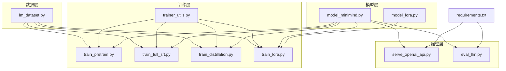
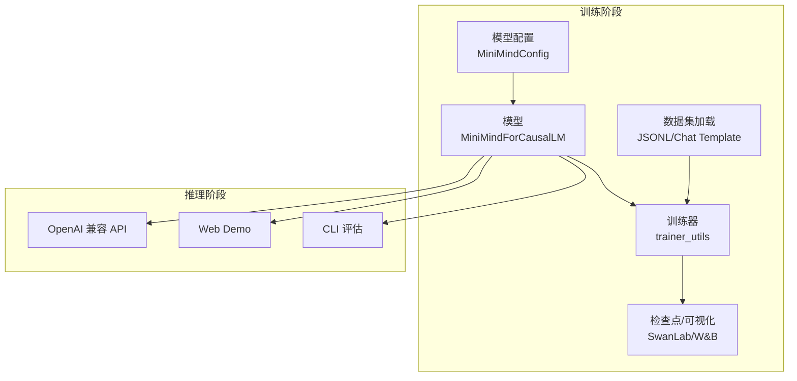
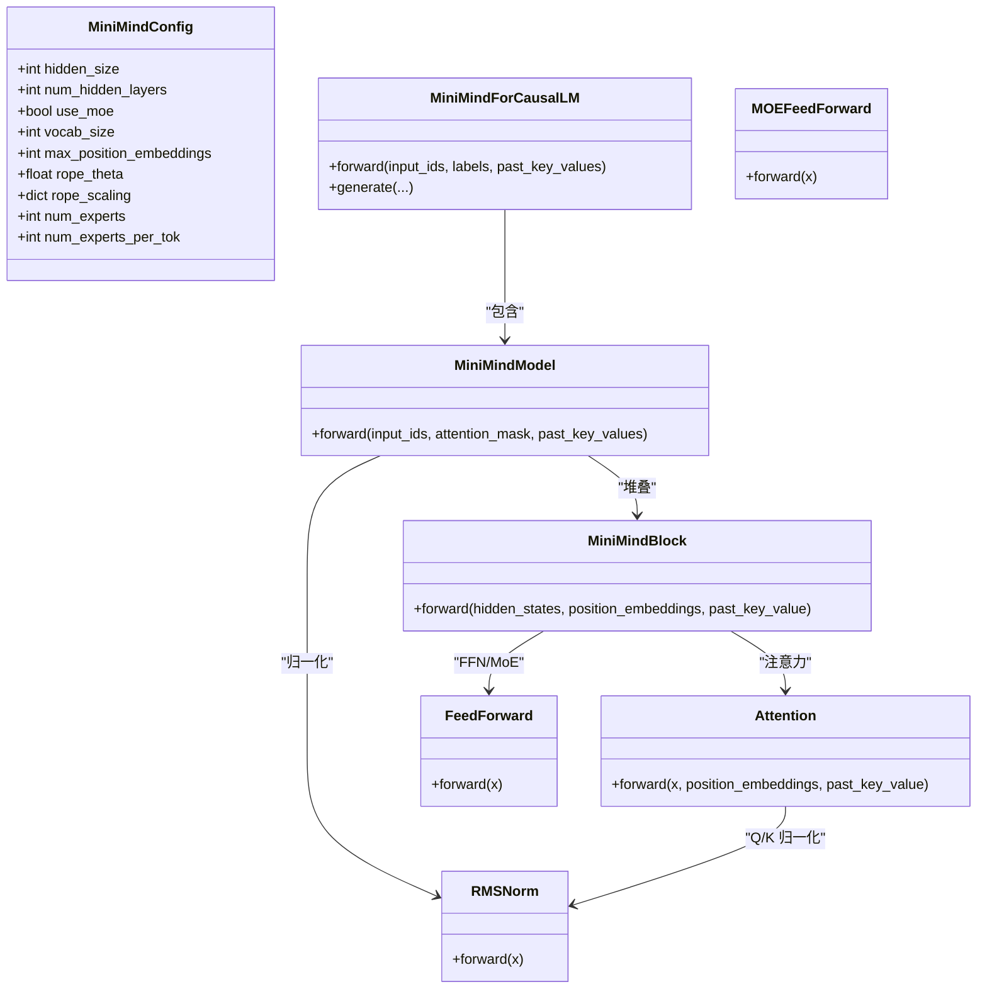
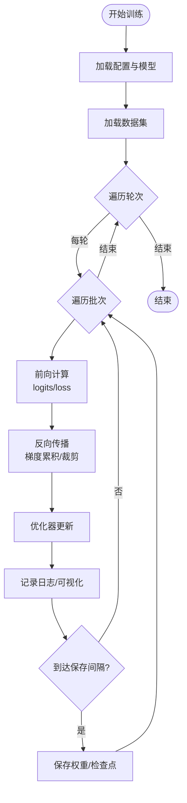
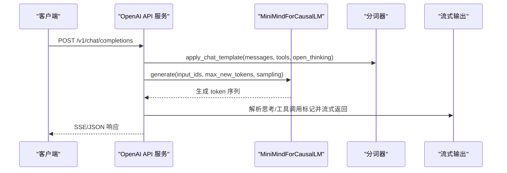
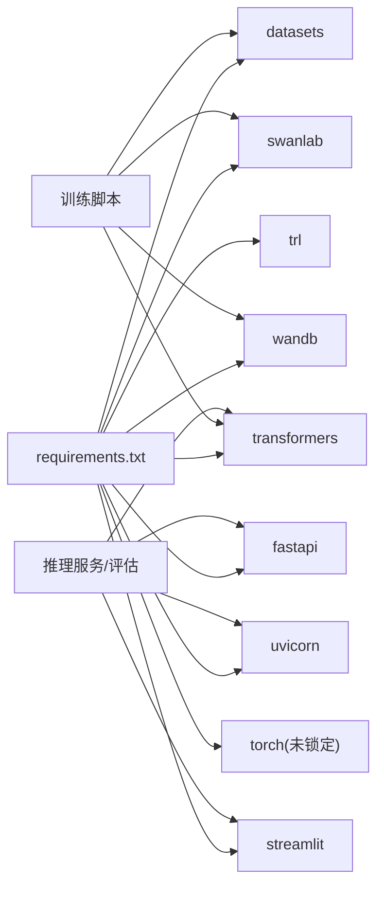

# 项目概述

<cite>
**本文引用的文件**
- [README.md](file://README.md)
- [model_minimind.py](file://model/model_minimind.py)
- [model_lora.py](file://model/model_lora.py)
- [lm_dataset.py](file://dataset/lm_dataset.py)
- [trainer_utils.py](file://trainer/trainer_utils.py)
- [train_pretrain.py](file://trainer/train_pretrain.py)
- [train_full_sft.py](file://trainer/train_full_sft.py)
- [train_distillation.py](file://trainer/train_distillation.py)
- [train_lora.py](file://trainer/train_lora.py)
- [serve_openai_api.py](file://scripts/serve_openai_api.py)
- [eval_llm.py](file://eval_llm.py)
- [requirements.txt](file://requirements.txt)
</cite>

## 目录
1. [引言](#引言)
2. [项目结构](#项目结构)
3. [核心组件](#核心组件)
4. [架构总览](#架构总览)
5. [详细组件分析](#详细组件分析)
6. [依赖关系分析](#依赖关系分析)
7. [性能考量](#性能考量)
8. [故障排查指南](#故障排查指南)
9. [结论](#结论)
10. [附录](#附录)

## 引言
MiniMind 是一个从零开始构建的超小参数量 LLM 训练与推理系统，目标是以极低成本（约 3 元人民币 GPU 租赁）与极短时间（单卡 3090 约 2 小时）训练出约 64M 参数的对话模型，并提供覆盖预训练、监督微调、知识蒸馏、LoRA、RLHF（DPO）、RLAIF（PPO/GRPO/CISPO）、Agent RL、工具调用（Tool Call）、自适应思考（Open Thinking）与推理服务的完整训练与推理链路。项目强调“从 0 实现”，所有关键算法均使用 PyTorch 原生实现，不依赖第三方高层抽象，既适合入门学习，也便于工程复现与扩展。

## 项目结构
项目采用按职责分层的组织方式：
- model：模型定义与 LoRA 实现
- dataset：数据集加载与预处理
- trainer：训练脚本与工具函数
- scripts：推理服务与演示
- 根目录：README、依赖清单与评估脚本

图表来源
- [model_minimind.py:1-280](file://model/model_minimind.py#L1-L280)
- [model_lora.py:1-66](file://model/model_lora.py#L1-L66)
- [lm_dataset.py:1-256](file://dataset/lm_dataset.py#L1-L256)
- [trainer_utils.py:1-177](file://trainer/trainer_utils.py#L1-L177)
- [train_pretrain.py:1-170](file://trainer/train_pretrain.py#L1-L170)
- [train_full_sft.py:1-171](file://trainer/train_full_sft.py#L1-L171)
- [train_distillation.py:1-246](file://trainer/train_distillation.py#L1-L246)
- [train_lora.py:1-184](file://trainer/train_lora.py#L1-L184)
- [serve_openai_api.py:1-246](file://scripts/serve_openai_api.py#L1-L246)
- [eval_llm.py:1-94](file://eval_llm.py#L1-L94)
- [requirements.txt:1-32](file://requirements.txt#L1-L32)

章节来源
- [README.md:216-367](file://README.md#L216-L367)
- [requirements.txt:1-32](file://requirements.txt#L1-L32)

## 核心组件
- 模型架构：MiniMindConfig + MiniMindForCausalLM，支持 Dense 与 MoE（4 experts / top-1），预标准化 + RMSNorm，SwiGLU 激活，RoPE + YaRN 外推，KV 重复与 Flash Attention 可选。
- 数据集：PretrainDataset/SFTDataset/DPODataset/RLAIFDataset/AgentRLDataset，统一 JSONL 格式，支持 chat template、工具调用与思考标签。
- 训练管线：预训练（Pretrain）、监督微调（SFT）、知识蒸馏（Distillation）、LoRA 微调、RLHF（DPO）、RLAIF（PPO/GRPO/CISPO）、Agent RL。
- 推理服务：OpenAI 兼容 API（Streaming/非流式）、Web Demo、CLI 评估。
- 工具函数：分布式初始化、断点续训、学习率调度、混合精度、SkipBatchSampler 等。

章节来源
- [model_minimind.py:10-280](file://model/model_minimind.py#L10-L280)
- [lm_dataset.py:37-256](file://dataset/lm_dataset.py#L37-L256)
- [trainer_utils.py:1-177](file://trainer/trainer_utils.py#L1-L177)
- [train_pretrain.py:82-170](file://trainer/train_pretrain.py#L82-L170)
- [train_full_sft.py:83-171](file://trainer/train_full_sft.py#L83-L171)
- [train_distillation.py:145-246](file://trainer/train_distillation.py#L145-L246)
- [train_lora.py:77-184](file://trainer/train_lora.py#L77-L184)
- [serve_openai_api.py:28-246](file://scripts/serve_openai_api.py#L28-L246)
- [eval_llm.py:12-94](file://eval_llm.py#L12-L94)

## 架构总览
MiniMind 的训练与推理架构遵循“数据 → 模型 → 训练器 → 检查点/可视化 → 推理服务”的闭环。训练脚本通过统一的工具函数完成分布式初始化、混合精度、断点续训与日志记录；推理服务兼容 OpenAI API 协议，支持思考与工具调用的流式输出。

图表来源
- [lm_dataset.py:37-256](file://dataset/lm_dataset.py#L37-L256)
- [model_minimind.py:10-280](file://model/model_minimind.py#L10-L280)
- [trainer_utils.py:63-131](file://trainer/trainer_utils.py#L63-L131)
- [serve_openai_api.py:28-246](file://scripts/serve_openai_api.py#L28-L246)
- [eval_llm.py:12-94](file://eval_llm.py#L12-L94)

## 详细组件分析

### 模型组件分析
- MiniMindConfig：集中管理模型超参，包括隐藏维度、层数、注意力头数、中间维度、RoPE 参数、MoE 配置等。
- MiniMindForCausalLM：解码器结构，嵌入层与输出层共享权重，支持 past_key_values 缓存与自定义生成逻辑。
- Attention/FeedForward/MOEFeedForward：注意力、SwiGLU 前馈与 MoE 前馈，支持 KV 重复、RoPE 旋转与可选 Flash Attention。
- RMSNorm/apply_rotary_pos_emb：归一化与位置编码，YaRN 外推支持长序列。

图表来源
- [model_minimind.py:10-280](file://model/model_minimind.py#L10-L280)

章节来源
- [model_minimind.py:10-280](file://model/model_minimind.py#L10-L280)

### 训练组件分析
- 训练工具：分布式初始化、断点续训、学习率余弦调度、混合精度、SkipBatchSampler、模型参数统计。
- 预训练：文本到下一个 token 的自回归目标，支持 MoE 辅助损失。
- SFT：多轮对话与工具调用模板，掩码损失仅对 assistant 回复部分生效。
- 知识蒸馏：CE + KL 混合损失，支持教师/学生模型配置与温度缩放。
- LoRA：仅训练低秩增量，冻结主干权重，支持保存/加载/合并 LoRA 权重。

图表来源
- [trainer_utils.py:23-157](file://trainer/trainer_utils.py#L23-L157)
- [train_pretrain.py:23-81](file://trainer/train_pretrain.py#L23-L81)
- [train_full_sft.py:23-81](file://trainer/train_full_sft.py#L23-L81)
- [train_distillation.py:38-143](file://trainer/train_distillation.py#L38-L143)
- [train_lora.py:24-76](file://trainer/train_lora.py#L24-L76)

章节来源
- [trainer_utils.py:1-177](file://trainer/trainer_utils.py#L1-L177)
- [train_pretrain.py:1-170](file://trainer/train_pretrain.py#L1-L170)
- [train_full_sft.py:1-171](file://trainer/train_full_sft.py#L1-L171)
- [train_distillation.py:1-246](file://trainer/train_distillation.py#L1-L246)
- [train_lora.py:1-184](file://trainer/train_lora.py#L1-L184)

### 推理服务组件分析
- OpenAI 兼容 API：FastAPI + Uvicorn，支持流式与非流式响应，解析思考与工具调用标记，兼容多种开启方式。
- CLI 评估：支持多轮对话、思考开关、历史轮数截断与生成速度统计。
- Web Demo：Streamlit 聊天界面，支持思考展示、工具选择与多轮 Tool Call。

图表来源
- [serve_openai_api.py:105-169](file://scripts/serve_openai_api.py#L105-L169)
- [eval_llm.py:62-91](file://eval_llm.py#L62-L91)

章节来源
- [serve_openai_api.py:1-246](file://scripts/serve_openai_api.py#L1-L246)
- [eval_llm.py:1-94](file://eval_llm.py#L1-L94)

## 依赖关系分析
- 技术栈：PyTorch 原生实现 + Transformers/Trainer/PEFT 生态兼容；SwanLab/W&B 可视化；FastAPI/uvicorn/OpenAI 兼容接口；Streamlit Web Demo。
- 训练脚本依赖统一工具函数，数据集通过 datasets 加载 JSONL，模型通过 AutoTokenizer/AutoModelForCausalLM 兼容 Transformers 格式。
- 推理服务与 CLI 评估共享模型与分词器，支持 LoRA 权重合并与导出。

图表来源
- [requirements.txt:1-32](file://requirements.txt#L1-L32)
- [trainer_utils.py:14-16](file://trainer/trainer_utils.py#L14-L16)
- [serve_openai_api.py:19-21](file://scripts/serve_openai_api.py#L19-L21)
- [eval_llm.py:6-8](file://eval_llm.py#L6-L8)

章节来源
- [requirements.txt:1-32](file://requirements.txt#L1-L32)

## 性能考量
- 训练效率：混合精度（bfloat16/float16）、梯度累积、梯度裁剪、余弦学习率调度；可选 torch.compile；DDP/DeepSpeed 多卡训练；断点续训与 SwanLab 可视化。
- 推理效率：KV 缓存、past_key_values、RMSNorm、可选 Flash Attention；YaRN 外推支持更长上下文；CLI/服务端均支持流式输出。
- 参数规模：Dense 约 64M，MoE 约 198M（A64M 实际激活），词表 6400，隐藏维度 768，层数 8，注意力头 8/4，RoPE theta 1e6，最长位置 32768。
- 成本与时长：单卡 3090 预训练 + SFT + Tool Call + RLAIF 总计约 2 小时，成本约 3 元人民币。

章节来源
- [README.md:618-647](file://README.md#L618-L647)
- [model_minimind.py:10-45](file://model/model_minimind.py#L10-L45)
- [train_pretrain.py:82-106](file://trainer/train_pretrain.py#L82-L106)
- [train_full_sft.py:83-107](file://trainer/train_full_sft.py#L83-L107)

## 故障排查指南
- 分布式训练：确认 NCCL 环境变量与后端，确保 LOCAL_RANK/CUDA 设备设置正确；断点续训会自动转换 step 以匹配 GPU 数量变化。
- 混合精度：CPU/CUDA 不同路径的 autocast 上下文；float16 需要 GradScaler；torch.compile 与 LoRA monkey-patch 不兼容。
- 检查点：检查 checkpoints 目录是否存在 _resume.pth；恢复时会自动替换 world_size 并转换 step。
- 推理服务：确保分词器与模型权重路径正确；LoRA 权重需与主干权重合并后使用；流式输出依赖自定义 TextStreamer。
- 可视化：默认使用 SwanLab 替代 W&B；如需 W&B，可按注释替换导入。

章节来源
- [trainer_utils.py:44-117](file://trainer/trainer_utils.py#L44-L117)
- [train_lora.py:163-166](file://trainer/train_lora.py#L163-L166)
- [serve_openai_api.py:28-47](file://scripts/serve_openai_api.py#L28-L47)

## 结论
MiniMind 以“从零实现、可复现、可理解、可扩展”为核心理念，提供从 0 到 1 的完整 LLM 训练与推理链路。通过 PyTorch 原生实现与简洁的模块化设计，项目在个人 GPU 上实现了快速训练与部署，同时保持与主流生态（Transformers/PEFT/Trl/Llama.cpp/vLLM/Ollama/OpenAI API）的兼容性。对于初学者，项目提供了清晰的数据格式、训练脚本与推理接口；对于有经验的开发者，项目展示了可扩展的训练管线与工程化的工具函数，便于二次开发与集成。

## 附录
- 快速开始：克隆仓库、安装依赖、下载模型/数据、运行推理/训练脚本。
- 数据集：预训练/监督微调/RL 数据均已开源，支持 mini 组合快速复现。
- 模型版本：minimind-3（64M Dense）、minimind-3-moe（198M / A64M MoE）等。
- 训练组合：pretrain_t2t + sft_t2t + rlaif/agent_rl 的阶段式训练。

章节来源
- [README.md:216-554](file://README.md#L216-L554)